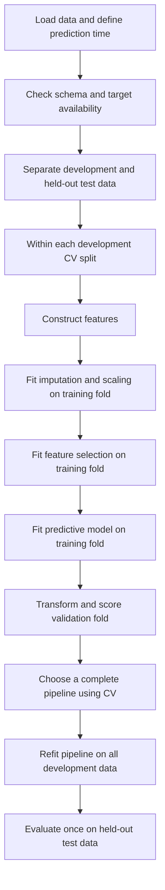

# Feature Engineering — From First Principles

Up: [[00 - Feature Engineering]]

> [!abstract] The central idea
> A model learns from its input representation. Feature engineering means designing that representation: which measurements to expose, how to express them, and which combinations make useful relationships easier to learn.

Imagine choosing an apartment. “The rent is ₹30,000” is useful, but incomplete. Is the apartment 400 square feet or 1,200? A person naturally compares price with space. A model given only separate rent and area columns may need help expressing that comparison. A new column, `rent / area`, makes the idea explicit.

Feature engineering includes constructing useful variables, transforming their scales, and selecting an appropriate set of inputs. These notes develop each operation from first principles and apply them to a rental-listings classification problem.

### Prerequisites and notation

The explanations assume familiarity with tables, basic arithmetic, and the idea of using past observations to predict an outcome. The Python examples use pandas for tables and scikit-learn for preprocessing, model fitting, and evaluation.

| Term | Meaning |
|---|---|
| Model or estimator | An algorithm that learns a rule from data, such as a classifier that predicts one of two classes |
| Training data | Observations used to learn model parameters or transformation statistics |
| Validation data | Observations used to compare modelling choices without fitting the evaluated model on those observations |
| Development data | The data available for training and model selection, excluding the final test set |
| Held-out test data | Observations reserved for evaluating the chosen modelling procedure |
| Cross-validation (CV) | Repeatedly dividing development data into training and validation portions to evaluate a procedure |
| Fold | One group of observations in a cross-validation partition |
| Pipeline | An ordered sequence of transformations followed by a model, fitted and applied as one procedure |
| Generalization | A model's ability to perform well on new observations |
| Overfitting | Learning sample-specific patterns that do not reliably persist in new observations |

In equations, $i$ identifies a row and $j$ identifies a feature column. A bar, such as $\bar x$, denotes a mean. A hat, such as $\hat p$, denotes an estimate. The symbol $\sum$ means to add the indicated terms.

## Contents

- [[#1. What is a feature?]]
- [[#2. Where feature engineering fits]]
- [[#3. Rental-listings case study]]
- [[#4. Constructing better columns]]
- [[#5. Scaling, standardization, and normalization]]
- [[#6. Which algorithms care about scale?]]
- [[#7. Leakage and the meaning of fit]]
- [[#8. Correlation and coefficients]]
- [[#9. Selecting columns with SelectKBest and f_classif]]
- [[#10. Selecting columns with RFE]]
- [[#11. The runnable experiment]]
- [[#12. Results and interpretation]]
- [[#13. Practical extensions and common mistakes]]
- [[#14. Bridge to dimensionality reduction]]
- [[#15. Check your understanding]]
- [[#16. Reference links]]

## 1. What is a feature?

A **sample** is one observation: here, one rental listing. A **feature** is an input attribute of that sample, such as its area. A **target** is the outcome to be predicted.

For a dataset containing $n$ listings and $p$ numeric input columns, the **feature matrix** $X$ and **target vector** $y$ have the following form:

$$X \in \mathbb{R}^{n\times p}, \qquad y\in\{0,1\}^{n}.$$

The notation $\mathbb{R}^{n\times p}$ means a table of real numbers with $n$ rows and $p$ columns. The notation $\{0,1\}^{n}$ means a sequence of $n$ binary labels. A **feature vector**, $x_i$, is the collection of input values in row $i$.

Each row of $X$ describes a listing. Each column records the same kind of measurement across listings. The $i$th target, $y_i$, belongs to the $i$th row. In **binary classification**, each observation belongs to one of two classes, represented here by 0 and 1. These labels remain separate from the numeric features and are not standardized.

In pandas:

```python
X = df[["area", "rooms", "rent", "distance"]]
y = df["left_fast"]
```

The model learns a function that maps a feature vector to a prediction:

$$\hat p_i = f(x_i), \qquad \hat p_i\approx P(y_i=1\mid x_i).$$

Here, $f$ is the learned prediction rule, and $P(y_i=1\mid x_i)$ means the probability of class 1 given the observed inputs. The vertical bar means “given.”

Feature engineering inserts a representation function $\phi$:

$$\hat p_i=f(\phi(x_i)).$$

For example, $\phi$ might keep the original four numbers, append two ratios, and rescale the resulting six columns.

> [!important] A column is not automatically a usable feature
> A listing ID might be an arbitrary identifier. A final lease date might reveal the answer after the event. A text address may require a suitable encoding. The first question is what the column means and whether it exists when a prediction must be made.

## 2. Where feature engineering fits

Feature engineering sits between loading the raw data and fitting the predictive model. Any transformation that learns from observations must use only the training portion of the data. This preserves an independent evaluation of how the complete modelling procedure performs on unseen observations.



### 2.1 Preprocessing and feature engineering

The terms overlap in practice. The following distinctions identify the purpose of each operation:

| Term | Useful working meaning | Rental example |
|---|---|---|
| Data cleaning | Repair or flag invalid records and inconsistent meanings | Fix mixed units; investigate impossible negative area |
| Preprocessing | Make data suitable for an estimator | Impute missing values, encode categories, scale numeric columns |
| Feature construction | Create new input variables | Rent per square foot, area per room |
| Feature selection | Keep a subset of available input variables | Retain distance and rent per area |
| Feature extraction | Transform inputs into another representation | PCA components or text embeddings |
| Feature engineering, broad usage | Design the entire input representation | All of the above as a coordinated workflow |

**Imputation** means replacing missing entries according to a defined rule, such as the median of the observed training values. **Encoding** converts nonnumeric information, such as neighbourhood names, into a numeric representation suitable for the model. An **interaction** is a relationship in which the effect of one input depends on another input.

In a narrow usage, someone may say “preprocessing, then feature engineering,” meaning that feature engineering refers mainly to domain-driven new columns. In these notes, **feature engineering is the broad umbrella**, with each individual operation identified explicitly.

**Scaling is preprocessing. Standardization is a kind of scaling. Min–max normalization is a kind of scaling. Unit-vector normalization is also preprocessing, but changes rows rather than independently rescaling columns.**

A preprocessing specification should identify the operation, the statistics it estimates, and the data used to estimate them. For example, median imputation learns a replacement value from each training column, while standardization learns a training mean and standard deviation.

### 2.2 Feature engineering as an iterative process

A candidate representation is evaluated on development data, inspected for weaknesses, and revised when the evidence supports a change. Adding a column is a hypothesis: “This measurement could help this estimator predict this outcome.” Cross-validation supplies evidence about that hypothesis.

A feature can help one algorithm and add little to another. A flexible tree can discover some interactions from raw columns; a linear model cannot automatically express every interaction. More columns can also mean more noise, unstable estimates, additional collection cost, and more opportunities to overfit.

## 3. Rental-listings case study

The prediction task is to determine, at publication time, whether a rental listing will be rented within seven days.

The target column, `left_fast`, records whether the listing was rented within the seven-day window:

$$y=\begin{cases}1&\text{rented within seven days}\\0&\text{not rented within seven days.}\end{cases}$$

In a real dataset, delisting is not necessarily renting: withdrawals, duplicate ads, and expired listings require careful label definitions. The case study assumes verified rental outcomes. Predictions are made **at publication time**, so every input must be available at that time. A newly published listing without seven days of follow-up has an unknown outcome, not automatically a zero.

| Column | Meaning | Units | Role |
|---|---|---|---|
| `area` | Floor area | Square feet | Input |
| `rooms` | Count of rooms under a consistent definition | Count | Input |
| `rent` | Advertised monthly rent | INR per month | Input |
| `distance` | Distance to a chosen city centre | Kilometres | Input |
| `left_fast` | Rented within seven days | 0 or 1 | Target |

The following illustrative records show the dataset structure. They are separate from the generated dataset used in the experiment:

```csv
area,rooms,rent,distance,left_fast
600,1,18000,3.0,1
1200,3,30000,7.0,1
800,2,32000,12.0,0
1500,4,45000,18.0,0
900,2,27000,4.0,1
```

A larger sample is needed to compare models and estimate predictive performance. The companion [listings.csv](examples/listings.csv) contains **800 synthetic listings**, generated reproducibly by [listings_demo.py](examples/listings_demo.py).

The simulation deliberately makes rental speed depend on rent per area and distance, with random outcomes. The resulting relationships are properties of the simulation and should not be interpreted as empirical findings about housing markets. Even the correct inputs cannot perfectly predict a random outcome.

## 4. Constructing better columns

### 4.1 Rent per area: a comparison hidden between two columns

Define:

$$\text{rent\_per\_area}=\frac{\text{monthly rent}}{\text{floor area}}.$$

Its units are INR per month per square foot.

Compare two listings:

| Listing | Area | Rent | Rent per area |
|---|---:|---:|---:|
| A | 600 | 18,000 | 30 |
| B | 1,200 | 30,000 | 25 |

B has a higher total rent, but a lower price per square foot. Neither number replaces the other: someone with a ₹20,000 budget still cannot afford B. A good representation may retain both total rent and relative price.

### 4.2 Why a deterministic column can help

The ratio contains no new information beyond rent and area. Anyone who knows both can calculate it. Nevertheless, it can change what a restricted model can express easily.

Raw-feature logistic regression uses a score such as:

$$z=b+w_a\,\text{area}+w_r\,\text{rent}+w_d\,\text{distance}+w_q\,\text{rooms}.$$

**Logistic regression** is a classification model despite its name. It first forms a weighted sum of the inputs. The weights $w_a,w_r,w_d,w_q$ are learned coefficients, and $b$ is an intercept that shifts the score. A sigmoid function then converts the score into a probability between 0 and 1.

Its probability is $\sigma(z)=1/(1+e^{-z})$. Adding the ratio allows:

$$z=b+w_a\,\text{area}+w_r\,\text{rent}+w_d\,\text{distance}
+w_q\,\text{rooms}+w_u\frac{\text{rent}}{\text{area}}.$$

This remains linear in its **coefficients**, but is no longer linear in the original raw inputs. The same ₹1,000 rent increase can now have a different effect depending on area.

There is a subtle qualification: one fixed rule such as `rent / area < 30` can be rewritten as `rent - 30 * area < 0` when area is positive. A raw linear classifier can represent that boundary. What it cannot generally reproduce is an entire logistic probability function that is linear in the ratio, especially alongside other effects. Feature construction should be justified by the needed relationship, not by assuming every ratio is impossible for a raw linear model.

> [!tip] Information versus accessibility
> A derived feature can make existing information easier for a particular model to use. It does not add an independent observation.

### 4.3 Other useful families

| Construction | Example | Hypothesis it expresses |
|---|---|---|
| Ratio | `area / rooms` | Space per room may matter |
| Difference | `rent - local_typical_rent` | Price relative to comparable homes matters |
| Interaction | `distance * rooms` | The effect of distance may vary with home size |
| Nonlinear transform | `log1p(rent)` | Relative changes matter more than absolute changes |
| Indicator | `distance <= 2` | A domain threshold may matter |
| Time feature | Publication month | Demand may vary seasonally |
| Historical aggregate | Prior neighbourhood rental rate | Local demand may matter |

The final three require care: a threshold should have a rationale or be tuned within development evaluation; time has cyclic structure; historical aggregates must use only information available before the prediction. Target-based aggregates require special leakage-safe training construction, often out-of-fold encoding.

### 4.4 Ratios need a meaning and a denominator policy

Dividing by zero produces an invalid value; dividing by a tiny number can produce an extreme one. Adding an arbitrary $10^{-8}$ avoids a software error but can invent an absurd price per area. Decide what an invalid denominator means.

In this dataset, an area or room count of zero is invalid. The transformer marks the corresponding ratio as missing so that the training-fold imputer can handle it:

```python
def add_features(X):
    out = X.copy()
    out["rent_per_area"] = out["rent"] / out["area"].where(out["area"] > 0)
    out["area_per_room"] = out["area"] / out["rooms"].where(out["rooms"] > 0)
    return out
```

This protects the ratios; it is not a complete validator for corrupt raw data. A production validator should also flag impossible raw values and inconsistent units. The generated raw data are positive and complete.

Construct ratios **before standardizing their ingredients**. The ratio of standardized rent to standardized area has neither the units nor the meaning of price per square foot, and standardized area can equal zero.

If values are missing, “construct ratio, then impute ratio” and “impute ingredients, then construct ratio” are different choices. Neither is universally correct. The example constructs ratios first and then imputes missing feature values. Because the supplied dataset is complete, imputation does not alter its values.

## 5. Scaling, standardization, and normalization

### 5.1 Why units can change a model's behaviour

Suppose two listings differ by ₹10,000 in rent and 5 km in distance. A raw Euclidean distance includes:

$$d^2=(10{,}000)^2+5^2=100{,}000{,}025.$$

Rent dominates numerically. Express rent in thousands of rupees and those terms become $10^2+5^2=125$. Nothing about the actual apartments changed, but the geometry did.

Scaling chooses how numeric differences are measured. Standardization says, roughly, “compare deviations relative to how much each feature varies.” This is a useful default, not proof that every feature deserves equal influence.

### 5.2 Standardization with StandardScaler

For feature $j$:

$$z_{ij}=\frac{x_{ij}-\mu_j}{s_j},$$

where $\mu_j$ and $s_j$ are computed from the training data. If training rent has mean ₹30,000 and standard deviation ₹10,000, then ₹45,000 becomes $1.5$: one and a half training standard deviations above the training mean.

The **mean** describes the average value. The **standard deviation** describes spread around that average and has the same units as the original measurement. With $m$ training observations, the quantities used here are

$$\mu_j=\frac{1}{m}\sum_{i=1}^{m}x_{ij},\qquad s_j=\sqrt{\frac{1}{m}\sum_{i=1}^{m}(x_{ij}-\mu_j)^2}.$$

`StandardScaler` stores a separate mean and scale for each column. Its default variance calculation uses `ddof=0`. A constant training column cannot be given unit variance; its scale factor is handled as 1, and centering makes its training values zero. See the [StandardScaler API](https://scikit-learn.org/stable/modules/generated/sklearn.preprocessing.StandardScaler.html).

```python
scaler = StandardScaler()
X_train_scaled = scaler.fit_transform(X_train)
X_valid_scaled = scaler.transform(X_valid)
```

Important consequences:

- Training columns are centred near zero and, when nonconstant, scaled to unit variance.
- Validation columns need not have mean zero or variance one. They use the training reference frame.
- Values are not bounded to $[-1,1]$ or $[0,1]$.
- Standardization does **not** make a skewed distribution Gaussian. It changes location and scale, not its underlying shape.
- Outliers affect both the mean and standard deviation.

Normality is not a requirement for applying `StandardScaler`. Likewise, logistic regression does not require normally distributed inputs.

### 5.3 Min–max scaling: a different operation

The default transformation to $[0,1]$ is:

$$x' = \frac{x-x_{\min,\text{train}}}{x_{\max,\text{train}}-x_{\min,\text{train}}}.$$

If training areas range from 400 to 1,600 square feet, 1,000 becomes 0.5. A future area of 2,000 becomes $1.333\ldots$ with default unclipped behaviour. The interval describes the training range, not a guarantee about future values.

This can be useful when a bounded training input range is desired, but extreme observations determine the range and can compress most observations into a small interval. Optional clipping changes the transformation and loses information about how far future values exceed the training range. See [MinMaxScaler](https://scikit-learn.org/stable/modules/generated/sklearn.preprocessing.MinMaxScaler.html).

### 5.4 Unit-vector normalization: across a row

`Normalizer(norm="l2")` divides a sample vector by its length:

$$\tilde x_i=\frac{x_i}{\|x_i\|_2},\qquad
\|x_i\|_2=\sqrt{\sum_{j=1}^{p}x_{ij}^{2}}.$$

The row $[3,4]$ becomes $[0.6,0.8]$. So does $[6,8]$. Direction remains, while magnitude is discarded. A zero vector remains zero under scikit-learn's implementation.

This makes sense when relative composition or direction matters more than total size, such as some text-vector or similarity tasks. For unit vectors, squared Euclidean distance and cosine similarity are related by:

$$\|u-v\|_2^2=2-2u^Tv.$$

It is usually a poor default for these listing rows: rent, kilometres, rooms, and square feet have different meanings, and absolute size and price matter. Changing the currency unit would change each row's direction before normalization. `Normalizer` acts independently on rows and does not learn column means or extrema. See [Normalizer](https://scikit-learn.org/stable/modules/generated/sklearn.preprocessing.Normalizer.html).

### 5.5 Comparison of transformations

| Operation | Acts on | What it does | Typical scikit-learn tool |
|---|---|---|---|
| Standardization | Each column | Subtract training mean, divide by training standard deviation | `StandardScaler` |
| Min–max scaling, often called normalization | Each column | Express values relative to training extrema | `MinMaxScaler` |
| Robust scaling | Each column | Use median and a quantile range, usually IQR | `RobustScaler` |
| Unit-norm normalization | Each row | Divide vector by its norm | `Normalizer` |
| Log transform | Individual values | Compress large positive magnitudes nonlinearly | `np.log1p` in a transformer |

“Normalize the data” is incomplete. Specify **which operation, along which axis, and fitted on which observations**.

Robust scaling makes the location and scale estimates less sensitive to outliers; it does not remove outliers. A log transform changes shape, so it answers a different question from standardization. You can sometimes use a log transform followed by standardization.

### 5.6 How scaling interacts with regularization

**Regularization** adds a cost for certain model parameters, discouraging unnecessarily large or complex fitted relationships. It can reduce overfitting. A **loss function** measures prediction error during training; the fitting algorithm seeks parameter values that reduce the loss together with any regularization penalty.

Consider a simplified regularized objective:

$$\text{prediction loss}+\lambda\sum_j w_j^2.$$

The nonnegative parameter $\lambda$ controls the strength of the penalty. This squared-coefficient penalty is called **L2 regularization**. An L1 penalty instead uses absolute coefficient values and can drive some coefficients to exactly zero.

If a feature's numeric values are multiplied by 1,000, the same contribution to a linear score can be represented with a coefficient 1,000 times smaller. Its squared penalty is then one million times smaller. Without a consistent scale, regularization can treat the same underlying relationship differently just because units changed.

Scaling also helps many numerical optimizers by avoiding very uneven curvature across parameter directions. For unregularized linear models, invertible rescaling can preserve the set of predictions representable in exact arithmetic; it can still affect numerical conditioning. With fixed regularization, it generally changes the effective modelling preference.

## 6. Which algorithms care about scale?

Think about the mechanism: **distance, dot products, gradient optimization, or penalties** are reasons to consider scaling. **Order-based single-feature thresholds** are a reason it may be unnecessary.

A distance measures how far apart two feature vectors are. A dot product multiplies corresponding coordinates and adds the products. Gradient-based optimization adjusts model parameters using the direction in which the training objective changes. Each can be affected by the numerical scale of an input. By comparison, a decision tree divides observations using rules such as `rent < 30000`.

In the table, SVM means support vector machine, RBF means radial basis function, SGD means stochastic gradient descent, and PCA means principal component analysis. These algorithms are listed to illustrate preprocessing choices; their full derivations are separate topics.

| Method | Usual choice | Why / qualification |
|---|---|---|
| k-nearest neighbours | Scale numeric features | Raw distances otherwise depend strongly on units |
| K-means | Scale when relative rather than raw variance should define clusters | Its squared-distance objective is scale-sensitive |
| RBF SVM | Usually standardize | Distances inside the kernel interact with `gamma` |
| Linear SVM | Usually standardize | Margins and regularization depend on feature scales |
| Regularized logistic regression | Usually standardize continuous inputs | Penalty comparability and optimization |
| Ridge, lasso, elastic net | Usually standardize | Coefficient penalties depend on units |
| Neural networks / SGD-based models | Usually scale suitably | Improves optimization; exact preprocessing depends on architecture and inputs |
| PCA | Scale when units should not determine the components | PCA seeks large-variance directions; raw-scale PCA is sometimes intentional |
| Ordinary unregularized least squares | Not mathematically mandatory | Can help conditioning; coefficient units change |
| Ordinary decision trees | Usually unnecessary | A positive affine rescaling preserves order and corresponding split partitions |
| Random forests / conventional boosted trees | Usually unnecessary | Their tree splits inherit this property; implementations may differ slightly numerically |
| Dummy classifier | Unnecessary | Ignores feature values |

“Needs scaling” is often shorthand for “a strong practical default,” not “the code cannot run without it.” A linear model can run on unscaled features and still obtain a score. That does not establish that the representation is appropriate.

For a tree, `rent < 30000` and `rent_in_thousands < 30` select the same rows. Scaling is therefore usually wasted work when the pipeline is solely an ordinary tree model. A pipeline containing distance-based imputation, PCA, or another scale-sensitive step may still need it.

Do not apply row normalization to every algorithm in the first half of the table. **Needing comparable feature scales does not mean needing unit-length samples.**

The rental-listings pipeline uses column standardization for regularized logistic regression. Row normalization is omitted because absolute price and size carry meaningful information. Alternative preprocessing choices can be compared using development data.

## 7. Leakage and the meaning of fit

### 7.1 Fit means learning something from observations

Several objects besides the final classifier learn from data:

| Object | What `fit` learns |
|---|---|
| Median imputer | Training-column medians |
| Standard scaler | Training-column means and scales |
| `SelectKBest(f_classif)` | Feature scores from training features and labels |
| RFE | A retained subset obtained through training model fits |
| Logistic regression | Coefficients and intercept |

`transform` applies the learned rule without estimating it again. `fit_transform` learns and applies it on the training subset. `predict` produces outputs using the fitted pipeline.

The fixed `rent / area` formula does not estimate population statistics. In principle, that stateless calculation could be performed before splitting if it uses only available inputs and a rule fixed independently of evaluation results. Including it in the pipeline ensures that training and future predictions use the same feature-construction code.

### 7.2 Two different forms of leakage

**Evaluation leakage:** scaling or selecting features using observations that are supposed to be unseen. A particularly serious example is selecting columns with all target labels before cross-validation. The validation labels have then already influenced the representation.

**Prediction-time leakage:** using information that will not exist when the prediction is needed. “Days until rented” would almost directly reveal the target. A pipeline cannot fix this semantic error.

The correct fold procedure is:

1. Fit every learned transformation on the fold's training rows.
2. Transform those training rows and fit the classifier.
3. Transform validation rows using the same fitted transformations.
4. Score predictions against validation labels.

Never fit a new scaler on validation or production rows to “make them standardized too.” That would change the coordinate system after the model learned its coefficients. Scikit-learn recommends pipelines to organize preprocessing safely during evaluation; see [common pitfalls](https://scikit-learn.org/stable/common_pitfalls.html).

### 7.3 The split must resemble deployment

The synthetic rows are independent, so random stratified splits are appropriate. Real listings may repeat the same property, landlord, or building. If the deployment question concerns unseen properties, keep property groups together. If predicting future listings, use chronological evaluation and respect label-availability delays.

Stratification preserves class proportions; it does not prevent property duplication, future leakage, or distribution shift.

## 8. Correlation and coefficients

Before selecting columns, distinguish three different questions:

1. Does a feature vary with the target on its own?
2. Do two input features contain overlapping information?
3. How does a fitted model use a feature alongside its other inputs?

Correlation helps with the first two. Model coefficients speak to the third. Neither automatically tells us what causes rental speed.

### 8.1 Pearson correlation: linear association

For two nonconstant variables:

$$r_{xy}=\frac{\sum_i(x_i-\bar x)(y_i-\bar y)}{
\sqrt{\sum_i(x_i-\bar x)^2}\sqrt{\sum_i(y_i-\bar y)^2}}.$$

Its range is $[-1,1]$:

- Near $+1$: larger values tend to accompany larger values in a roughly linear pattern.
- Near $-1$: larger values tend to accompany smaller values in a roughly linear pattern.
- Near 0: little linear association; nonlinear dependence may still exist.

For a numeric feature and a binary target coded 0/1, Pearson correlation is the **point-biserial correlation**. A negative correlation between rent per area and `left_fast` means higher unit prices tend to occur with fewer positive outcomes in this sample.

Changing a feature from rupees to thousands of rupees does not change its Pearson correlation. Positive affine transformations leave it unchanged; multiplying by a negative number reverses its sign. Standardizing therefore does not uncover a previously hidden Pearson correlation. Constant columns have undefined correlation.

An outlier can strongly affect Pearson correlation. A curved relationship can also fool it: if $x$ is symmetrically distributed and $y=x^2$, the correlation can be zero even though $y$ is completely determined by $x$.

### 8.2 Spearman correlation: rank association

Spearman correlation is Pearson correlation applied to ranks. It asks whether larger values of one variable tend to accompany larger values of the other, even when the relationship is not a straight line. Ties receive appropriate shared ranks.

It can capture monotonic nonlinear relationships. It still misses many nonmonotonic patterns, and it is not immune to every data-quality problem. With a binary target, the many tied target ranks also limit what “rank agreement” can mean.

### 8.3 Feature–feature correlation is a different diagnostic

Area and rooms may be strongly correlated because larger homes tend to have more rooms. Keeping both can be useful, but a linear model may have difficulty assigning their overlapping effect to one coefficient or the other. This is one aspect of **multicollinearity**.

Consequences can include unstable coefficients without a dramatic loss of predictive accuracy. A fixed rule such as “drop every column with correlation above 0.8” ignores model type, measurement reliability, interactions, and which feature would be more useful in deployment.

Similarly, a weak target correlation does not prove a feature is useless. Area helps create the useful rent-per-area ratio even if area itself has near-zero target correlation.

### 8.4 A logistic coefficient is not a correlation coefficient

Logistic regression models log-odds:

$$\log\frac{p}{1-p}=b+\sum_j\beta_j z_j.$$

The **odds** of a positive outcome are $p/(1-p)$. For example, a probability of 0.8 corresponds to odds of 4 to 1. Log-odds are the natural logarithm of the odds. The symbols $\beta_j$ denote fitted coefficients and $z_j$ denote standardized feature values in this equation.

For a standardized input, $\beta_j$ describes the log-odds change for a one-training-standard-deviation increase while the other model inputs are held fixed. The corresponding odds multiplier is $e^{\beta_j}$.

A coefficient of $-0.87$ corresponds to multiplying the odds by approximately $0.42$. It does **not** mean the probability falls by 87 percentage points. The probability change depends on its starting value.

When inputs include a variable and its deterministic derivatives, “hold all the others fixed” may describe an impossible physical change. You cannot increase rent while holding both area and rent per area fixed. Coefficients then remain descriptions of the fitted equation, with limited independent real-world interpretation.

Correlation is marginal, whereas a fitted coefficient depends on the other included variables, regularization, feature scaling, and the sample. Neither is a causal effect simply because it is large.

## 9. Selecting columns with SelectKBest and f_classif

### 9.1 The selector and its scoring function

**`SelectKBest`** is a feature selector that retains a specified number of columns according to a scoring function. **`f_classif`** computes an analysis-of-variance (ANOVA) F statistic for each numeric feature using the class labels.

```python
selector = SelectKBest(score_func=f_classif, k=3)
```

`f_classif` produces a score for each column. `SelectKBest` keeps the $k$ highest-scoring columns. It returns a reduced representation; it is not the final classifier. See [SelectKBest](https://scikit-learn.org/stable/modules/generated/sklearn.feature_selection.SelectKBest.html) and [f_classif](https://scikit-learn.org/stable/modules/generated/sklearn.feature_selection.f_classif.html).

### 9.2 The intuition: separation compared with spread

Take just `rent_per_area`, and group its values by target:

- Group 0: listings that did not rent quickly.
- Group 1: listings that did rent quickly.

If the group means differ substantially and each group's values are fairly concentrated, the feature separates the classes. If the means differ only slightly compared with within-group variation, the evidence of mean separation is weaker.

For a small arithmetic example, use group 0 values $[4,5,6]$ and group 1 values $[8,9,10]$. Their means are 5 and 9, and the overall mean is 7. Within each group, deviations are $[-1,0,1]$: total within-group squared deviation is 4. Between-group squared deviation is $3(5-7)^2+3(9-7)^2=24$. Accounting for degrees of freedom gives $F=(24/1)/(4/4)=24$.

If the same group means came with far wider overlapping clouds, the denominator would increase and the F-score would fall. Larger separation or tighter groups raises the score.

### 9.3 The ANOVA F statistic

For one feature, let $C$ be the number of classes, $n_c$ their sizes, $\bar x_c$ their feature means, and $\bar x$ the overall feature mean:

$$SS_B=\sum_{c=1}^{C}n_c(\bar x_c-\bar x)^2,$$

$$SS_W=\sum_{c=1}^{C}\sum_{i:y_i=c}(x_i-\bar x_c)^2,$$

$$F=\frac{SS_B/(C-1)}{SS_W/(n-C)}.$$

The numerator measures differences between class means. The denominator measures variation within classes. This is repeated separately for every column. No logistic regression is fitted to compute these scores.

For two classes, this F statistic equals the square of the ordinary pooled-variance two-sample t statistic. With a binary target and the same complete observations, it also relates to point-biserial correlation:

$$F=\frac{(n-2)r^2}{1-r^2}.$$

Thus, for this complete binary dataset, ranking by this F-score is equivalent to ranking by absolute Pearson target correlation. It loses direction: a strong negative relationship can earn a high score just like a strong positive one.

### 9.4 F-scores, p-values, and scaling

`scores_` contains the F statistics; `pvalues_` contains their associated p-values. A p-value refers to the probability, under the test's null hypothesis and assumptions, of obtaining a statistic at least as extreme. It is not the probability that a feature is useless, nor the probability that the null hypothesis is true.

The **null hypothesis** here states that the population feature means are equal across classes. The alternative is that at least one class mean differs. The statistic measures the observed separation; the p-value evaluates how unusual that separation would be under the null model.

Classical ANOVA inference assumes independent observations, normally distributed within-group errors, and equal group variances. As a predictive filter, practitioners may use the F statistic as a ranking heuristic even when the inferential assumptions are imperfect. That does not turn the p-values into assumption-free evidence.

Testing many columns also creates a multiple-testing problem. `SelectKBest` keeps exactly $k$ columns; it does not control a false-discovery rate or require that the retained columns cross a significance threshold. If all inputs are noise, it still selects $k$ of them.

Scaling a column by a nonzero constant multiplies both sums of squares by the same squared factor. Translating it also leaves deviations unchanged. Therefore standardization does not change the theoretical F ranking, except for numerical edge cases. Scaling remains useful in the pipeline because the following logistic model benefits from comparable feature scales.

### 9.5 Why scoring each column separately is limited

**Redundancy:** two near-duplicates can both score highly, so the selected set may repeat the same information.

**Interactions:** consider balanced binary inputs and the target “exactly one input equals 1,” or XOR:

| $x_1$ | $x_2$ | $y$ |
|---:|---:|---:|
| 0 | 0 | 0 |
| 0 | 1 | 1 |
| 1 | 0 | 1 |
| 1 | 1 | 0 |

Each raw input alone has the same mean in both target classes. Their joint pattern determines the target. A univariate mean-separation score misses the relationship. An appropriate constructed interaction or a capable nonlinear model can expose it.

**Other forms of dependence:** classes can differ in feature variance or have a U-shaped relationship without different means. Mutual information is an alternative univariate criterion that can detect more general dependence, though its estimation has its own limitations and it still scores one column at a time.

The number of retained columns, $k$, can be fixed in advance or tuned within development evaluation. Final test labels must not influence this choice.

## 10. Selecting columns with RFE

### 10.1 Recursive Feature Elimination

RFE is a **wrapper**: it repeatedly fits an estimator and uses that estimator's feature importance to remove inputs.

With six columns, a target of three, and `step=1`:

1. Fit the estimator on six columns; remove the least important one.
2. Refit on the remaining five; remove one.
3. Refit on the remaining four; remove one.
4. Fit the estimator on the final three.

The refitting is the key. Once a column disappears, the remaining columns may share the work differently. RFE greedily follows one elimination path; it does not exhaustively test all possible three-column subsets.

```python
selector = RFE(
    estimator=LogisticRegression(C=1.0, solver="lbfgs", max_iter=2000),
    n_features_to_select=3,
    step=1,
)
```

For the binary linear estimator used here, coefficient magnitudes determine the relative importances; scikit-learn's RFE internally squares coefficients for this comparison. With multiclass coefficients, it aggregates squared values across class rows. A tree-based estimator can instead expose `feature_importances_`. See the [RFE API](https://scikit-learn.org/stable/modules/generated/sklearn.feature_selection.RFE.html).

### 10.2 Why scale before coefficient-based RFE?

A coefficient of 0.001 per rupee and a coefficient of 1 per kilometre are not directly comparable. Their units differ. Standardizing first makes the coefficient magnitudes correspond to changes of one training standard deviation, though correlation and regularization still complicate importance.

The pipeline applies the operations in this order:

```text
construct columns → impute → standardize → RFE → final logistic regression
```

RFE fits its own logistic estimator repeatedly to choose a subset. The final logistic step then fits on the chosen subset. This extra fit is intentional: it presents feature selection as a reusable transformation. The internal RFE estimator and the final model need not always be the same kind of estimator, although they are here.

### 10.3 Interpreting fitted attributes

- `support_`: Boolean mask of retained columns.
- `ranking_`: retained columns have rank 1; discarded columns have larger ranks.
- `estimator_`: the internal estimator fitted on the retained columns.

A rank of 1 does not mean all retained columns are equally influential. A rank of 4 does not mean a feature is “four times worse.” With larger elimination steps, discarded features can share a rank.

### 10.4 What RFE does not solve

RFE is conditional on the estimator, hyperparameters, input representation, and data. Correlated features can substitute for one another, making the selected subset unstable. A linear estimator used inside RFE cannot suddenly detect arbitrary nonlinear interactions. RFE does not fix the XOR problem unless its estimator or supplied representation can model it.

RFE also costs more than a univariate filter: several fits are needed per fold. `RFECV` adds cross-validation to choose the retained feature count. Evaluating the performance of the entire selection procedure requires an independent outer evaluation or an untouched test set. More layers of CV do not justify preprocessing outside the relevant training split.

### 10.5 Comparing selection approaches

| Question | `SelectKBest(f_classif)` | RFE |
|---|---|---|
| Core signal | Individual class-mean separation | Fitted model importance among currently retained inputs |
| Fits a predictive model to rank inputs? | No | Yes, repeatedly |
| Considers inputs jointly? | No | Through the estimator, within its capabilities |
| Sensitive to standardization? | F statistic is affine-scale invariant | Often yes with coefficient-based estimators |
| Removes redundant columns reliably? | No | Sometimes; no guarantee |
| Computational cost | Relatively low | Higher |
| Uses class labels? | Yes | Yes |
| Must run inside CV? | Yes | Yes |

Embedded selection is a third family: for example, an L1-regularized linear model can make some fitted coefficients zero during training. Selection, interpretation, and causal discovery remain different tasks.

## 11. The runnable experiment

### 11.1 Files and execution

The complete, runnable source is [examples/listings_demo.py](examples/listings_demo.py). It reads the supplied CSV, creates it deterministically if absent, and writes [examples/results.txt](examples/results.txt). It does not download data.

From the repository root:

```powershell
python "learn/_ml/Feature Engineering/examples/listings_demo.py"
```

If setting up a fresh environment, the dependencies are:

```powershell
python -m pip install numpy pandas scikit-learn
```

The recorded run used Python 3.14.7, NumPy 2.5.3, pandas 3.0.5, and scikit-learn 1.9.0. Small numerical differences across versions are possible. The following sections explain the executable script in pieces; use the linked script for the complete program with imports and reporting.

### 11.2 Synthetic data-generating process

The script samples plausible positive measurements and creates outcomes from:

$$z=0.35-0.13\left(\frac{\text{rent}}{\text{area}}-35\right)
-0.10(\text{distance}-10),$$

$$p=\sigma(z),\qquad y\sim\operatorname{Bernoulli}(p).$$

A Bernoulli draw returns 1 with probability $p$. It does not simply round $p$. Consequently, similar homes can have different outcomes.

This equation defines the simulation, but it is not supplied to the fitted models. They receive only the observed feature values and training labels. The known generating process makes the role of the ratio explicit. In an empirical application, the underlying relationship is generally unknown and must be assessed through independent evaluation.

### 11.3 Reserve a final test set first

```python
df = pd.read_csv(csv_path)
X = df[["area", "rooms", "rent", "distance"]]
y = df["left_fast"]

X_dev, X_test, y_dev, y_test = train_test_split(
    X, y, test_size=0.20, stratify=y, random_state=42
)
```

The split produces 640 development rows and 160 final test rows. Development data are used for comparing pipelines. The final test data are used after choosing a pipeline. Looking at a final test score and then changing the model makes that test set part of development; it is no longer a fresh check.

### 11.4 Build the complete pipeline

```python
def logistic():
    return LogisticRegression(C=1.0, solver="lbfgs", max_iter=2000)

def make_pipeline(engineered=False, selector=None):
    steps = []
    if engineered:
        steps.append(("features", FunctionTransformer(add_features, validate=False)))
    steps.extend([
        ("impute", SimpleImputer(strategy="median")),
        ("scale", StandardScaler()),
    ])
    if selector is not None:
        steps.append(("select", selector))
    steps.append(("model", logistic()))
    return Pipeline(steps)
```

`FunctionTransformer` wraps the fixed DataFrame-to-DataFrame function. `validate=False` lets it receive that DataFrame directly. The imputer and scaler learn their statistics when the pipeline is fitted. The optional selector then chooses columns, and the logistic model fits the resulting representation.

`C` controls inverse regularization strength: smaller values mean stronger regularization. All candidate logistic models use `C=1.0`, allowing the experiment to compare representations at a fixed regularization setting. `max_iter` is an optimization limit, not a feature-engineering parameter.

Compare five candidates:

```python
candidates = {
    "dummy": DummyClassifier(strategy="prior"),
    "raw_scaled": make_pipeline(),
    "engineered_scaled": make_pipeline(engineered=True),
    "engineered_kbest3": make_pipeline(
        engineered=True, selector=SelectKBest(f_classif, k=3)),
    "engineered_rfe3": make_pipeline(
        engineered=True,
        selector=RFE(logistic(), n_features_to_select=3, step=1)),
}
```

The dummy model predicts training class proportions as probabilities and the most frequent training class as its hard prediction. It ignores all input values. This gives a baseline: a model should demonstrate value beyond merely knowing the class balance. See [DummyClassifier](https://scikit-learn.org/stable/modules/generated/sklearn.dummy.DummyClassifier.html).

### 11.5 Repeated stratified K-fold

```python
cv = RepeatedStratifiedKFold(
    n_splits=5, n_repeats=3, random_state=42
)
splits = list(cv.split(X_dev, y_dev))

result = cross_validate(
    candidates["engineered_kbest3"], X_dev, y_dev,
    cv=splits,
    scoring={"auc": "roc_auc", "accuracy": "accuracy",
             "balanced_accuracy": "balanced_accuracy"},
    error_score="raise", n_jobs=1,
)
```

For one five-fold repeat, the 640 rows form five validation groups of 128. Each fit uses the other 512 rows. Every row is in validation exactly once per repeat. Three repeats produce 15 validation scores per candidate, using different randomized partitions while approximately preserving class proportions. See [RepeatedStratifiedKFold](https://scikit-learn.org/stable/modules/generated/sklearn.model_selection.RepeatedStratifiedKFold.html).

`cross_validate` fits fresh estimator clones for the splits. Each clone gets its own imputer, scaler, selected columns, and classifier. Different folds can legitimately select different columns. The code reuses the same list of splits across candidates to make their comparisons paired.

The output keys such as `test_auc` refer to each CV validation fold. They do **not** refer to the separately reserved `X_test`.

The selection rule chooses the candidate with the highest mean development ROC AUC. Searching many candidates and reporting the winning CV score as an unbiased final estimate would be optimistic. The untouched test set evaluates the selected procedure once; nested CV is another option for evaluating model selection.

### 11.6 Evaluation metrics

A **hard prediction** is a selected class label, while a probability prediction assigns a score between 0 and 1 to class 1. For the following metrics, class 1 is the positive class: a listing rented within seven days.

| Count | Meaning |
|---|---|
| True positive ($TP$) | Predicted 1 and observed 1 |
| False positive ($FP$) | Predicted 1 but observed 0 |
| True negative ($TN$) | Predicted 0 and observed 0 |
| False negative ($FN$) | Predicted 0 but observed 1 |

**Recall** is the fraction of actual members of a class identified correctly. Positive-class recall is $TP/(TP+FN)$.

**Accuracy** is the proportion of hard predictions that are correct. It can be misleading when one class dominates.

**Balanced accuracy** averages recall for the two classes:

$$\text{balanced accuracy}=\tfrac12\left(\frac{TP}{TP+FN}+\frac{TN}{TN+FP}\right).$$

An always-majority classifier has balanced accuracy 0.5 when both classes are present.

**ROC AUC** measures ranking: how often a randomly chosen positive receives a higher score than a randomly chosen negative, giving half credit for ties. A constant-probability dummy gets 0.5. AUC is not the fraction of correctly classified rows, does not select a decision threshold, and does not establish probability calibration.

ROC stands for **receiver operating characteristic**. Its curve plots the true-positive rate against the false-positive rate as the classification threshold varies; AUC is the **area under that curve**. Probability **calibration** is a separate property: among observations assigned a probability near 0.8, approximately 80% should be positive if those predictions are well calibrated.

Logistic hard predictions here use the usual binary probability cutoff around 0.5. For real applications, costs may justify a different threshold, chosen using development data. Severe imbalance may also make precision–recall measures particularly informative.

## 12. Results and interpretation

The following results were obtained from the supplied 800-row dataset. Values are rounded to four decimal places.

| Pipeline | Mean CV ROC AUC | Fold AUC SD | Mean accuracy | Mean balanced accuracy |
|---|---:|---:|---:|---:|
| Dummy | 0.5000 | 0.0000 | 0.5391 | 0.5000 |
| Four raw columns, scaled | 0.8338 | 0.0207 | 0.7573 | 0.7537 |
| Six columns including ratios, scaled | 0.8526 | 0.0241 | 0.7797 | 0.7773 |
| Six candidates → `SelectKBest`, keep 3 | 0.8536 | 0.0229 | 0.7760 | 0.7734 |
| Six candidates → RFE, keep 3 | 0.8534 | 0.0229 | 0.7781 | 0.7755 |

The development set contains 345 negatives and 295 positives. That explains the dummy accuracy of $345/640\approx0.5391$. Its zero AUC spread reflects constant ranking performance, not useful predictive certainty.

The ratio representation raises mean AUC by about 0.019 over the raw-feature pipeline. The two selectors then differ by only about 0.0002. The code chooses `engineered_kbest3` by the predefined mean-AUC rule, but this tiny difference does not support a general conclusion that it is superior to RFE.

The reported SD is the sample standard deviation of 15 fold scores. Repeats reuse observations and training sets overlap, so these scores are dependent. The SD is descriptive split-to-split variation, **not** a confidence interval; do not automatically divide it by $\sqrt{15}$ and claim an independent-sample standard error.

### 12.1 Univariate selection results

Fitting the filter pipeline on all development data gives the following feature scores and selected subset:

| Feature | Pearson correlation with target | F-score | Kept by `SelectKBest`? |
|---|---:|---:|---|
| `area` | 0.0145 | 0.1348 | No |
| `rooms` | 0.0154 | 0.1517 | No |
| `rent` | -0.2941 | 60.4164 | Yes |
| `distance` | -0.2848 | 56.3285 | Yes |
| `rent_per_area` | -0.5429 | 266.6330 | Yes |
| `area_per_room` | -0.0100 | 0.0632 | No |

The ratio has the strongest individual association. Rent also carries some signal because rent partly reflects unit price, although it also mixes in area. The filter can keep both because it does not penalize their overlapping information.

The p-values and Spearman coefficients are included in [the full results](examples/results.txt). For example, the ratio's very small p-value is evidence of mean separation under the test assumptions; it is not a measure of deployment reliability or proof of a causal relationship.

These scores come from a development-data refit. They are not one universal subset that was chosen before CV and reused in every fold.

### 12.2 RFE results

| Feature | RFE rank | Retained? |
|---|---:|---|
| `area` | 4 | No |
| `rooms` | 1 | Yes |
| `rent` | 2 | No |
| `distance` | 1 | Yes |
| `rent_per_area` | 1 | Yes |
| `area_per_room` | 3 | No |

RFE retains rooms instead of rent. The final logistic coefficients in that pipeline are approximately:

```text
rooms           -0.0859
distance        -0.8676
rent_per_area   -1.5385
```

Rooms has a small coefficient. The selector is configured to retain three features, although the generating equation uses only two. A retained feature can therefore be a weak extra input, not a discovery of an essential mechanism. With a different sample or regularization strength, the third retained feature could differ.

### 12.3 Refit the chosen pipeline and evaluate once

```python
winner = results["auc_mean"].idxmax()
final_model = clone(candidates[winner]).fit(X_dev, y_dev)
probabilities = final_model.predict_proba(X_test)[:, 1]
predictions = final_model.predict(X_test)
```

The chosen filter pipeline gets:

| Held-out metric | Value |
|---|---:|
| ROC AUC | 0.8328 |
| Accuracy | 0.7312 |
| Balanced accuracy | 0.7283 |

A test score need not match the CV mean. These are different, finite samples. A lower test score alone is not a reason to revise the model using the test set; doing so would compromise its independence.

For a new observation:

```python
new_listing = pd.DataFrame([{
    "area": 900, "rooms": 2, "rent": 27000, "distance": 4
}])
final_model.predict_proba(new_listing)[0, 1]
# Recorded output: 0.8535
```

The pipeline computes the ratios, applies stored medians and scales, selects the learned subset, and predicts. No target column is supplied. This is a fitted probability estimate in the synthetic example, not a calibrated promise about a real listing.

## 13. Practical extensions and common mistakes

### 13.1 Missing values and categories

Real data rarely consist only of four complete numeric columns. A neighbourhood column usually needs categorical encoding, often one-hot encoding for a linear model. Assigning neighbourhoods arbitrary integers can impose a fake order and spacing. Numeric and categorical columns generally need separate branches, commonly organized with `ColumnTransformer`.

A missingness indicator can help if absence itself conveys information, but missingness patterns may change after deployment. Learn imputation values from training data; do not assume that replacing everything with zero is neutral.

Binary indicators do not always need scaling. Whether to scale them depends on the estimator and the intended effect of regularization. For sparse one-hot or text matrices, mean-centering can destroy sparsity; use an appropriate sparse-compatible approach such as `StandardScaler(with_mean=False)` when suitable.

### 13.2 A feature-engineering decision sequence

1. Define the prediction event, target, and time at which inputs are available.
2. Reserve an evaluation split that resembles deployment.
3. Establish a dummy baseline and a simple raw-feature pipeline.
4. Propose a feature with a clear interpretation, unit, and missing-value policy.
5. Put all learned preparation and selection inside the evaluated pipeline.
6. Compare on the same development splits using a relevant metric.
7. Prefer a simpler representation when evidence for extra complexity is weak.
8. Freeze choices, refit on development data, and evaluate on the untouched test set.

Feature selection is optional. If six inexpensive, reliable inputs generalize as well as three, selection may offer little practical benefit. If acquiring a feature is expensive, reducing inputs can matter even without better AUC.

### 13.3 Frequent misconceptions

| Claim | Correction |
|---|---|
| “Standardization makes the data normal.” | It changes mean and scale, not distribution shape. |
| “Every model needs normalization.” | The choice depends on its computations and the meaning of magnitude. |
| “Scale the full dataset before CV.” | Fit learned scales separately inside each training fold. |
| “A low correlation means delete the column.” | Nonlinear relationships and combinations can still matter. |
| “A large F-score is high model accuracy.” | It measures class-mean separation for one feature. |
| “A small p-value means a practically important feature.” | Sample size and assumptions matter; predictive utility needs evaluation. |
| “RFE finds the globally best subset.” | It follows a greedy, estimator-dependent elimination path. |
| “Rank 1 means the feature has a large effect.” | It means retained; a forced subset size can retain weak columns. |
| “A pipeline prevents all leakage.” | It cannot make a future-only input available at prediction time. |
| “More repeated folds create more independent data.” | They reuse the same observations. |
| “The target should be scaled with the features.” | The binary target remains a separate 0/1 label vector. |

## 14. Bridge to dimensionality reduction

The **dimension** of a tabular input is its number of feature coordinates. Starting with four columns gives each observation four coordinates. Adding two ratios increases that to six. Selecting three columns reduces it to three.

There are two broad ways to reduce dimension:

**Selection:** retain some existing coordinates. Keeping distance, rent, and rent per area preserves their names and meanings.

**Extraction or projection:** construct fewer new coordinates from many inputs. PCA can form a component such as

$$z_1=a_1x_1+a_2x_2+\cdots+a_px_p,$$

and retain a few components. These coordinates generally mix original variables, making interpretation less direct. PCA chooses variance-preserving directions without using class labels, whereas the ANOVA filter and classification RFE use the target.

High variance does not necessarily mean strong predictive signal. PCA also needs training-only fitting, and scaling can change which directions have the most variance. The distinction between retaining existing features and constructing new coordinates is fundamental to dimensionality reduction.

## 15. Check your understanding

### Questions

1. Why can rent per area help a model even though it contains no new raw information?
2. If you replace rupees with thousands of rupees, which is more directly affected: raw k-nearest neighbours or an ordinary decision tree?
3. Does `StandardScaler` guarantee values between 0 and 1? Does it guarantee a Gaussian distribution?
4. What information is lost when $[3,4]$ and $[6,8]$ are both normalized to $[0.6,0.8]$?
5. Why is fitting `SelectKBest` before cross-validation a problem?
6. Can `f_classif` give a large score to a negatively correlated feature?
7. Why might RFE retain a feature that has little individual target correlation?
8. Why is area potentially useful even though its target correlation here is near zero?
9. Does an RFE rank of 1 establish that a feature is necessary?
10. What goes wrong if a listing observed for only two days is labelled 0 because it has not yet rented?

> [!success]- Answers
> 1. It makes a useful relationship directly accessible to a restricted model family.
> 2. k-nearest neighbours, because its raw distances change; ordinary tree split partitions can remain the same.
> 3. Neither. It uses a training mean and standard deviation.
> 4. Their overall magnitude and the distinction between those proportional vectors.
> 5. Validation labels influence which columns the model receives.
> 6. Yes. The statistic measures separation, not its direction.
> 7. Its model-based conditional role can differ from its marginal association; sample noise and a forced subset size also matter.
> 8. It is a necessary ingredient in the useful price-per-area ratio.
> 9. No. It only establishes membership in the selected subset under that procedure.
> 10. The seven-day outcome is not yet known; this creates an incorrect negative label.

### Practice exercises

- On development data, compare keeping 1, 2, 3, and all 6 inputs. Put each selector inside the pipeline. Explain why choosing among them is model selection.
- Duplicate `rent_per_area` under another name. Inspect whether the univariate filter spends two positions on nearly the same information.
- Change the generator so the target depends on total rent instead of unit rent. Does your preferred representation change?
- Compare raw and standardized logistic pipelines while checking convergence and keeping regularization settings explicit.
- Replace logistic regression with a tree and compare scaled versus unscaled inputs on identical folds.

These exercises belong to a new development experiment. Do not repeatedly inspect the already-used test set and treat it as untouched evidence.

## 16. Reference links

Official scikit-learn documentation provides implementation details and additional examples:

- [Preprocessing guide](https://scikit-learn.org/stable/modules/preprocessing.html): preprocessing concepts and transformers.
- [StandardScaler](https://scikit-learn.org/stable/modules/generated/sklearn.preprocessing.StandardScaler.html), [MinMaxScaler](https://scikit-learn.org/stable/modules/generated/sklearn.preprocessing.MinMaxScaler.html), and [Normalizer](https://scikit-learn.org/stable/modules/generated/sklearn.preprocessing.Normalizer.html): precise transformation semantics.
- [Feature-selection guide](https://scikit-learn.org/stable/modules/feature_selection.html): filter, wrapper, and model-based methods.
- [SelectKBest](https://scikit-learn.org/stable/modules/generated/sklearn.feature_selection.SelectKBest.html) and [f_classif](https://scikit-learn.org/stable/modules/generated/sklearn.feature_selection.f_classif.html): univariate filtering APIs.
- [RFE](https://scikit-learn.org/stable/modules/generated/sklearn.feature_selection.RFE.html): elimination procedure and fitted attributes.
- [Common pitfalls](https://scikit-learn.org/stable/common_pitfalls.html): inconsistent preprocessing and leakage.
- [RepeatedStratifiedKFold](https://scikit-learn.org/stable/modules/generated/sklearn.model_selection.RepeatedStratifiedKFold.html): repeated stratified splitting.

Return to [[00 - Feature Engineering]].
