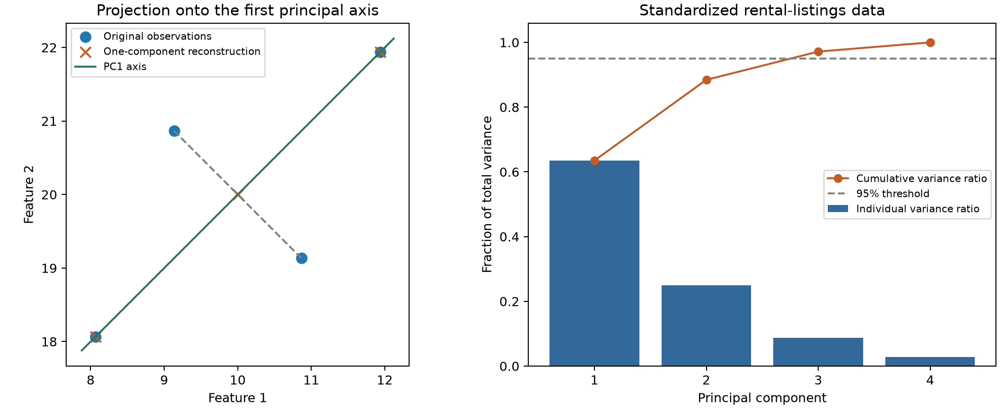

# Principal Component Analysis — From First Principles

Section: [[00 - Feature Engineering]]
Prerequisite: [[01 - Feature Engineering - From First Principles]]

> [!abstract] Central idea
> Principal component analysis (PCA) finds perpendicular directions along which a dataset varies most. It expresses observations using coordinates along those directions. Retaining only the leading coordinates gives a lower-dimensional approximation of the data.

Two measurements can describe much of the same underlying variation. Larger apartments often have more rooms; taller people often have longer limbs. Recording both measurements provides two columns, but the observations may lie close to a line rather than filling the entire two-dimensional plane. PCA identifies that line and uses position along it as a new feature.

PCA is a method of **feature extraction**: its output columns are combinations of the original inputs. It does not usually select a few original columns. It also does not use the target labels when learning its directions. Its objective is to preserve variation in the inputs, which is different from preserving information useful for a prediction task.

## Contents

- [[#1. Dimensions, redundancy, and compression]]
- [[#2. Geometric intuition]]
- [[#3. The mathematical building blocks]]
- [[#4. Deriving the principal directions]]
- [[#5. A complete numerical example]]
- [[#6. Projection and reconstruction]]
- [[#7. Explained variance and the number of components]]
- [[#8. Centering, scaling, and whitening]]
- [[#9. Interpreting components]]
- [[#10. PCA in a machine-learning pipeline]]
- [[#11. Worked experiment on rental listings]]
- [[#12. Strengths, limitations, and alternatives]]
- [[#13. Common misconceptions]]
- [[#14. Review exercises]]
- [[#15. References]]

## 1. Dimensions, redundancy, and compression

### 1.1 A feature is a coordinate

A listing described by area, rooms, rent, and distance has four coordinates:

$$x_i=[\text{area}_i,\text{rooms}_i,\text{rent}_i,\text{distance}_i].$$

Here, $i$ identifies the observation. Four input columns mean four dimensions, regardless of whether the dataset has 100 or one million rows. Adding observations increases sample size; adding features increases dimensionality.

For $n$ observations and $p$ numeric features, the feature matrix is

$$X\in\mathbb{R}^{n\times p}.$$

This notation means a table of real numbers with $n$ rows and $p$ columns. A reduced representation has $k$ columns, where $k<p$:

$$Z\in\mathbb{R}^{n\times k}.$$

### 1.2 Ambient dimension and effective dimension

Consider two identical columns. Their observations lie exactly on the line $x_2=x_1$. Although each row contains two numbers, one number is enough to recover both. The data occupy a one-dimensional subspace within a two-dimensional coordinate system.

When the columns are nearly identical, points form a narrow cloud around that line. One coordinate captures most of their variation, while a second coordinate records small departures from the line. Discarding the second coordinate introduces approximation error.

The number of supplied coordinates is the **ambient dimension**. The number of directions needed to describe the data approximately can be much smaller. PCA measures this through linear directions; it does not discover every possible form of low-dimensional structure.

### 1.3 Selection versus extraction

| Operation | Example | What remains interpretable directly? |
|---|---|---|
| Feature selection | Keep area and distance; discard rooms and rent | Original column meanings |
| PCA feature extraction | Replace four inputs with two weighted combinations | New coordinates whose meanings require examining their weights |

Selection removes columns. PCA changes the coordinate system and can then discard some of the new coordinates. A model trained on principal components usually still needs **all original inputs used to compute those components** at prediction time. Reducing the number of model inputs therefore does not automatically reduce data-collection requirements.

## 2. Geometric intuition

### 2.1 Rotating the coordinate system

Suppose a two-feature scatter plot forms a long, narrow diagonal cloud. Measuring movement horizontally and vertically separately obscures the cloud's dominant structure. A more natural coordinate system has:

1. One axis along the length of the cloud.
2. A second axis across its width.

PCA finds these axes from the observations. The first is the **first principal direction**. The coordinate of an observation along that direction is its **first principal-component score**.

Keeping both coordinates is a change of basis: the same points are described in a different coordinate system. Keeping only the first coordinate is dimensionality reduction.

### 2.2 Projection as a shadow

Imagine shining light perpendicular to a line through the centre of the cloud. Every observation casts a shadow on the line. Its position along the line is a one-dimensional description of the observation.

Different line orientations produce different shadows. A line across the cloud's narrow width gives tightly packed scores. A line along its length gives a broad spread of scores. PCA chooses the orientation with the largest score variance.

For centred observations and orthogonal projection, the same choice also minimizes the total squared distances from points to their shadows. These are two descriptions of one optimization problem:

- **Maximum retained variance:** preserve as much spread as possible along the retained directions.
- **Minimum reconstruction error:** lose as little squared distance as possible when replacing observations by their projections.

The equivalence concerns squared Euclidean error in the representation supplied to PCA. Standardizing inputs changes that representation and therefore changes what counts as a large error.

### 2.3 Subsequent components

The second principal direction captures the greatest remaining variance while being perpendicular to the first. The third must be perpendicular to both, and so on.

Perpendicular directions are called **orthogonal**. Requiring orthogonality prevents the procedure from choosing the same high-variance direction repeatedly. The resulting training component scores have zero covariance with one another.

> [!important] Variance is not predictive importance
> PCA does not know which outcome matters. Large variation can describe signal, nuisance variation, measurement scale, or outliers. A small-variance direction can be essential for predicting the target.



*Left: a two-dimensional example projected onto its first principal axis. Dashed segments show reconstruction errors. Right: individual and cumulative explained variance for standardized rental-listing features. The calculations behind both panels appear below.*

## 3. The mathematical building blocks

### 3.1 Notation

| Symbol | Meaning | Shape |
|---|---|---|
| $X$ | Original feature matrix | $n\times p$ |
| $\mu$ | Vector of training feature means | $p$ entries |
| $X_c$ | Column-centred feature matrix | $n\times p$ |
| $S$ | Sample covariance matrix | $p\times p$ |
| $v_j$ | Unit direction of component $j$ | $p$ entries |
| $\lambda_j$ | Variance along direction $v_j$ | Scalar |
| $V_k$ | First $k$ directions stored as columns | $p\times k$ |
| $Z$ | Component scores | $n\times k$ |

The superscript $T$ denotes transpose: rows become columns. The notation $\|v\|$ denotes vector length. The identity matrix $I$ leaves a vector unchanged when multiplied by it.

### 3.2 Centering

For feature $j$, calculate its training mean:

$$\mu_j=\frac{1}{n}\sum_{i=1}^{n}x_{ij}.$$

Then subtract that mean from every entry in the column:

$$x_{c,ij}=x_{ij}-\mu_j.$$

Centering moves the training cloud's centre to the origin. PCA then describes variation **around the mean**, rather than letting the location of the entire cloud dominate the calculation.

Centering does not change the distance between two observations. It also does not equalize feature scales. Subtracting a mean rent of ₹30,000 leaves rent measured in rupees.

### 3.3 Variance

The sample variance of a centred column is

$$s_j^2=\frac{1}{n-1}\sum_{i=1}^{n}x_{c,ij}^2.$$

Variance measures squared spread around a mean. Its units are the square of the original units. Standard deviation is the square root of variance and has the original units.

The denominator $n-1$ is the usual sample-variance convention. PCA's explained variances in scikit-learn use this convention. It differs from the $n$ denominator used by `StandardScaler` for its scaling statistics; this distinction does not change the principal directions or explained-variance ratios when the difference is a common factor.

### 3.4 Covariance

For two centred columns, covariance is

$$\operatorname{cov}(x_j,x_\ell)=\frac{1}{n-1}\sum_{i=1}^{n}x_{c,ij}x_{c,i\ell}.$$

If both features tend to be above their means together, their products tend to be positive. If one tends to be above its mean when the other is below, the products tend to be negative. Covariance summarizes this joint movement.

The covariance matrix collects every pair:

$$S=\frac{1}{n-1}X_c^TX_c.$$

Diagonal entries are feature variances. Off-diagonal entries are covariances. The matrix is symmetric because swapping the two features does not change their covariance.

Correlation rescales covariance by the two standard deviations. PCA on standardized columns is therefore closely related to decomposing a correlation matrix; PCA on unscaled columns decomposes the covariance structure in the original units.

### 3.5 Dot products and projection

For a unit direction $v$, the projection score of observation $x_c$ is

$$z=x_c^Tv.$$

This **dot product** multiplies corresponding entries and adds them. The condition $v^Tv=1$ means that $v$ has length one, so the score measures position along the direction without an arbitrary stretch factor.

For all observations together:

$$z=X_cv.$$

The projected point in the original centred coordinate system is $zv$. A score is one number; a projected point is a vector with $p$ coordinates. Distinguishing them prevents confusion during reconstruction.

## 4. Deriving the principal directions

### 4.1 The maximum-variance problem

Because $X_c$ is centred, the scores $X_cv$ have mean zero. Their sample variance is

$$\operatorname{Var}(X_cv)=\frac{1}{n-1}(X_cv)^T(X_cv)=v^TSv.$$

The first principal direction solves

$$\max_v v^TSv\quad\text{subject to}\quad v^Tv=1.$$

The unit-length restriction is essential. Without it, multiplying $v$ by an arbitrarily large constant would increase the score variance without finding a better direction.

### 4.2 Eigenvectors and eigenvalues

An eigenvector of $S$ is a nonzero vector whose direction is preserved by multiplication by $S$:

$$Sv=\lambda v.$$

The scalar $\lambda$ is its eigenvalue. For a covariance matrix, eigenvalues are nonnegative. Intuitively, they measure how much spread the dataset has along the corresponding eigenvector directions.

The constrained maximization produces this equation. Introducing a multiplier gives

$$L(v,\lambda)=v^TSv-\lambda(v^Tv-1).$$

Setting the derivative with respect to $v$ to zero yields

$$2Sv-2\lambda v=0\quad\Rightarrow\quad Sv=\lambda v.$$

For a unit eigenvector, its score variance is

$$v^TSv=v^T(\lambda v)=\lambda.$$

Therefore, the eigenvector with the largest eigenvalue gives the first principal direction. The others follow in descending eigenvalue order:

$$\lambda_1\geq\lambda_2\geq\cdots\geq\lambda_p\geq0.$$

The covariance matrix admits an orthonormal eigenvector basis: the vectors are mutually perpendicular and each has length one. If eigenvalues are tied, the individual directions within the tied subspace are not unique.

### 4.3 Singular value decomposition

PCA can also be calculated directly from the centred data matrix using **singular value decomposition (SVD)**:

$$X_c=U\Sigma V^T.$$

In a thin decomposition with $r=\min(n,p)$, $U$ has shape $n\times r$, $\Sigma$ is an $r\times r$ diagonal matrix, and $V$ has shape $p\times r$. Columns of $U$ and $V$ are orthonormal. The diagonal entries $\sigma_j$ of $\Sigma$ are singular values, ordered from largest to smallest.

Substitution into the covariance equation gives

$$S=V\frac{\Sigma^2}{n-1}V^T.$$

Thus the columns of $V$ supply the principal directions, and

$$\lambda_j=\frac{\sigma_j^2}{n-1},\qquad X_cV_k=U_k\Sigma_k.$$

SVD avoids explicitly constructing a potentially large covariance matrix. Forming $X_c^TX_c$ also squares the ratio of its largest to smallest nonzero singular values, which can worsen numerical sensitivity. Implementations offer different solvers for different matrix sizes; the worked example uses `svd_solver="full"` for a direct, reproducible calculation.

## 5. A complete numerical example

### 5.1 Four observations

Consider the following two-feature dataset. Displayed values are rounded; the companion script constructs the exact values used in the calculation.

| Observation | Feature 1 | Feature 2 |
|---|---:|---:|
| A | 11.9365 | 21.9365 |
| B | 8.0635 | 18.0635 |
| C | 10.8660 | 19.1340 |
| D | 9.1340 | 20.8660 |

The mean is $\mu=[10,20]$. After centering, the points are

$$X_c=\begin{bmatrix}
\sqrt{15}/2&\sqrt{15}/2\\
-\sqrt{15}/2&-\sqrt{15}/2\\
\sqrt{3}/2&-\sqrt{3}/2\\
-\sqrt{3}/2&\sqrt{3}/2
\end{bmatrix}.$$

Each column's squared entries sum to 9, so each sample variance is $9/3=3$. The cross-products sum to 6, so the covariance is $6/3=2$:

$$S=\begin{bmatrix}3&2\\2&3\end{bmatrix}.$$

### 5.2 Directions and variances

Two unit directions are

$$v_1=\frac{1}{\sqrt2}\begin{bmatrix}1\\1\end{bmatrix},\qquad
v_2=\frac{1}{\sqrt2}\begin{bmatrix}1\\-1\end{bmatrix}.$$

Multiplication verifies

$$Sv_1=5v_1,\qquad Sv_2=1v_2.$$

The eigenvalues are therefore 5 and 1. The first direction describes joint increases in both features. The second describes a contrast: one feature increases while the other decreases.

### 5.3 Component scores

The two new coordinates are

$$z_1=\frac{(x_1-10)+(x_2-20)}{\sqrt2},$$

$$z_2=\frac{(x_1-10)-(x_2-20)}{\sqrt2}.$$

| Observation | PC1 score | PC2 score |
|---|---:|---:|
| A | $\sqrt{7.5}\approx2.7386$ | 0 |
| B | $-\sqrt{7.5}\approx-2.7386$ | 0 |
| C | 0 | $\sqrt{1.5}\approx1.2247$ |
| D | 0 | $-\sqrt{1.5}\approx-1.2247$ |

The first score's sample variance is $(7.5+7.5)/3=5$. The second's is $(1.5+1.5)/3=1$. These match the eigenvalues.

### 5.4 Keep one component

Total variance is $5+1=6$. PC1 retains $5/6\approx83.33\%$ of it. Reducing to one dimension keeps the PC1 column and discards PC2.

A and B lie on the first principal axis, so they reconstruct exactly. C and D both have PC1 score zero, so both reconstruct to the mean $[10,20]$. Their distinction is lost.

The total squared reconstruction error is $1.5+1.5=3$. This is not a failure of the calculation: it is the cost of removing the second coordinate.

## 6. Projection and reconstruction

### 6.1 Transformation

Store the retained directions as columns of $V_k$. The reduced coordinates are

$$Z=X_cV_k.$$

The dimensions verify the calculation:

$$(n\times p)(p\times k)=n\times k.$$

For a new observation, subtract the **training mean** and apply the **training directions**. Recomputing PCA on a new batch would produce a different coordinate system, incompatible with a downstream model trained on the original scores.

### 6.2 Inverse transformation

The reconstruction is

$$\hat X_c=ZV_k^T,\qquad \hat X=ZV_k^T+\mu.$$

The mean vector is added to every row. This is an exact inverse only when the retained directions span all of the relevant variation. With fewer directions, it is an approximation: multiple original points can share the same reduced coordinates.

Keeping all $p$ directions gives $V_pV_p^T=I$ and recovers every centred input, up to floating-point error. With fewer directions that span the training data's nonzero-variance subspace, training reconstruction can still be exact, but a future observation may contain variation outside that subspace.

### 6.3 Why maximum variance minimizes squared error

For an orthogonal projection, each centred point splits into perpendicular retained and discarded parts. The Pythagorean theorem gives

$$\|x_c\|^2=\|\hat x_c\|^2+\|x_c-\hat x_c\|^2.$$

The left-hand side is fixed. Increasing retained squared length must decrease discarded squared length. Summing over observations shows why maximum retained variance and minimum reconstruction error select the same subspace.

For the best $k$-component approximation,

$$\operatorname{SSE}=\|X_c-\hat X_c\|_F^2
=(n-1)\sum_{j=k+1}^{p}\lambda_j.$$

The subscript $F$ denotes the **Frobenius norm**: square every entry in the error matrix, add the squares, and take the square root. SSE is the square of this norm. Mean squared error per entry is $\operatorname{SSE}/(np)$.

This is an optimality statement about **linear, rank-$k$ reconstruction under squared error**. It does not claim optimal classification accuracy, preservation of every pairwise distance, or the best possible nonlinear compression.

### 6.4 Rank and component limits

Centering imposes a dependency among the rows: their sum is zero. Consequently,

$$\operatorname{rank}(X_c)\leq\min(n-1,p).$$

There can be at most that many nonzero-variance components. Requesting an additional component may produce a zero or numerically tiny variance when the solver permits it. Constant features contribute no variation and generally should be removed before interpreting PCA.

## 7. Explained variance and the number of components

### 7.1 Individual and cumulative ratios

The explained-variance ratio of component $j$ is

$$r_j=\frac{\lambda_j}{\sum_{\ell=1}^{p}\lambda_\ell}.$$

The cumulative ratio for the first $k$ components is

$$R_k=\sum_{j=1}^{k}r_j.$$

For the numerical example, $r_1=5/6$, $r_2=1/6$, and $R_2=1$. These ratios describe the training inputs in the representation supplied to PCA. For constant data with zero total variance, explained-variance ratios are not meaningful.

“95% explained variance” means that the retained directions capture 95% of the total training variance. It does **not** mean 95% accuracy, 95% of the original columns, or 95% of all useful information.

### 7.2 Scree plots and elbows

A **scree plot** shows eigenvalues or individual explained-variance ratios in descending order. A sharp bend, or elbow, can indicate that later components add comparatively little variance. A cumulative plot shows how many components are needed to reach a chosen fraction.

An elbow is a heuristic rather than an objective truth. Some datasets have no clear bend. Different scaling choices can also produce very different plots.

### 7.3 Choose the criterion for the task

| Purpose | Suitable criterion |
|---|---|
| Two-dimensional visualization | Two components, with the omitted variance reported |
| Compression | Storage constraints and acceptable reconstruction error |
| Denoising | Evidence that discarded directions mainly contain noise |
| Predictive modelling | Cross-validated downstream performance, including a no-PCA baseline |
| Approximate input preservation | A prespecified cumulative-variance threshold |

Variance thresholds such as 90%, 95%, or 99% are conventions, not universal guarantees. In a predictive pipeline, the component count can be treated as a hyperparameter and tuned using training/development evaluation.

For scikit-learn, an integer `n_components=3` requests three coordinates. With `svd_solver="full"`, a fraction such as `n_components=0.95` selects enough components to exceed the requested cumulative variance fraction. The fitted count is available as `n_components_`. See the [PCA API](https://scikit-learn.org/stable/modules/generated/sklearn.decomposition.PCA.html).

### 7.4 A low-variance predictive signal

Suppose $x_1$ is a large, irrelevant fluctuation with variance 100, while $x_2$ has variance 1 and the target is determined by whether $x_2>0$. If the inputs are uncorrelated, unscaled PCA retains $x_1$ first. A one-component representation preserves about 99% of the variance and discards the predictive signal.

Standardizing solves the unequal-unit version of this problem, but not the general mismatch between input variance and prediction. For example, many standardized, strongly correlated nuisance measurements can form a dominant component, while a label-relevant contrast between two similar measurements has low variance. The target still does not participate in PCA's objective.

## 8. Centering, scaling, and whitening

### 8.1 Centering and standardizing are separate operations

Ordinary scikit-learn `PCA` centres its input during fitting but does not standardize each feature. `StandardScaler` can precede it when comparable relative variation is appropriate. See the [decomposition guide](https://scikit-learn.org/stable/modules/decomposition.html).

```python
representation = Pipeline([
    ("scale", StandardScaler()),
    ("pca", PCA(n_components=2, svd_solver="full")),
])
Z_train = representation.fit_transform(X_train)
Z_valid = representation.transform(X_valid)
```

In rental data, rent may have numerical variation in the tens of thousands while room counts vary by a few units. Raw PCA can become dominated by rent because squared rupee differences overwhelm squared room-count differences.

Standardization uses

$$x'_{ij}=\frac{x_{ij}-\mu_j}{s_j}.$$

Each nonconstant training column then has population variance one under `StandardScaler`'s convention. PCA compares relative deviations rather than raw numerical units. It can still discover correlations: equal individual variances do not imply equal variance in every joint direction.

### 8.2 When unscaled PCA is appropriate

Scaling is not compulsory. If features share meaningful units and their absolute variances should influence the result, unscaled PCA may be appropriate. Measurements from comparable sensors or image pixels can be examples, depending on the application.

Standardizing a nearly constant, noisy measurement gives its small fluctuations the same initial variance as a reliable feature. That can amplify noise. The correct choice depends on what differences should count as important, not on a rule that scaling is always beneficial.

### 8.3 Reconstruction units

If PCA receives standardized data, its inverse transformation returns an approximation in **standardized units**. Recovering original units also requires reversing the scaler:

```python
Z = representation.transform(X_valid)
X_valid_reconstructed = representation.inverse_transform(Z)
```

This two-step pipeline supports the inverse because both transformations provide one. A classifier pipeline does not generally provide the same operation. An imputer also cannot ordinarily recover the original missing entries merely by reversing its replacement rule.

Squared reconstruction error in standardized space weights a raw error by the inverse square of that feature's training scale. It is therefore different from adding squared errors in the original units.

### 8.4 Whitening

Ordinary PCA scores are uncorrelated but have variances $\lambda_1,\lambda_2,\ldots$. Whitening additionally divides each nonzero-variance score by its standard deviation:

$$z_j^{\text{white}}=\frac{z_j}{\sqrt{\lambda_j}}.$$

The training covariance of these whitened coordinates is the identity matrix under the corresponding sample-variance convention. Whitening changes the relative scale of components; it does not change which principal directions are retained.

Whitening can be useful when a downstream procedure should treat retained directions equally. It can also amplify small-variance noise and change how regularization behaves. It is not a default improvement. Division by a zero eigenvalue is undefined, so zero-variance directions should not be treated as useful whitening dimensions.

Distinguish three operations:

| Operation | Coordinates being scaled | Result |
|---|---|---|
| Standardization | Original feature columns | Comparable original-feature scales |
| PCA without whitening | Rotated component coordinates | Uncorrelated training scores with descending variances |
| PCA with whitening | Retained component coordinates | Uncorrelated training scores rescaled to unit variance |

## 9. Interpreting components

### 9.1 Directions, weights, and scores

A component direction contains one coefficient per input feature. For example,

$$z_1=0.60\,a'+0.57\,q'+0.55\,r'-0.05\,d'$$

could describe a joint size-and-price direction, where primes denote standardized area, rooms, rent, and distance. The coefficients describe the axis. A listing's score describes where that listing lies along it.

The term **loading** has multiple conventions. It can mean the eigenvector coefficient $v_{\ell j}$, or the coefficient multiplied by $\sqrt{\lambda_j}$. Under sample-unit-variance standardization, the latter is the correlation between feature $\ell$ and component score $j$. More generally, that correlation is

$$\operatorname{corr}(x_\ell,z_j)=\frac{\sqrt{\lambda_j}\,v_{\ell j}}{s_\ell}.$$

Here $s_\ell$ is the sample standard deviation of the feature in the actual PCA input. Naming the convention avoids treating different loading tables as contradictory.

Scikit-learn's `components_` stores direction vectors as **rows**, so its shape is $(k,p)$. For a loading-style table with features as rows and components as columns, use `pca.components_.T`.

### 9.2 Sign ambiguity

If $v$ is a valid direction, $-v$ describes the same axis. Reversing the direction also reverses all its scores, leaving reconstruction unchanged:

$$(X_c(-v))(-v)^T=(X_cv)v^T.$$

The sign of a single coefficient is therefore not intrinsically meaningful. Relative signs within a component still describe whether variables move together or oppose one another along that axis. Results with all signs reversed for a component are equivalent.

### 9.3 Uncorrelated does not mean independent

PCA makes the training score covariance diagonal. This removes linear correlation, not every possible dependence. For example, a symmetric variable $u$ and $u^2$ can have zero covariance despite a deterministic relationship.

Under a multivariate Gaussian distribution, uncorrelated coordinates are independent. Without that additional distributional assumption, independence does not follow. PCA itself does not require Gaussian data to compute its variance-maximizing directions.

The learned directions remain perpendicular when applied to future data, but the resulting future scores need not have diagonal covariance. Their distribution may differ from the training distribution.

### 9.4 Stability and interpretation

When eigenvalues are close, small sample changes can rotate their individual directions substantially. The combined subspace may be stable even when component-by-component names are not. Distinct-looking components can therefore describe similar retained geometry.

PCA weights are not causal effects, regression coefficients for a target, or universal feature importances. A large weight means that a feature contributes strongly to a particular variance direction under the chosen preprocessing.

## 10. PCA in a machine-learning pipeline

### 10.1 Fitting PCA is a learning operation

PCA learns a mean, directions, and variances from observations. It therefore belongs inside the evaluated pipeline, even though it ignores target labels.

```text
Training fold:
    fit imputer → fit scaler → fit PCA → fit classifier

Validation fold:
    apply fitted imputer → apply fitted scaler → apply fitted PCA → predict
```

Fitting PCA on the complete dataset before cross-validation allows validation observations to influence the representation. This is leakage. The same restriction applies to selecting a component count from a variance plot calculated using the final test data.

### 10.2 A complete classifier pipeline

```python
from sklearn.decomposition import PCA
from sklearn.impute import SimpleImputer
from sklearn.linear_model import LogisticRegression
from sklearn.pipeline import Pipeline
from sklearn.preprocessing import StandardScaler

model = Pipeline([
    ("impute", SimpleImputer(strategy="median")),
    ("scale", StandardScaler()),
    ("pca", PCA(n_components=3, svd_solver="full")),
    ("model", LogisticRegression(C=1.0, max_iter=2000)),
])
model.fit(X_train, y_train)
probabilities = model.predict_proba(X_valid)[:, 1]
```

Median imputation supplies finite values when inputs are missing. Standardization sets the feature scales. PCA creates three new coordinates. Logistic regression uses those coordinates to predict class probabilities.

The classifier uses labels; the PCA transformation does not. A supervised task can therefore contain an unsupervised representation step.

### 10.3 Tuning the component count

```python
from sklearn.model_selection import GridSearchCV, StratifiedKFold

inner_cv = StratifiedKFold(n_splits=5, shuffle=True, random_state=42)
search = GridSearchCV(
    model,
    param_grid={"pca__n_components": [1, 2, 3, 4]},
    scoring="roc_auc",
    cv=inner_cv,
)
search.fit(X_dev, y_dev)
```

The parameter name `pca__n_components` addresses the `n_components` setting of the pipeline step named `pca`. The candidate range must respect the number of features and the training-fold size. Here, four input columns make counts from one to four valid.

The best internal CV score has participated in selection and is not an independent final performance estimate. Evaluate the selected procedure using an untouched test set or an outer CV loop. A variance threshold fitted inside each fold is also valid, though it may select different counts in different folds.

### 10.4 Why keeping every component can leave a model unchanged

Full, unwhitened PCA is an orthogonal rotation of the centred input space. A linear model can absorb that rotation into its coefficients. L2 regularization is also rotation-invariant because an orthogonal transformation preserves squared coefficient length.

Consequently, standardized logistic regression with an L2 penalty and all PCA components should give effectively the same predictions as the corresponding model without PCA, subject to solver tolerances. Keeping all components generally adds computation without compression.

This equivalence does not automatically extend to L1 penalties, whitening, axis-aligned trees, or a reduced component set. L1 coefficient sums depend on the axes; whitening changes scale; trees split along individual input coordinates.

## 11. Worked experiment on rental listings

### 11.1 Dataset and execution

The experiment uses the same [800-row synthetic listings dataset](examples/listings.csv) as the feature-engineering lecture:

| Input | Meaning |
|---|---|
| `area` | Floor area in square feet |
| `rooms` | Number of rooms |
| `rent` | Monthly advertised rent in INR |
| `distance` | Distance to the city centre in kilometres |
| `left_fast` | Target: 1 if rented within seven days, otherwise 0 |

Only the first four columns enter PCA. The target is never included in the feature matrix. The data-generating process makes the target depend on rent per area and distance; these are synthetic relationships, not housing-market findings.

The complete runnable script is [pca_demo.py](examples/pca_demo.py). From the repository root:

```powershell
python "learn/_ml/Feature Engineering/examples/pca_demo.py"
```

Dependencies for a fresh environment:

```powershell
python -m pip install numpy pandas scikit-learn matplotlib
```

The script reads `listings.csv`, checks the numerical example and reconstruction identity, compares pipelines, and saves [the results](examples/pca_results.txt) and the figure embedded above. The code excerpts in these notes illustrate individual operations; the linked script contains the complete executable program.

### 11.2 Evaluation design

A fixed stratified split reserves 160 observations for final testing and leaves 640 for development. Stratification approximately preserves the class proportions. Candidate pipelines use identical five-fold partitions repeated three times, producing 15 validation scores each.

The comparison includes standardized logistic regression without PCA, with one through four components, and with a 95% variance threshold. Every fitted imputer, scaler, and PCA belongs inside its training fold. The classifier's regularization setting remains fixed.

The primary metric is **ROC AUC**, a measure of ranking quality. It is the probability that a randomly selected positive receives a higher score than a randomly selected negative, with half credit for ties. A constant score has AUC 0.5. AUC is not classification accuracy.

The PCA inspection tables below are fitted on development data only. The test labels do not influence those tables or the chosen pipeline.

### 11.3 Scaling changes the apparent compressibility

| Component | Raw-input variance ratio | Standardized-input variance ratio |
|---|---:|---:|
| PC1 | 0.9998154 | 0.635031 |
| PC2 | 0.0001844 | 0.249336 |
| PC3 | 0.000000134 | 0.087264 |
| PC4 | 0.000000000743 | 0.028369 |

Unscaled PCA appears to preserve almost all variance with one coordinate because rent dominates the numerical scale. That does not establish that room count or distance is redundant. Standardization changes the geometry: the first component now preserves about 63.5%, and the first two preserve about 88.4%.

### 11.4 Component directions

The standardized development-data directions are:

| Feature | PC1 | PC2 | PC3 | PC4 |
|---|---:|---:|---:|---:|
| Area | 0.6025 | 0.0355 | -0.1394 | 0.7851 |
| Rooms | 0.5740 | -0.0019 | -0.6082 | -0.5484 |
| Rent | 0.5524 | 0.0517 | 0.7806 | -0.2877 |
| Distance | -0.0490 | 0.9980 | -0.0367 | -0.0141 |

PC1 combines larger area, more rooms, and higher total rent. PC2 is almost entirely distance. PC3 contrasts rent with room count and, to a lesser extent, area. These are descriptions of input variation, not learned explanations of the target.

The table contains direction coefficients, not per-feature predictive importance. An equivalent implementation could reverse the signs of an entire column.

### 11.5 Variance retained and reconstruction error

| Retained components | Cumulative variance | MSE per standardized entry |
|---:|---:|---:|
| 1 | 0.635031 | 0.364969 |
| 2 | 0.884367 | 0.115633 |
| 3 | 0.971631 | 0.028369 |
| 4 | 1.000000 | Approximately 0 |

Three components exceed the 95% threshold. The MSE here equals the discarded variance fraction because all four nonconstant training columns were standardized to population variance one. That numerical equality is specific to this scaling and per-entry error definition; it is not a universal formula for arbitrary raw datasets.

### 11.6 Predictive performance

| Pipeline | Mean CV ROC AUC | Fold-score standard deviation |
|---|---:|---:|
| Standardized features, no PCA | 0.833800 | 0.020743 |
| PCA: 1 component | 0.545877 | 0.032252 |
| PCA: 2 components | 0.678179 | 0.042831 |
| PCA: 3 components | 0.793613 | 0.027906 |
| PCA: all 4 components | 0.833800 | 0.020743 |
| PCA: 95% variance threshold | 0.793613 | 0.027906 |

The first component summarizes a large fraction of input variation but predicts rental speed poorly. Preserving approximately 97% of the input variance with three components still reduces AUC relative to the four-input baseline. The discarded direction contains variation useful to the fitted predictor.

Keeping all four components matches the no-PCA model, consistent with rotation invariance of the L2-regularized linear classifier. PCA does not create the nonlinear rent-per-area relationship: a linear combination of raw area and rent is generally not the ratio of rent to area. Domain-based feature construction and PCA solve different problems.

The score standard deviations describe variation across overlapping folds. They are not confidence intervals and should not be treated as estimates from 15 independent datasets.

The selection rule chooses the highest mean CV AUC, preferring the earlier candidate when scores differ by at most $10^{-10}$. This resolves the numerical tie in favour of the simpler no-PCA pipeline. Its held-out ROC AUC is **0.805154**.

This test set was also used in the preceding lecture's experiment. Each script keeps it out of fitting and selection, but repeated research decisions informed by either test result would compromise its independence. A subsequent model revision requires fresh held-out evidence or an appropriate outer evaluation. The examples are illustrations of evaluation structure, not independent benchmark studies.

Recorded environment: Python 3.14.7, NumPy 2.5.3, pandas 3.0.5, and scikit-learn 1.9.0. Small numerical differences across library versions are possible.

## 12. Strengths, limitations, and alternatives

### 12.1 Useful applications

PCA can compress highly correlated measurements, accelerate some downstream calculations, expose broad variation patterns, and provide two- or three-dimensional visualizations. It can reduce noise when low-variance directions are predominantly noise, and remove redundant linear directions that make numerical problems poorly conditioned.

These benefits must be checked against the task. Computing PCA itself has a cost. Reducing four columns to three rarely yields a meaningful speed benefit; reducing thousands of correlated coordinates may.

### 12.2 Outliers and nonlinear structure

Variance uses squared deviations, so extreme observations can strongly influence principal directions. Standardization does not make PCA robust to outliers: the mean and standard deviation are themselves sensitive to extremes. Data validation, suitable transforms, and robust methods may be needed.

A curved one-dimensional structure, such as points along a semicircle, may require two linear PCA coordinates to represent well. PCA finds a flat subspace, not a curved coordinate system. It can describe some nonlinear data approximately, but it does not generally “unroll” nonlinear manifolds.

### 12.3 Missing values, categories, and sparse inputs

Ordinary PCA requires an appropriate finite numeric matrix. Missing values require a defined treatment before fitting. Arbitrary integer codes for categories create artificial distances; applying PCA to those codes does not fix their meaning.

One-hot encoded categories can be used numerically, but feature frequency and scaling affect the geometry. Standardizing rare binary indicators can give them substantial weight. The result should reflect an intentional representation choice.

Large sparse text matrices require special care because centering can destroy sparsity. **TruncatedSVD** is commonly used in that setting and does not centre its input. It is therefore not generally equivalent to centred PCA. Specialized sparse support and solver constraints should be checked for the chosen implementation.

### 12.4 Related methods

| Method | Main distinction from ordinary PCA |
|---|---|
| Feature selection | Retains original columns rather than rotating them |
| Kernel PCA | Uses a kernel-defined space to capture some nonlinear structure |
| Incremental PCA | Processes batches when the full data matrix is inconvenient to hold in memory |
| Sparse PCA | Encourages components with fewer nonzero weights; ordinary PCA orthogonality properties need not hold |
| Linear discriminant analysis | Uses class labels to find discriminative directions |
| Independent component analysis | Seeks statistical independence under additional modelling assumptions |
| Autoencoder | Learns reconstruction through a neural network and can model nonlinear compression |

The right alternative depends on the objective: interpretation, compression, visualization, separation of classes, or reconstruction. None is a universal replacement for evaluating the original-feature baseline.

## 13. Common misconceptions

| Misconception | Correct interpretation |
|---|---|
| PCA keeps the most important original columns. | It retains weighted directions, usually involving many original columns. |
| The first component is best for predicting the target. | It has the greatest input variance; labels do not determine it. |
| 95% explained variance means 95% accuracy. | It describes retained variance in the PCA input representation. |
| PCA always requires standardization. | Standardization is a modelling choice about units and relative variation. |
| PCA automatically standardizes features. | Ordinary PCA centres inputs; scaling is separate. |
| Every PCA component has variance one. | Only appropriately whitened scores have unit variance. |
| Orthogonal components are always independent. | Their training scores are uncorrelated; independence requires stronger conditions. |
| PCA is safe to fit before splitting because it ignores labels. | Unseen observations would still influence the representation. |
| Inverse transformation recovers information discarded by PCA. | It reconstructs an approximation from the retained coordinates. |
| More components always improve validation performance. | Training reconstruction improves, but prediction may improve or worsen. |
| A reversed component sign changes the solution. | Reversing both direction and scores leaves the projection unchanged. |
| PCA always improves a model. | It can discard useful information and add computation. |

## 14. Review exercises

### Conceptual questions

1. A dataset has 10,000 rows and 12 feature columns. What is its input dimension?
2. How does keeping every principal component differ from keeping only two?
3. Why must the first principal direction have unit length?
4. Why does centering not solve the problem of rent and rooms having different units?
5. What does a negative component weight mean when the whole component can reverse sign?
6. Can PCA preserve almost all input variance and still destroy predictive performance?
7. Why does the number of nonzero-variance components never exceed $n-1$ after centering?
8. Why must PCA be refitted separately within each cross-validation training fold?

> [!success]- Answers
> 1. Twelve dimensions; row count is sample size.
> 2. Keeping every direction changes coordinates without discarding input-space dimensions. Keeping two usually loses variation outside their span.
> 3. Otherwise its length could increase the score variance arbitrarily without changing its orientation.
> 4. Centering subtracts location; the units and scale of deviations remain unchanged.
> 5. Its sign describes a relative direction of movement within the chosen axis orientation, not an intrinsic positive or negative effect.
> 6. Yes. A low-variance direction may carry the target signal.
> 7. Centred rows sum to zero, creating a linear dependency.
> 8. Validation observations must not influence the learned mean, scales, directions, or retained count.

### Calculation exercise

A covariance matrix has eigenvalues $8,3,1$. Calculate the fraction of variance retained by one and two components. Determine the smallest count that reaches 90%.

> [!success]- Solution
> Total variance is 12. One component retains $8/12=66.67\%$. Two retain $11/12=91.67\%$, so two components reach 90%. For $n$ observations, the two-component training reconstruction SSE is $(n-1)\times1$.

### Practical exercises

- Change rent from rupees to thousands of rupees. Compare raw PCA before and after the unit change, then repeat with standardized PCA.
- Fit one through four components and verify that training reconstruction error never increases as more directions are retained.
- Reverse one fitted component direction and its corresponding scores. Verify that their reconstructed contribution is unchanged.
- Compare a variance-threshold choice with a component count chosen by downstream CV performance. Keep the final test data outside both choices.
- Add a rent-per-area feature before PCA and compare the resulting pipeline on development data. Explain why constructing a ratio and rotating coordinates are distinct operations.

## 15. References

- [Scikit-learn PCA API](https://scikit-learn.org/stable/modules/generated/sklearn.decomposition.PCA.html): parameters, fitted attributes, transformation, and inverse transformation.
- [Scikit-learn decomposition guide](https://scikit-learn.org/stable/modules/decomposition.html): PCA, SVD-based methods, and related decompositions.
- [[01 - Feature Engineering - From First Principles]]: scaling, leakage, model evaluation, and supervised feature selection.

Return to [[00 - Feature Engineering]].
