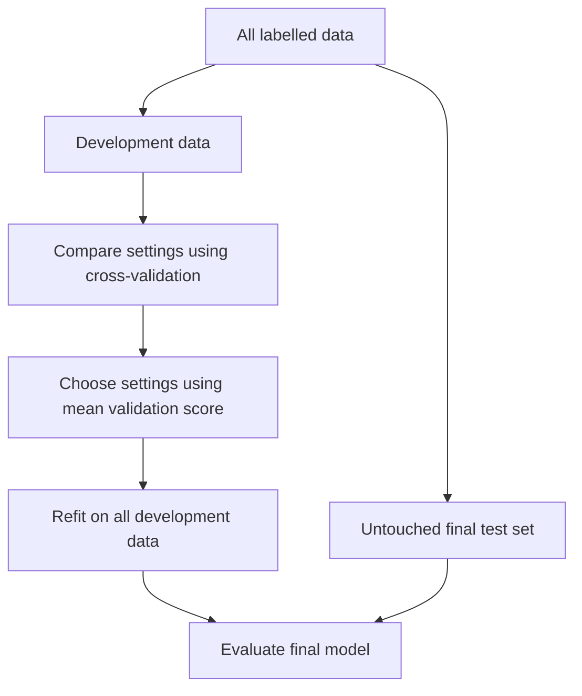

---
tags:
  - machine-learning
  - model-selection
---

# Cross-Validation and Hyperparameter Search

## 1. Three questions, three tools

| Question | Tool |
| --- | --- |
| How well does this model predict unseen examples? | **Cross-validation (CV)** |
| What does “good prediction” mean for this task? | A **scoring metric**, such as accuracy or MAE |
| Which model settings should we use? | **Hyperparameter search**, evaluated using CV |

A **parameter** is learned during fitting, such as a regression coefficient. A **hyperparameter** is a setting supplied before fitting, such as a tree’s maximum depth or an SVM’s `C`.

> [!summary] The connection
> A search proposes settings. Cross-validation evaluates those settings. A metric produces the scores used to compare them.

## 2. Keep a final test set separate

Imagine 1,000 labelled observations:

- **800 development observations:** use these to train, compare, and tune models.
- **200 final test observations:** set these aside until all choices are fixed.

Inside the development data, CV repeatedly creates **training** and **validation** subsets. Training fits a model; validation evaluates that fitted model on examples it did not train on.



Choosing settings repeatedly using the final test set would gradually make it part of training decisions. Its score would no longer be an independent final check.

## 3. K-fold cross-validation: rotate the validation set

A **fold** is one part of the data. In **5-fold CV**, split the development data into five approximately equal parts. Train five fresh models with the **same settings**, rotating which part is held out.

| Run | Fold 1 | Fold 2 | Fold 3 | Fold 4 | Fold 5 |
| --- | --- | --- | --- | --- | --- |
| 1 | **Validate** | Train | Train | Train | Train |
| 2 | Train | **Validate** | Train | Train | Train |
| 3 | Train | Train | **Validate** | Train | Train |
| 4 | Train | Train | Train | **Validate** | Train |
| 5 | Train | Train | Train | Train | **Validate** |

With 800 development observations, each run trains on **640** and validates on **160**. Each observation is used for validation once and training four times.

The result is **five validation scores**. We summarize these scores; we do not normally average the five fitted models. After choosing settings, we fit a fresh model on all 800 development observations.

Here, $K$ counts folds. It has no connection to the number of neighbours in KNN or clusters in K-means.

## 4. Worked example: mean, deviations, and standard deviation

For easy arithmetic, consider a smaller development set of 100 observations, with 20 in each validation fold. Suppose one classifier produces:

| Fold | Correct predictions | Accuracy $s_i$ | Deviation from mean $s_i-\bar{s}$ | Squared deviation |
| --- | ---: | ---: | ---: | ---: |
| 1 | 16/20 | 0.80 | −0.10 | 0.0100 |
| 2 | 18/20 | 0.90 | 0 | 0 |
| 3 | 17/20 | 0.85 | −0.05 | 0.0025 |
| 4 | 19/20 | 0.95 | +0.05 | 0.0025 |
| 5 | 20/20 | 1.00 | +0.10 | 0.0100 |

### Mean: average performance

$$
\bar{s}=\frac{1}{K}\sum_{i=1}^{K}s_i
=\frac{0.80+0.90+0.85+0.95+1.00}{5}
=\boxed{0.90}
$$

The **mean CV accuracy is 90%**. It averages performance across several held-out subsets instead of relying on one split.

### Deviation: distance from the mean

A deviation is a score minus the mean. Fold 1 is **10 percentage points below** the mean; fold 5 is 10 points above it.

Signed deviations cancel out. Squaring prevents this cancellation; taking a square root returns the result to the score’s original scale.

$$
\sigma=\sqrt{\frac{1}{K}\sum_{i=1}^{K}(s_i-\bar{s})^2}
=\sqrt{\frac{0.025}{5}}
\approx\boxed{0.0707}
$$

Report this as **mean accuracy 90%; fold standard deviation 7.1 percentage points**.

- **Mean:** how well the model performed on average.
- **Standard deviation (SD):** how much its scores varied across these folds.
- The formula uses divisor $K$, matching NumPy’s default `std(ddof=0)` and search results’ `std_test_score`. The sample-SD convention uses $K-1$ instead.

> [!important] Spread is not certainty
> “90% ± 7.1 percentage points” describes fold variation, **not a confidence interval or a guaranteed range for future accuracy**. Training sets overlap, so fold scores are not independent measurements. A small SD also does not make a poorly performing model good.

For example, scores `[0.88, 0.89, 0.90, 0.91, 0.92]` have the same mean of 0.90 but a much smaller SD of about 0.014. This model was more consistent across these particular folds.

## 5. Which score should we use?

### Classification

For a chosen positive class, **TP** means true positive, **FP** false positive, and **FN** false negative.

| Metric | Meaning | Scikit-learn `scoring` |
| --- | --- | --- |
| Accuracy | Fraction of predictions that are correct | `"accuracy"` |
| Precision | Of predicted positives, how many are correct? $TP/(TP+FP)$ | `"precision"` |
| Recall | Of actual positives, how many were found? $TP/(TP+FN)$ | `"recall"` |
| F1 | Harmonic mean of precision and recall: $2PR/(P+R)$ | `"f1"` |
| Balanced accuracy | Mean recall across classes; gives each class equal importance | `"balanced_accuracy"` |
| ROC AUC | How well prediction scores rank positives above negatives across thresholds | `"roc_auc"` for binary classification |

If only 5% of observations are positive, predicting “negative” every time gives **95% accuracy but 0% positive-class recall**. The metric must reflect the mistakes that matter.

`precision`, `recall`, and `f1` above use binary defaults. For multiclass problems, `f1_macro` averages class F1 scores equally; `f1_weighted` weights them by class frequency. ROC AUC uses decision scores or probabilities, rather than only predicted labels.

### Regression

| Metric | Meaning | Better direction | Scikit-learn `scoring` |
| --- | --- | --- | --- |
| MAE | Mean absolute prediction error | Lower | `"neg_mean_absolute_error"` |
| RMSE | Square root of mean squared error; emphasizes large mistakes | Lower | `"neg_root_mean_squared_error"` |
| $R^2$ | Performance relative to predicting the evaluation set’s mean target | Higher | `"r2"` |

MAE and RMSE use the target’s units. For a nonconstant target, $R^2=1$ is perfect, $R^2=0$ matches that mean baseline, and a negative value is worse.

**Scikit-learn maximizes scorer values**, so error metrics are returned with a minus sign. A score of **−3 beats −5** because an error of 3 is better than 5. Negate the scores to report ordinary positive errors. See the [scoring documentation](https://scikit-learn.org/stable/modules/model_evaluation.html).

## 6. Read training and validation scores together

| Pattern | Possible interpretation |
| --- | --- |
| Strong training score, much weaker validation score | Overfitting: learning details that do not generalize |
| Weak training and validation scores | Underfitting, weak features, or a difficult/noisy task |
| Strong validation mean, large fold SD | Performance varies with the held-out subset; inspect the data and splits |

These are diagnostic clues, not proofs. Compare using the **same metric and folds**.

## 7. GridSearchCV: evaluate every listed combination

Suppose we tune a decision tree:

```python
param_grid = {
    "max_depth": [2, 4, 8],
    "min_samples_leaf": [1, 5],
}
```

There are $3\times2=6$ candidate combinations. With 5-fold CV:

$$
\text{CV fits}=6\times5=30
$$

Here are **illustrative**, not measured, results:

| Depth | Minimum leaf size | Mean validation accuracy | Fold SD |
| ---: | ---: | ---: | ---: |
| 2 | 1 | 0.82 | 0.03 |
| 2 | 5 | 0.81 | 0.02 |
| 4 | 1 | 0.88 | 0.03 |
| 4 | 5 | **0.90** | 0.02 |
| 8 | 1 | 0.86 | 0.06 |
| 8 | 5 | 0.89 | 0.03 |

With a single accuracy scorer, the search selects **depth 4, leaf size 5** because it has the highest mean. It does **not** automatically subtract SD or favour a simpler model.

With `refit=True`, it then fits the selected configuration on all development data: **30 CV fits + 1 refit = 31 fits**. Grid search finds the best tested setting, not necessarily the best possible setting. See [GridSearchCV](https://scikit-learn.org/stable/modules/generated/sklearn.model_selection.GridSearchCV.html).

## 8. RandomizedSearchCV: sample a fixed budget of candidates

Instead of trying every combination, random search samples settings from lists or probability distributions.

For an SVM, `C` and `gamma` often need exploration across several orders of magnitude. A **log-uniform** distribution gives equal probability to equal multiplicative ranges, such as 0.01–0.1 and 0.1–1.

With `n_iter=20` and 5-fold CV, the search evaluates **20 candidates × 5 folds = 100 fits**, followed by one refit.

It does not use earlier scores to guide later samples. If all settings are lists, sampling is without replacement; if a distribution is supplied, sampling is with replacement. `random_state` makes the sampling reproducible. See [RandomizedSearchCV](https://scikit-learn.org/stable/modules/generated/sklearn.model_selection.RandomizedSearchCV.html).

## 9. Bayesian search: learn which settings to try next

Bayesian optimization uses earlier evaluations to guide later choices:

1. Evaluate some initial settings using CV.
2. Fit a **surrogate model**: a cheaper model predicting CV score from hyperparameters, with uncertainty.
3. Choose a promising or uncertain configuration to evaluate next.
4. Observe its actual CV score and update the surrogate.

It balances **exploitation** (try settings predicted to work well) with **exploration** (try uncertain regions). It can use evaluations efficiently when fitting is expensive, but adds overhead and does not guarantee the optimum.

> [!note] Python class name
> In scikit-optimize, the class is **`BayesSearchCV`**, imported from `skopt`. It is a separate package, not a class named `BayesianSearchCV` in scikit-learn. Its `n_iter` controls the candidate budget for a single search space. See [BayesSearchCV](https://scikit-optimize.readthedocs.io/en/latest/modules/generated/skopt.BayesSearchCV.html).

| Search | Candidate selection | Useful when |
| --- | --- | --- |
| Grid | Every listed combination | A small, specific set of possibilities |
| Randomized | Random samples, independent of previous scores | A broad space with a fixed evaluation budget |
| Bayesian | Guided by previous results and uncertainty | Each evaluation is expensive |

## 10. Python: one workflow, three search options

This example uses Iris classification and an RBF SVM. **The scaler is inside the pipeline**, so each CV run learns scaling only from its own training folds.

```python
from sklearn.datasets import load_iris
from sklearn.model_selection import (
    train_test_split, StratifiedKFold, cross_validate,
    GridSearchCV, RandomizedSearchCV,
)
from sklearn.pipeline import Pipeline
from sklearn.preprocessing import StandardScaler
from sklearn.svm import SVC
from sklearn.metrics import accuracy_score
from scipy.stats import loguniform

X, y = load_iris(return_X_y=True)
X_dev, X_test, y_dev, y_test = train_test_split(
    X, y, test_size=0.20, stratify=y, random_state=42
)
cv = StratifiedKFold(n_splits=5, shuffle=True, random_state=42)
model = Pipeline([
    ("scale", StandardScaler()),
    ("svc", SVC(kernel="rbf")),
])

# Evaluate one fixed configuration using two metrics.
results = cross_validate(
    model, X_dev, y_dev, cv=cv,
    scoring={"accuracy": "accuracy", "macro_f1": "f1_macro"},
    return_train_score=True,
)
scores = results["test_accuracy"]
print("Fold accuracies:", scores)
print("Mean and SD:", scores.mean(), scores.std(ddof=0))

# Option 1: 9 candidates, each evaluated on the same 5 folds.
search = GridSearchCV(
    model,
    param_grid={"svc__C": [0.1, 1, 10],
                "svc__gamma": [0.01, 0.1, 1]},
    scoring="accuracy", cv=cv, refit=True,
    return_train_score=True,
)

# Option 2: replace the GridSearchCV definition with this.
# search = RandomizedSearchCV(
#     model,
#     param_distributions={"svc__C": loguniform(1e-2, 1e2),
#                          "svc__gamma": loguniform(1e-3, 1)},
#     n_iter=20, scoring="accuracy", cv=cv,
#     refit=True, random_state=42,
# )

search.fit(X_dev, y_dev)
print("Selected settings:", search.best_params_)
print("Selected mean CV score:", search.best_score_)
i = search.best_index_
print("Selected fold SD:", search.cv_results_["std_test_score"][i])

# Use once, after model choices are fixed.
predictions = search.predict(X_test)
print("Final test accuracy:", accuracy_score(y_test, predictions))
```

`svc__C` means “the `C` setting of the pipeline step named `svc`.” The double underscore connects a step to its setting.

**Option 3:** with the separate `scikit-optimize` package installed, replace the search definition above with:

```python
from skopt import BayesSearchCV
from skopt.space import Real

search = BayesSearchCV(
    model,
    search_spaces={
        "svc__C": Real(1e-2, 1e2, prior="log-uniform"),
        "svc__gamma": Real(1e-3, 1, prior="log-uniform"),
    },
    n_iter=20, scoring="accuracy", cv=cv,
    refit=True, random_state=42,
)
```

### Understanding result names

| Result | Meaning |
| --- | --- |
| `cross_val_score(...)` | One metric’s validation score for each fold |
| `cross_validate(...)` | Multiple metrics, timing, and optional training scores |
| `best_params_` | Selected hyperparameter values |
| `best_score_` | Selected candidate’s mean CV validation score |
| `best_estimator_` | Selected model refitted on all development data when `refit=True` |
| `cv_results_` | Candidate settings, fold scores, means, SDs, ranks, and timings |

**“test” inside `test_accuracy` or `mean_test_score` means the held-out CV fold, not the untouched final test set.** With multiple scorers in GridSearchCV or RandomizedSearchCV, choose the selection metric explicitly, for example `refit="accuracy"`.

## 11. Match the folds to the data

| Data situation | Splitter | Reason |
| --- | --- | --- |
| Independent observations, often regression | `KFold` | Ordinary approximately equal folds |
| Classification | `StratifiedKFold` | Approximately preserves class proportions |
| Repeated rows for the same person or device | `GroupKFold` | Keeps each group out of both sides of a split |
| Time-ordered prediction | `TimeSeriesSplit` | Trains on earlier observations and validates on later ones |

For independent observations, shuffled folds with a fixed seed avoid accidental ordering effects. Do not randomly mix past and future for forecasting. Stratification does not prevent leakage between related observations; choose splits that reflect the future prediction task. See the [cross-validation guide](https://scikit-learn.org/stable/modules/cross_validation.html).

## 12. Small details that change the conclusion

- **Five or ten folds are common choices.** More folds mean more fits and larger training subsets per fit, but smaller validation subsets. They do not guarantee a more reliable estimate. Ensure enough examples per class for stratified folds.
- **Fit preprocessing inside CV.** Scaling, imputation, and feature selection must learn from each training fold only. A pipeline keeps these operations with the model.
- **Use the same folds to compare candidates.** Otherwise, a score change can reflect a different split rather than better settings.
- **The best CV score is a selection score.** Trying many candidates can select one that benefited from noise. Use the untouched test set for final assessment. **Nested CV** instead uses an inner CV search within each outer training split and scores the selected model on the outer held-out fold.
- **A mean fold score is not always a pooled score.** Averaging five F1 scores need not equal F1 calculated from all held-out predictions combined; unequal fold sizes also affect comparisons with pooled accuracy.

> [!summary] Mental model
> **Folds define the evaluation splits. Metrics define success. Mean summarizes performance; SD describes variation. Search chooses settings; refitting produces the final model; an untouched evaluation checks generalization.**
