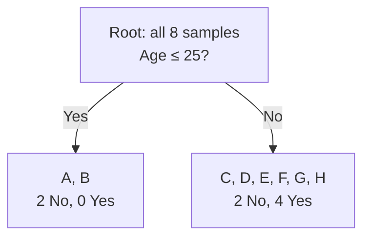
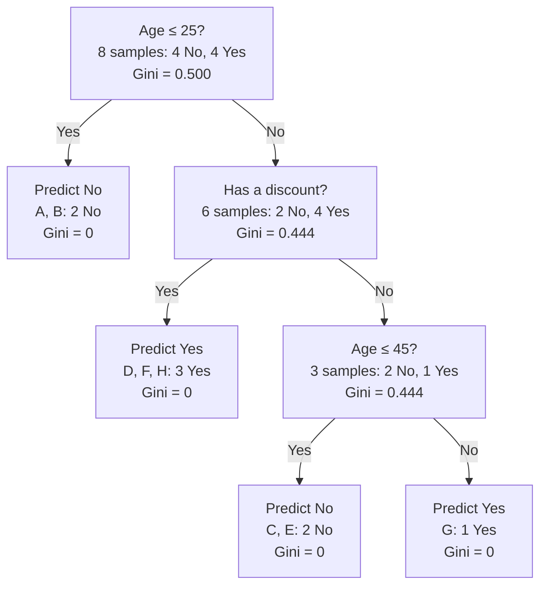

# Decision Trees — From Data to Predictions

> [!abstract] The idea
> A decision tree learns a sequence of questions from examples. Each question sends an example down a branch. When the example reaches a leaf, the tree returns a prediction.
>
> We will build a small tree by hand: start with training rows, compare possible questions using Gini impurity, grow the branches, decide when to stop, and predict an outcome for a new example.

## 1. What is the tree trying to learn?

Suppose we want to predict whether a customer will buy a laptop. We have records of previous customers:

| Customer | Age | Has a discount? | Bought a laptop? |
|---|---:|---|---|
| A | 20 | No | No |
| B | 20 | Yes | No |
| C | 30 | No | No |
| D | 30 | Yes | Yes |
| E | 40 | No | No |
| F | 40 | Yes | Yes |
| G | 50 | No | Yes |
| H | 50 | Yes | Yes |

This is our **training dataset**: examples whose outcomes are already known.

- A **sample** is one row: one customer.
- A **feature** is an input available when making a prediction. Here, the features are `Age` and `Has a discount?`.
- The **target** is the outcome we want to predict: `Bought a laptop?`.
- A **class** is a possible target category. Our two classes are `Yes` and `No`.
- `Customer` is an identifier so we can track rows. We will not use it as a feature.

This is a **classification** problem because the output is a category. Predicting a number, such as the amount spent, would be a **regression** problem.

> [!important] Training and prediction are different activities
> **During training**, the tree sees features and known targets. It uses those targets to choose questions that separate the classes.
>
> **During prediction**, the tree sees a new customer's features and follows its existing questions. It does not need the new customer's outcome and does not rebuild itself.

The training labels help choose questions, but they cannot be used as questions. Asking “Did this customer buy a laptop?” would require knowing the answer we are trying to predict.

## 2. What does a node contain?

### 2.1 The root node: where all training samples begin

The **root node** is the first node at the top of the tree. Before any split, all eight training samples belong to it.

For our root:

```text
Samples reaching this node: A, B, C, D, E, F, G, H
Number of samples: 8
Target counts: No = 4, Yes = 4
Class proportions: No = 4/8, Yes = 4/8
```

When we say a node “contains samples,” we mean that those samples reach that node during training. An implementation may track their row indices rather than copying the entire dataset into each node.

As the tree grows, a node can record information such as:

| Information | What it means |
|---|---|
| Sample count | How many training examples reached this node |
| Class counts or proportions | How those examples are distributed across target classes |
| Impurity | How mixed their target labels are |
| Split rule, if the node is split | Which feature and threshold send samples to each child |
| Prediction, if the node is a leaf | The output for future examples that finish here |

> [!note] A fitted tree does not need to keep every original row
> Training uses the rows to learn the rules and node statistics. Prediction can then use those learned rules and statistics without searching the original training dataset.

### 2.2 Parent, children, branches, and leaves

Suppose the root asks:

```text
Age ≤ 25?
```

- Customers A and B answer **Yes** and go to the left child.
- Customers C through H answer **No** and go to the right child.
- The root is the **parent** of those two **child nodes**.
- The connections are **branches**.
- A node that asks a question is an **internal node** or **decision node**.
- A node that returns a prediction without another question is a **leaf** or **terminal node**.



A split **partitions the rows**. In this example, each row goes to exactly one child. It does not remove the other feature columns: both children still have Age and Discount available for further questions.

The remaining question is: **why choose this split instead of another one?**

## 3. Measuring how mixed a node is: Gini impurity

### 3.1 Purity refers to the target labels

A classification node is **pure** when every training sample in it has the same target label.

```text
[Yes, Yes, Yes, Yes] → Pure
[No, No, No, No]     → Pure
[Yes, Yes, Yes, No]  → Mixed
[Yes, Yes, No, No]   → Most mixed for two classes
```

The feature values do not need to be identical for a node to be pure. Purity concerns the outcomes we are trying to predict.

### 3.2 The Gini formula

For a node with class proportions $p_1, p_2, \ldots, p_c$:

$$
Gini = 1 - \sum_{i=1}^{c} p_i^2
$$

For our two classes:

$$
Gini = 1 - p_{No}^2 - p_{Yes}^2
$$

Here, $p_{Yes}$ is the number of Yes samples divided by the total number of samples **at this node**. Every child will have its own proportions.

### 3.3 Calculate the root's Gini

The root has four No and four Yes samples:

$$
p_{No}=\frac48=0.5,\qquad p_{Yes}=\frac48=0.5
$$

$$
Gini(root)=1-(0.5)^2-(0.5)^2=1-0.25-0.25=0.5
$$

This is the maximum Gini impurity for two classes: neither class is more common.

### 3.4 Calculate a pure node's Gini

The group containing A and B has two No and zero Yes:

$$
Gini=1-\left(\frac22\right)^2-\left(\frac02\right)^2=0
$$

There is no class mixture.

### 3.5 Calculate a mostly pure node's Gini

A group with three Yes and one No has:

$$
Gini=1-\left(\frac34\right)^2-\left(\frac14\right)^2
=1-\frac9{16}-\frac1{16}=\frac6{16}=0.375
$$

| Class distribution | Gini | Interpretation |
|---|---:|---|
| 4 Yes, 0 No | 0 | Pure |
| 3 Yes, 1 No | 0.375 | Some mixture |
| 2 Yes, 2 No | 0.5 | Maximum mixture for two classes |

> [!info] Why does this formula measure impurity?
> Imagine independently drawing two labels from the node's class distribution. The probability that both are Yes is $p_{Yes}^2$, and that both are No is $p_{No}^2$.
>
> Their sum is the probability of matching labels. Subtracting from 1 gives the probability of different labels. More mixture means more disagreement.
>
> This is an interpretation of the score; the tree does not make predictions by randomly drawing labels.

> [!note] More than two classes
> With $c$ classes, maximum Gini is $1-1/c$, reached when the classes are equally common. The maximum is 0.5 only for two classes.

## 4. How does the tree compare possible splits?

A useful split sends samples into children whose labels are less mixed **on average** than the parent's labels.

For a binary split:

$$
Gini_{after}
=\frac{N_L}{N}Gini(L)+\frac{N_R}{N}Gini(R)
$$

Here:

- $N$ is the number of samples at the parent.
- $N_L$ and $N_R$ are the numbers sent left and right.
- $Gini(L)$ and $Gini(R)$ are calculated from each child's own class proportions.

The **Gini decrease** is:

$$
\Delta Gini=Gini(parent)-Gini_{after}
$$

We prefer the valid split with the **largest decrease**, equivalently the smallest weighted impurity after splitting.

### 4.1 Why use a weighted average?

A child containing most of the samples should contribute most of the score.

Suppose one child has 90 samples and Gini 0.5, while the other has 10 samples and Gini 0:

$$
Gini_{after}=\frac{90}{100}(0.5)+\frac{10}{100}(0)=0.45
$$

An ordinary average would give $(0.5+0)/2=0.25$. That would overstate the improvement: 90% of the samples still belong to a maximally mixed group.

### 4.2 Where do numerical thresholds come from?

Our distinct ages are:

```text
20, 30, 40, 50
```

For a standard search for the best numerical split, we can consider midpoints between consecutive distinct values:

```text
Age ≤ 25?
Age ≤ 35?
Age ≤ 45?
```

Thresholds anywhere between 20 and 30 produce the same partition of these training rows, so we do not need to test every decimal number. The exact chosen threshold can still affect predictions for future ages inside that gap.

Discount is binary, so it provides one partition:

```text
Has a discount = No?  versus  Has a discount = Yes?
```

## 5. Choose the root split: all calculations

The root Gini is 0.5. We will compare all four candidate partitions.

### 5.1 Candidate: Age ≤ 25

**Left child:** A, B → two No, zero Yes.

$$
Gini(L)=0
$$

**Right child:** C, D, E, F, G, H → two No, four Yes.

$$
Gini(R)=1-\left(\frac26\right)^2-\left(\frac46\right)^2
=\frac49\approx0.4444
$$

Weighted impurity:

$$
Gini_{after}=\frac28(0)+\frac68\left(\frac49\right)=\frac13
$$

Gini decrease:

$$
\Delta Gini=\frac12-\frac13=\frac16\approx0.1667
$$

### 5.2 Candidate: Age ≤ 35

**Left child:** A, B, C, D → three No, one Yes.

$$
Gini(L)=1-\left(\frac34\right)^2-\left(\frac14\right)^2=0.375
$$

**Right child:** E, F, G, H → one No, three Yes.

$$
Gini(R)=0.375
$$

Therefore:

$$
Gini_{after}=\frac48(0.375)+\frac48(0.375)=0.375
$$

$$
\Delta Gini=0.5-0.375=0.125
$$

### 5.3 Candidate: Age ≤ 45

**Left child:** A through F → four No, two Yes, so Gini is $4/9$.

**Right child:** G, H → zero No, two Yes, so Gini is 0.

$$
Gini_{after}=\frac68\left(\frac49\right)+\frac28(0)=\frac13
$$

$$
\Delta Gini=\frac12-\frac13=\frac16\approx0.1667
$$

### 5.4 Candidate: split by Discount

**No discount:** A, C, E, G → three No, one Yes, so Gini is 0.375.

**Has discount:** B, D, F, H → one No, three Yes, so Gini is 0.375.

$$
Gini_{after}=\frac48(0.375)+\frac48(0.375)=0.375
$$

$$
\Delta Gini=0.125
$$

### 5.5 Compare the results

| Candidate | Weighted Gini after split | Gini decrease |
|---|---:|---:|
| Age ≤ 25 | 0.3333 | **0.1667** |
| Age ≤ 35 | 0.3750 | 0.1250 |
| Age ≤ 45 | 0.3333 | **0.1667** |
| Discount | 0.3750 | 0.1250 |

The best score is tied. For this hand-built tree, choose **Age ≤ 25**. A library's tie-breaking behavior may produce a different, equally good first split.

> [!important] Best now does not mean best overall
> This search is **greedy**: it chooses the greatest immediate impurity reduction. It does not normally explore all possible future trees before selecting the first question.

## 6. Grow the next branches

### 6.1 Left child: A and B

Both customers have target No. This child is pure, so it becomes a leaf:

```text
If Age ≤ 25 → Predict No
```

### 6.2 Right child: C through H

This node contains only these six rows:

| Customer | Age | Discount | Bought? |
|---|---:|---|---|
| C | 30 | No | No |
| D | 30 | Yes | Yes |
| E | 40 | No | No |
| F | 40 | Yes | Yes |
| G | 50 | No | Yes |
| H | 50 | Yes | Yes |

Its Gini is $4/9$. We now compare questions using **these six samples only**. The weights use 6 as the denominator, not 8.

For **Age ≤ 35**:

- Left: C, D → one No, one Yes → Gini $=1/2$.
- Right: E, F, G, H → one No, three Yes → Gini $=3/8$.

$$
Gini_{after}=\frac26\left(\frac12\right)+\frac46\left(\frac38\right)
=\frac5{12}\approx0.4167
$$

For **Age ≤ 45**:

- Left: C, D, E, F → two No, two Yes → Gini $=1/2$.
- Right: G, H → two Yes → Gini $=0$.

$$
Gini_{after}=\frac46\left(\frac12\right)+\frac26(0)=\frac13
$$

For **Discount**:

- No discount: C, E, G → two No, one Yes → Gini $=4/9$.
- Has discount: D, F, H → three Yes → Gini $=0$.

$$
Gini_{after}=\frac36\left(\frac49\right)+\frac36(0)=\frac29
$$

| Candidate at this node | Weighted Gini after | Decrease from $4/9$ |
|---|---:|---:|
| Age ≤ 35 | 0.4167 | 0.0278 |
| Age ≤ 45 | 0.3333 | 0.1111 |
| Discount | **0.2222** | **0.2222** |

Discount wins. The discount-Yes child is pure and predicts Yes.

### 6.3 Continue with C, E, and G

The remaining mixed node contains:

```text
C: Age 30, Discount No, Target No
E: Age 40, Discount No, Target No
G: Age 50, Discount No, Target Yes
```

Discount is constant here, so it cannot separate these rows. Age can still be used even though it was used at the root.

- `Age ≤ 35` creates `[No]` and `[No, Yes]`, with weighted Gini $1/3$.
- `Age ≤ 45` creates `[No, No]` and `[Yes]`, with weighted Gini 0.

Choose **Age ≤ 45**. Its Gini decrease is $4/9-0=4/9$. Both children become leaves.

> [!info] Recursive growth
> The same procedure is applied repeatedly: take the samples at the current node, compare valid questions, choose a split, and repeat for its children. This is called **recursion**.
>
> In a binary tree, each split creates exactly two children. Numerical features can be reused at different thresholds along a path.

## 7. The finished tree and a new prediction



For a new customer aged **42 with no discount**:

1. Is Age ≤ 25? **No** → follow the right branch.
2. Has a discount? **No** → follow the no-discount branch.
3. Is Age ≤ 45? **Yes** → reach the No leaf.

The prediction is **No**.

At prediction time, the tree evaluates only the questions along this path. It does not recalculate Gini or compare candidate splits.

### 7.1 What if a leaf is mixed?

Suppose we stopped before splitting C, E, and G. That leaf would contain two No and one Yes.

- Predicted class: **No**, the majority class.
- Estimated class proportions: $P(No)=2/3$ and $P(Yes)=1/3$.

These proportions can serve as probability estimates, but small leaves can produce unreliable estimates. Class or sample weights, when used, also affect the proportions.

> [!warning] Pure does not mean certain
> The leaf containing G has one Yes sample and no No samples. Its training proportion for Yes is 100%, but one observed customer does not establish certainty about future customers.

### 7.2 Depth

Depth counts **edges from the root**:

- Root: depth 0.
- Root's children: depth 1.
- Their children: depth 2.

Our deepest leaves are at depth 3, so this tree has depth 3.

## 8. When should growth stop?

A node becomes a leaf when growth is no longer possible or is prevented by a constraint. Examples include:

- The node is already pure.
- No feature can create a valid split.
- The maximum depth has been reached.
- There are too few samples to split.
- A split would create a child smaller than the allowed minimum.
- The improvement is below the configured threshold.

### 8.1 Some leaves cannot become pure

Imagine adding another customer with Age 50 and Discount No, but target No. That customer's features would be identical to G's, whose target is Yes.

No question using only these two features can separate them. They must reach the same leaf, which remains mixed. If class counts tie, the implementation needs a tie-breaking rule.

### 8.2 How constraints affect our tree

If `max_depth=2`, C, E, and G cannot be split again: their node is already at depth 2. It becomes a leaf predicting No.

If `min_samples_leaf=2`, the split isolating G is invalid because it would create a child containing only one sample.

> [!note] Minimum split size and minimum leaf size are different
> `min_samples_split=4` permits a node with four samples to attempt a split, potentially into children of sizes 1 and 3.
>
> `min_samples_leaf=2` rejects that particular split because both children must contain at least two samples.

## 9. Overfitting: why a perfect training tree can fail

Our completed tree correctly classifies all eight training customers. That tells us how well it fits these eight rows; it does not tell us how well it predicts future customers.

**Overfitting** occurs when a model learns details of its training sample that do not generalize, such as noise or accidental patterns.

A deeper tree has more opportunities to create very specific rules. Training performance may improve while performance on unseen examples gets worse.

**Underfitting** occurs when the model is too restricted to capture useful patterns. A root-only tree would make the same prediction for every customer, ignoring both features.

### 9.1 Training, validation, and test data

- **Training set:** used to learn splits and leaf predictions.
- **Validation set:** used to compare settings such as maximum depth.
- **Test set:** held aside for a final evaluation after model choices are made.

With **cross-validation**, the training portion is divided into folds. A candidate configuration trains on some folds and is evaluated on the held-out fold; the process repeats with different held-out folds. Average performance helps compare configurations.

Do not choose settings by repeatedly checking the final test set. That would allow test outcomes to influence model selection.

### 9.2 Bias and variance

**Bias** is systematic error caused by overly restrictive assumptions. **Variance** describes how much a fitted model changes when its training sample changes.

| Typical tendency | Shallow tree | Deep tree |
|---|---|---|
| Flexibility | Lower | Higher |
| Bias | Higher | Lower |
| Variance | Lower | Higher |
| Main risk | Missing useful patterns | Fitting sample-specific details |

These are tendencies, not guarantees. A shallow tree can fit a simple relationship well. Even shallow trees can be unstable when candidate splits have similar scores.

## 10. Controlling complexity: pre-pruning and post-pruning

### 10.1 Pre-pruning: constrain growth

Pre-pruning limits growth while the tree is being trained.

| Setting | Meaning |
|---|---|
| `max_depth` | Maximum depth, measured in edges from the root |
| `min_samples_split` | Minimum samples required at a node before attempting a split |
| `min_samples_leaf` | Minimum samples required in each resulting leaf |
| `max_leaf_nodes` | Maximum number of leaves |
| `min_impurity_decrease` | Required weighted impurity improvement |
| `max_features` | Number of features considered when searching for a split |

For scikit-learn, `min_impurity_decrease` uses the local impurity decrease multiplied by the fraction of all training samples reaching the node. This differs from the local decreases calculated earlier:

$$
\text{Weighted decrease}
=\frac{N_{node}}{N_{training}}\left(I(parent)-\sum_k\frac{N_k}{N_{node}}I(child_k)\right)
$$

At the root, the outside factor is 1. Sample weights modify the counts when supplied.

### 10.2 Post-pruning: simplify a grown tree

Post-pruning replaces selected subtrees with leaves. **Cost-complexity pruning** balances fit against the number of leaves:

$$
R_\alpha(T)=R(T)+\alpha|T|
$$

- $T$: a candidate tree.
- $R(T)$: its training error or impurity measure, depending on the formulation.
- $|T|$: number of leaves.
- $\alpha$: penalty per leaf.

For an illustrative score:

| Tree | Error score | Leaves | Score at $\alpha=0.01$ |
|---|---:|---:|---:|
| Larger tree | 0.10 | 10 | $0.10+0.01(10)=0.20$ |
| Smaller tree | 0.14 | 4 | $0.14+0.01(4)=0.18$ |

The smaller tree wins under this penalty despite its worse training fit. Larger alpha values favor simpler trees.

Scikit-learn uses sample-weighted leaf impurity for $R(T)$ and exposes alpha as `ccp_alpha`. Cross-validation can help select alpha. The initial tree may already have growth constraints; it need not be completely unconstrained before pruning.

## 11. Entropy and information gain

Gini is one way to measure class mixture. Another is **entropy**:

$$
H(S)=-\sum_{i=1}^{c}p_i\log_2 p_i
$$

Here, $S$ is the set of samples at the node and $p_i$ is its proportion of class $i$.

### 11.1 Why the logarithm?

The quantity $-\log_2 p_i$ measures the **surprise** of observing class $i$:

- An outcome with probability 1 has surprise 0 bits.
- An outcome with probability $1/2$ has surprise 1 bit.
- An outcome with probability $1/4$ has surprise 2 bits.

Entropy weights each class's surprise by how often it occurs. It is the **average surprise**, or uncertainty, of the label distribution.

We define the contribution of a zero-probability class as zero: $0\log_2 0=0$ by convention.

### 11.2 Use the same root and split

At our root, both classes have probability $1/2$:

$$
H(root)=-\frac12\log_2\frac12-\frac12\log_2\frac12=1
$$

For `Age ≤ 25`, the left child is pure, so its entropy is 0. The right child has two No and four Yes:

$$
H(R)=-\frac13\log_2\frac13-\frac23\log_2\frac23\approx0.9183
$$

The weighted entropy after the split is:

$$
H_{after}=\frac28(0)+\frac68(0.9183)\approx0.6887
$$

The entropy reduction is called **information gain**:

$$
IG=H(parent)-H_{after}\approx1-0.6887=0.3113
$$

The structure of the calculation is the same as Gini decrease: impurity before minus weighted impurity after.

| Property | Gini | Entropy |
|---|---|---|
| Pure node | 0 | 0 |
| Binary 50/50 node | 0.5 | 1 bit |
| Maximum for $c$ classes | $1-1/c$ | $\log_2 c$ |
| Split score | Gini decrease | Information gain |

Both favor purer children and often produce similar trees, but can choose different splits. Their numerical scales differ, so comparing a Gini decrease directly with an information gain is not meaningful.

## 12. Regression trees: predicting numbers

A regression tree asks feature questions in the same way, but its target is numeric. Class proportions and classification impurity no longer apply.

Consider a separate small example of house prices, in lakhs:

```text
50, 55, 60, 120, 130
```

For **squared-error regression**, a leaf predicts the mean:

$$
\bar y=\frac{50+55+60+120+130}{5}=83
$$

The mean minimizes the sum of squared deviations within the leaf:

$$
SSE=\sum_i(y_i-\bar y)^2
$$

For this parent:

$$
SSE=1089+784+529+1369+2209=5980
$$

Suppose an available feature question, such as a house-size threshold, separates the rows into:

| Child | Target values | Mean prediction | SSE |
|---|---|---:|---:|
| Left | 50, 55, 60 | 55 | $25+0+25=50$ |
| Right | 120, 130 | 125 | $25+25=50$ |

Total SSE after splitting is $50+50=100$, a reduction of 5880.

> [!important] The question still uses an input feature
> Prices are used to score the candidate split. The split itself must use a feature available for a new house, such as its size. We cannot ask for the unknown price to decide which price to predict.

### 12.1 Variance and SSE

The node variance used here is:

$$
Variance=\frac{SSE}{N}
$$

The parent variance is $5980/5=1196$. The weighted child variance is:

$$
\frac35\left(\frac{50}{3}\right)+\frac25\left(\frac{50}{2}\right)=20
$$

So variance decreases by $1196-20=1176$.

At a fixed parent, minimizing total child SSE and minimizing weighted child variance select the same split. **Add child SSEs directly; do not weight them by child sizes again.**

### 12.2 Why predictions look like steps

Every example reaching a particular leaf receives the same predicted value. As inputs change enough to enter a different leaf, the prediction jumps. Standard regression trees therefore produce **piecewise-constant** predictions.

A squared-error tree cannot extrapolate a rising trend beyond its training targets: its leaf means stay within the observed target range. Other criteria can use different leaf summaries; for example, absolute-error regression uses the median.

## 13. ID3, C4.5, and CART

These are related algorithms for constructing trees, with different splitting rules and capabilities.

| Algorithm | Typical criterion | Output | Split structure |
|---|---|---|---|
| ID3 | Entropy information gain | Classification | Usually one branch per category |
| C4.5 | Gain ratio with additional selection rules | Classification | Categorical multi-way and numerical threshold splits |
| CART | Commonly Gini for classification; squared error for regression | Classification and regression | Binary splits |

Our worked tree follows the binary, Gini-based approach associated with CART.

> [!note] Algorithm versus implementation
> CART describes an algorithmic approach. Scikit-learn implements an optimized version with particular supported features. A capability of classical CART is not automatically a capability of every CART library.

### 13.1 Why introduce gain ratio?

For a multi-way split, a feature with many distinct values can create many tiny children. Splitting on a unique customer ID would create eight one-sample leaves in our dataset. All would be pure, giving maximum information gain while providing no useful rule for an unseen ID.

Gain ratio divides information gain by the split's own entropy:

$$
SplitInformation=-\sum_k\frac{N_k}{N}\log_2\left(\frac{N_k}{N}\right)
$$

$$
GainRatio=\frac{InformationGain}{SplitInformation}
$$

This mitigates the preference for heavily fragmented splits. It is not a guarantee against overfitting. C4.5 uses additional selection rules rather than blindly maximizing this ratio; splits with very small denominators need care.

Binary splitting also does not eliminate all selection bias: features offering many candidate splits have more opportunities to obtain a good score by chance.

## 14. Categorical features and missing values

### 14.1 Binary and multi-category inputs

Our Discount feature has only two values. Coding No as 0 and Yes as 1 gives the same partition with a threshold of 0.5.

For an unordered feature such as Color, arbitrary numeric codes can be restrictive:

```text
Red = 0, Green = 1, Blue = 2
```

A single threshold can separate Red from the others or Blue from the others. It cannot isolate Green from both Red and Blue in one split.

- **Ordinal encoding** is appropriate when an ordering is meaningful, such as Low < Medium < High.
- **One-hot encoding** creates separate binary features such as `Is Red?`, `Is Green?`, and `Is Blue?`, avoiding an arbitrary numerical order.
- **Native categorical splitting**, where supported, can group categories directly, such as `{Red, Blue}` versus `{Green}`.

Classical CART can partition categories into two groups. Scikit-learn's decision trees require categorical features to be encoded numerically. In scikit-learn, `OrdinalEncoder` encodes feature columns; `LabelEncoder` is intended for target labels.

### 14.2 What if a feature value is missing?

If Age is missing, the question `Age ≤ 25?` has no ordinary yes/no answer. A method must define what happens.

Common approaches include:

- **Imputation:** replace missing numeric values with a training-set median, or categorical values with a training-set mode.
- **Missing as a category:** represent a missing categorical value explicitly, allowing missingness to be predictive.
- **Learned missing-value direction:** during training, evaluate whether missing values should go left or right.
- **Surrogate splits:** use another feature's question that approximately reproduces the primary split's routing.

Classical CART can use surrogate splits. Supported scikit-learn tree configurations use learned missing-value routing, not surrogate splits. Check the library's current support for the chosen estimator, splitter, and criterion.

> [!warning] Fit preprocessing on training data
> Learn imputation values and other preprocessing rules from the training set, then apply them to validation and test data. During cross-validation, fit them separately within each training fold. Otherwise, information from held-out data can influence training.

## 15. Strengths and limitations

| Property | Explanation |
|---|---|
| Small trees are interpretable | A root-to-leaf path is a sequence of readable conditions. Very large trees become difficult to inspect. |
| Usually no feature scaling required | Standard splits compare values within one feature. They do not compare distances across features with different units. |
| Nonlinear relationships | Different regions of the feature space can receive different predictions. |
| Feature interactions | The effect of one feature can depend on earlier questions. In our tree, Discount matters only after the age question. |
| Instability | Small changes to training rows can change a selected split and the branches below it. |
| Overfitting | Small leaves may represent noise or accidental patterns. |
| Limited extrapolation | Standard constant-leaf regression trees do not extend trends beyond observed targets. |
| Axis-aligned splits | A standard numerical split tests one feature at a time. A diagonal boundary can require many staircase-like cuts. |

For example, converting all ages from years to months rescales the thresholds but preserves the training partitions in exact arithmetic. This explains why standard feature scaling is usually unnecessary; it does not remove the need for encoding, missing-value handling, or sound evaluation.

### 15.1 Class imbalance

If 99% of examples are No, a model that always predicts No achieves 99% accuracy while detecting no Yes cases. Examine metrics appropriate to the task, such as precision and recall, and consider class weighting when suitable.

### 15.2 Feature importance

Impurity-based importance credits features for the weighted impurity reductions their splits produce throughout the tree.

It describes how the fitted model used its features. It does not prove causation, and it can favor features with many possible split points. Correlated features can also share or substitute for one another's importance.

## 16. From one tree to ensembles

An **ensemble** combines multiple models.

### Random forests

A random forest builds many trees using bootstrap samples—random samples of training rows drawn with replacement—and random feature subsets considered at splits.

Combining their outputs can reduce the variance of a single tree. Regression forests average predictions. Classification forests combine class predictions or probabilities; scikit-learn averages class probabilities before selecting the predicted class.

### Gradient boosting

Gradient boosting adds trees sequentially to improve the current ensemble under a chosen loss function.

For squared-error regression, the next tree fits residuals: actual values minus current predictions. For other losses, trees fit gradient-based targets. Each tree's contribution is commonly scaled by a learning rate.

Boosting can reduce underfitting, but too much fitting can still overfit. Tree complexity, learning rate, and the number of trees need evaluation on unseen data.

## 17. Self-check

> [!question]- What does the root contain before the first split?
> All training samples. In our example, it represents eight customers: four No and four Yes, with Gini 0.5.

> [!question]- Does a pure node require identical feature values?
> No. It requires identical target labels. Feature values may differ.

> [!question]- Why is the root split Age ≤ 25 in our worked tree?
> It achieves a Gini decrease of about 0.1667, tied with Age ≤ 45 and better than the other candidates. We chose it to resolve the tie.

> [!question]- Why weight child impurities by sample count?
> Larger children represent more of the parent's samples and should contribute more to the score.

> [!question]- When working on the six-sample right child, why do the local weights use 6 rather than 8?
> We are evaluating a split of that node. Its children partition those six samples. The separate global weighting used by some controls serves a different purpose.

> [!question]- Can Age appear more than once on a path?
> Yes. Numerical features can be reused with different thresholds to narrow a range.

> [!question]- What does the tree predict for Age 42 with Discount Yes?
> Age ≤ 25 is false, then Discount Yes reaches the Yes leaf.

> [!question]- Does the tree compute Gini for a new customer?
> No. Gini helps select splits during training. Prediction follows the learned questions.

> [!question]- Why might a leaf remain mixed even without a depth limit?
> Different labels may have identical available features, making separation impossible.

> [!question]- Does perfect training accuracy establish good generalization?
> No. Performance must be evaluated on unseen examples.

> [!question]- What is the difference between information gain and Gini decrease?
> Both measure impurity reduction. Information gain uses entropy; Gini decrease uses Gini impurity.

> [!question]- Should child SSE values be weighted again when scoring a regression split?
> No. Add child SSEs directly. If using child variances instead, weight them by child sample proportions.

## References

- [Scikit-learn: Decision trees](https://scikit-learn.org/stable/modules/tree.html) — splitting, criteria, algorithm families, missing values, and pruning.
- [Scikit-learn: DecisionTreeClassifier](https://scikit-learn.org/stable/modules/generated/sklearn.tree.DecisionTreeClassifier.html) — parameter definitions and prediction behavior.
- [Scikit-learn: Encoding categorical features](https://scikit-learn.org/stable/modules/preprocessing.html#encoding-categorical-features) — ordinal and one-hot encoding.
- [Scikit-learn: Forests of randomized trees](https://scikit-learn.org/stable/modules/ensemble.html#forest) — random forests and aggregation.
- [Scikit-learn: Gradient boosting](https://scikit-learn.org/stable/modules/ensemble.html#gradient-boosting) — sequential fitting and loss functions.

---

**Next:** [[02 - Decision Trees - Practical Implementation]]
