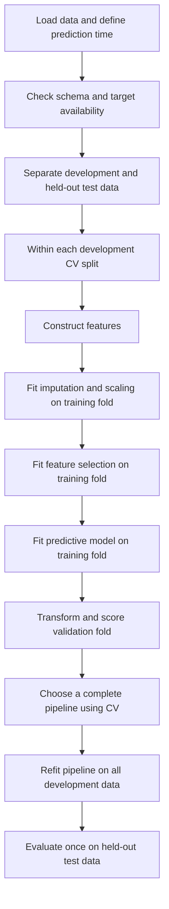
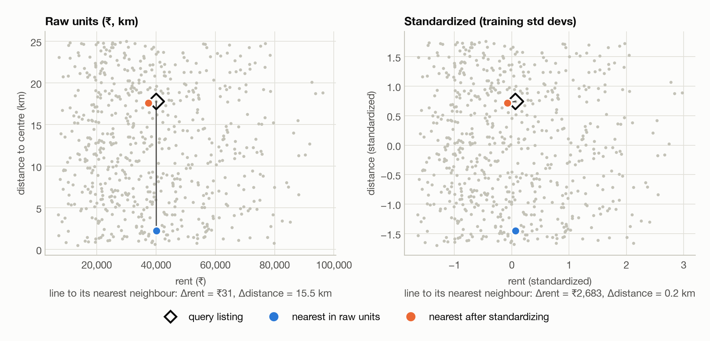
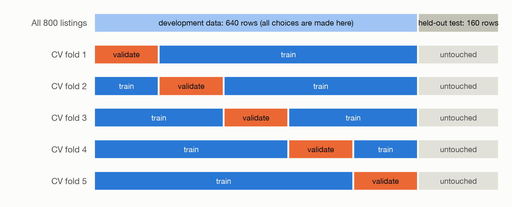
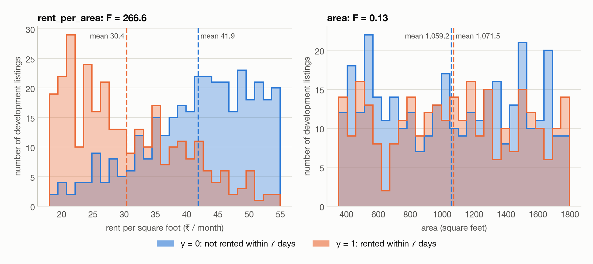
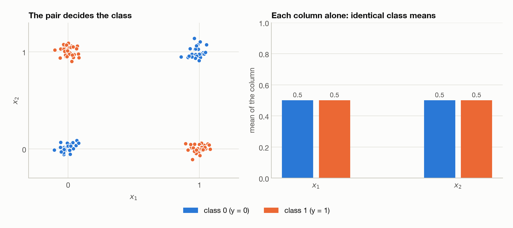
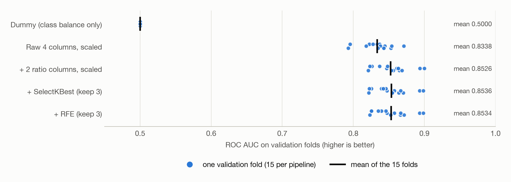

# Feature Engineering — From First Principles

Up: [[00 - Feature Engineering]] · Next: [[02 - Principal Component Analysis - From First Principles]]

> [!abstract] The central idea
> A model learns from its input representation. Feature engineering means designing that representation: which measurements to expose, how to express them, and which combinations make useful relationships easier to learn.

Imagine choosing an apartment. “The rent is ₹30,000” is useful, but incomplete. Is the apartment 400 square feet or 1,200? A person naturally compares price with space. A model given only separate rent and area columns may need help expressing that comparison. A new column, `rent / area`, makes the idea explicit.

This note builds three skills on one running example, predicting which rental listings rent quickly: **constructing** useful columns, **rescaling** them, and **selecting** which ones to keep. It also shows how to test whether any of it helped without fooling yourself.

> [!question] After this note you should be able to
> - Explain why a derived column such as `rent / area` can help a model even though it adds no new data.
> - Choose between standardization, min–max scaling, and row normalization, and say which algorithms care.
> - Explain what “fit” means, and why fitting a scaler or selector on all the data before cross-validation is leakage.
> - Read a correlation, an F-score, and an RFE ranking without over-interpreting them.
> - Build a leak-free scikit-learn `Pipeline` and compare candidate pipelines with cross-validation and a held-out test set.

> [!tip] How to read this note
> - **Core path:** §1–§7, then §9–§12. Answer the checkpoints as you go.
> - §8 (correlation and coefficients), §10 (RFE) and §13 (practical extensions) fill in the rest. §15 is a one-page summary for revision.
> - Boxes titled **Going deeper** are collapsed. Skip them on a first read and open them when you want the reason behind a claim.

## Vocabulary and notation

You need to be comfortable with tables, basic arithmetic, and the idea of using past observations to predict an outcome. The Python examples use pandas for tables and scikit-learn for preprocessing, model fitting, and evaluation.

| Term | Meaning |
|---|---|
| Model or estimator | An algorithm that learns a rule from data, such as a classifier that predicts one of two classes |
| Training data | Observations used to learn model parameters or transformation statistics |
| Validation data | Observations used to compare modelling choices, never used to fit the model being evaluated |
| Development data | Everything available for training and model selection, excluding the final test set |
| Held-out test data | Observations reserved for evaluating the chosen procedure once, at the end |
| Cross-validation (CV) | Repeatedly splitting development data into training and validation parts to evaluate a procedure |
| Fold | One group of observations in a cross-validation partition |
| Pipeline | An ordered sequence of transformations followed by a model, fitted and applied as one procedure |
| Generalization | A model's ability to perform well on new observations |
| Overfitting | Learning sample-specific patterns that do not persist in new observations |

In equations, $i$ identifies a row and $j$ a feature column. A bar, such as $\bar x$, denotes a mean; a hat, such as $\hat p$, denotes an estimate; $\sum$ means “add the indicated terms.”

## Contents

- [[#1. What is a feature?]]
- [[#2. Where feature engineering fits]]
- [[#3. Rental-listings case study]]
- [[#4. Constructing better columns]]
- [[#5. Scaling, standardization, and normalization]]
- [[#6. Which algorithms care about scale?]]
- [[#7. Leakage and the meaning of fit]]
- [[#8. Correlation and coefficients]]
- [[#9. Selecting columns with SelectKBest and f_classif]]
- [[#10. Selecting columns with RFE]]
- [[#11. The runnable experiment]]
- [[#12. Results and interpretation]]
- [[#13. Practical extensions and common mistakes]]
- [[#14. Bridge to dimensionality reduction]]
- [[#15. Summary]]
- [[#16. Check your understanding]]
- [[#17. Reference links]]

## 1. What is a feature?

A **sample** is one observation: here, one rental listing. A **feature** is an input attribute of that sample, such as its area. A **target** is the outcome to be predicted.

For $n$ listings and $p$ numeric input columns, the **feature matrix** $X$ and **target vector** $y$ are

$$X \in \mathbb{R}^{n\times p}, \qquad y\in\{0,1\}^{n}.$$

$\mathbb{R}^{n\times p}$ means a table of real numbers with $n$ rows and $p$ columns; $\{0,1\}^{n}$ means $n$ binary labels. The **feature vector** $x_i$ is row $i$ of $X$, and $y_i$ is its label. In **binary classification** every observation belongs to one of two classes, here 0 and 1. The labels stay separate from the features and are never standardized.

In pandas:

```python
X = df[["area", "rooms", "rent", "distance"]]
y = df["left_fast"]
```

The model learns a function $f$ that maps a feature vector to a probability of class 1:

$$\hat p_i = f(x_i), \qquad \hat p_i\approx P(y_i=1\mid x_i).$$

The vertical bar means “given”: $P(y_i=1\mid x_i)$ is the probability of class 1 given the observed inputs. Feature engineering inserts a **representation function** $\phi$ in front of the model:

$$\hat p_i=f(\phi(x_i)).$$

For example, $\phi$ might keep the original four numbers, append two ratios, and rescale all six columns.

> [!important] A column is not automatically a usable feature
> A listing ID might be an arbitrary identifier. A final lease date might reveal the answer after the event. A text address may need encoding. The first question is always: what does this column mean, and does it exist at the moment a prediction must be made?

## 2. Where feature engineering fits

Feature engineering sits between loading the raw data and fitting the model. One rule governs everything in this note:

> [!important] The rule
> Any step that **learns** from data (a median, a mean, a selected subset, a coefficient) must learn from the **training** rows only. Otherwise the evaluation no longer measures performance on unseen data.



Read the chart top to bottom. The test set is separated first (C) and touched only at the very end (L). Everything in between happens inside cross-validation, where each learned step sees only that fold's training rows (F–H).

### 2.1 Preprocessing and feature engineering

The terms overlap in practice. These distinctions identify the purpose of each operation:

| Term | Working meaning | Rental example |
|---|---|---|
| Data cleaning | Repair or flag invalid records and inconsistent meanings | Fix mixed units; investigate an impossible negative area |
| Preprocessing | Make data suitable for an estimator | Impute missing values, encode categories, scale numeric columns |
| Feature construction | Create new input variables | Rent per square foot, area per room |
| Feature selection | Keep a subset of the available inputs | Retain distance and rent per area |
| Feature extraction | Transform inputs into another representation | PCA components, text embeddings |
| Feature engineering (broad) | Design the whole input representation | All of the above as one coordinated workflow |

Three more terms you will meet:

- **Imputation** replaces missing entries by a defined rule, such as the median of the observed training values.
- **Encoding** converts nonnumeric information, such as neighbourhood names, into numbers.
- An **interaction** is a relationship in which the effect of one input depends on another input.

Scaling is a kind of preprocessing. Standardization and min–max normalization are kinds of scaling that treat each column separately. Unit-vector normalization is also preprocessing, but it works on rows (§5.4). In these notes **feature engineering is the broad umbrella**; some authors reserve the phrase for domain-driven new columns only.

Every learned step has three parts you should be able to name: the operation, the statistics it estimates, and the data used to estimate them. Median imputation learns one replacement value per training column; standardization learns a training mean and standard deviation per column.

### 2.2 Feature engineering as an iterative process

Adding a column is a hypothesis: “this measurement could help this estimator predict this outcome.” Cross-validation supplies evidence about the hypothesis, and you revise when the evidence says so.

A feature can help one algorithm and do little for another. A flexible tree can discover some interactions from raw columns; a linear model cannot express every interaction automatically. More columns can also mean more noise, less stable estimates, extra collection cost, and more room to overfit.

> [!tip] Key takeaway
> Feature engineering is designing the model's inputs. Every learned step belongs inside the training-only part of the workflow.

## 3. Rental-listings case study

The task: at publication time, predict whether a rental listing will be rented within seven days. The target `left_fast` is

$$y=\begin{cases}1&\text{rented within seven days}\\0&\text{not rented within seven days.}\end{cases}$$

| Column | Meaning | Units | Role |
|---|---|---|---|
| `area` | Floor area | Square feet | Input |
| `rooms` | Count of rooms under a consistent definition | Count | Input |
| `rent` | Advertised monthly rent | INR per month | Input |
| `distance` | Distance to a chosen city centre | Kilometres | Input |
| `left_fast` | Rented within seven days | 0 or 1 | Target |

Illustrative records (these are separate from the generated dataset used in the experiment):

```csv
area,rooms,rent,distance,left_fast
600,1,18000,3.0,1
1200,3,30000,7.0,1
800,2,32000,12.0,0
1500,4,45000,18.0,0
900,2,27000,4.0,1
```

> [!warning] Labels need care in real data
> Delisting is not necessarily renting: withdrawals, duplicate ads, and expired listings all end a listing. This case study assumes verified rental outcomes. A listing published two days ago has an **unknown** outcome, not automatically a zero.

Predictions are made **at publication time**, so every input must be available then.

Comparing models needs more than five rows. The companion [listings.csv](examples/listings.csv) holds **800 synthetic listings**, generated reproducibly by [listings_demo.py](examples/listings_demo.py). The simulation deliberately makes rental speed depend on rent per area and distance, plus randomness. Those relationships belong to the simulation and say nothing about real housing markets. Even the correct inputs cannot perfectly predict a random outcome.

## 4. Constructing better columns

### 4.1 Rent per area: a comparison hidden between two columns

$$\text{rent\_per\_area}=\frac{\text{monthly rent}}{\text{floor area}},\qquad\text{units: INR per month per square foot.}$$

| Listing | Area | Rent | Rent per area |
|---|---:|---:|---:|
| A | 600 | 18,000 | 30 |
| B | 1,200 | 30,000 | 25 |

B has the higher total rent but the lower price per square foot. Neither number replaces the other: someone with a ₹20,000 budget still cannot afford B. A good representation may keep both total rent and relative price.

### 4.2 Why a deterministic column can help

The ratio contains no new information: anyone who knows rent and area can compute it. Even so, it can change what a restricted model can express easily.

**Logistic regression** is a classification model despite its name. It forms a weighted sum of the inputs, then a sigmoid function turns that score into a probability between 0 and 1. On the four raw columns the score is

$$z=b+w_a\,\text{area}+w_r\,\text{rent}+w_d\,\text{distance}+w_q\,\text{rooms}.$$

The weights $w$ are learned coefficients, $b$ is an intercept that shifts the score, and the probability is $\sigma(z)=1/(1+e^{-z})$. Adding the ratio gives

$$z=b+w_a\,\text{area}+w_r\,\text{rent}+w_d\,\text{distance}
+w_q\,\text{rooms}+w_u\frac{\text{rent}}{\text{area}}.$$

The model is still linear in its **coefficients**, but no longer linear in the original inputs. The same ₹1,000 rent increase can now have a different effect depending on the area.

> [!note] Information versus accessibility
> A derived feature can make existing information easier for a particular model to use. It does not add an independent observation.

> [!note]- Going deeper: can a raw linear model already draw this boundary?
> Partly. A fixed rule such as `rent / area < 30` can be rewritten as `rent - 30 * area < 0` when area is positive, and a raw linear classifier can represent that boundary. What it cannot generally reproduce is a whole logistic probability function that is *linear in the ratio*, especially alongside other effects. So justify a constructed feature by the relationship you need, not by assuming every ratio is out of reach for a raw linear model.

### 4.3 Other useful families

| Construction | Example | Hypothesis it expresses |
|---|---|---|
| Ratio | `area / rooms` | Space per room may matter |
| Difference | `rent - local_typical_rent` | Price relative to comparable homes matters |
| Interaction | `distance * rooms` | The effect of distance may vary with home size |
| Nonlinear transform | `log1p(rent)` | Relative changes matter more than absolute changes |
| Indicator | `distance <= 2` | A domain threshold may matter |
| Time feature | Publication month | Demand may vary seasonally |
| Historical aggregate | Prior neighbourhood rental rate | Local demand may matter |

The last three need care. A threshold needs a rationale, or must be tuned inside development evaluation. Time has cyclic structure (December is next to January). A historical aggregate may use only information available before the prediction; target-based aggregates need special leakage-safe construction, often out-of-fold encoding.

### 4.4 Ratios need a meaning and a denominator policy

Dividing by zero gives an invalid value, and dividing by a tiny number gives an extreme one. Adding an arbitrary $10^{-8}$ avoids the software error but can invent an absurd price per area. Decide what an invalid denominator *means*. Here a zero area or room count is invalid, so the transformer marks the ratio as missing and lets the training-fold imputer handle it:

```python
def add_features(X):
    out = X.copy()
    out["rent_per_area"] = out["rent"] / out["area"].where(out["area"] > 0)
    out["area_per_room"] = out["area"] / out["rooms"].where(out["rooms"] > 0)
    return out
```

This protects the ratios; it is not a complete validator for corrupt raw data. A production validator should also flag impossible raw values and inconsistent units. The generated data are positive and complete.

Two ordering rules:

- Construct ratios **before standardizing their ingredients.** The ratio of standardized rent to standardized area has neither the units nor the meaning of price per square foot, and standardized area can equal zero.
- With missing values, “construct the ratio, then impute it” and “impute the ingredients, then construct the ratio” are different choices, and neither is universally correct. The example constructs first, then imputes. Because the dataset is complete, imputation changes nothing here.

> [!tip] Key takeaway
> A constructed column is a hypothesis with units, a meaning, and a missing-value policy. It rearranges information; it does not create it.

## 5. Scaling, standardization, and normalization

### 5.1 Why units can change a model's behaviour

Suppose two listings differ by ₹10,000 in rent and 5 km in distance. Their raw squared Euclidean distance is

$$d^2=(10{,}000)^2+5^2=100{,}000{,}025.$$

Rent dominates because rupee numbers are large. Express rent in thousands of rupees and the terms become $10^2+5^2=125$. Nothing about the apartments changed, but the geometry did.

The figure shows the consequence for a nearest-neighbour search.



*The same query listing (hollow diamond), the same 640 development listings. In raw units the nearest neighbour is almost the same rent (₹31 apart) but 15.5 km further out, because kilometres are tiny numbers next to rupees. After standardizing, the nearest neighbour is 0.2 km away and ₹2,683 apart.*

Scaling chooses how numeric differences are measured. Standardization says, roughly, “compare deviations relative to how much each feature varies.” That is a useful default, not proof that every feature deserves equal influence.

### 5.2 Standardization with StandardScaler

For feature $j$:

$$z_{ij}=\frac{x_{ij}-\mu_j}{s_j},$$

where $\mu_j$ and $s_j$ are computed from the **training** data. If training rent has mean ₹30,000 and standard deviation ₹10,000, then ₹45,000 becomes $1.5$: one and a half training standard deviations above the training mean.

The **mean** is the average. The **standard deviation** measures spread around it, in the original units. With $m$ training observations:

$$\mu_j=\frac{1}{m}\sum_{i=1}^{m}x_{ij},\qquad s_j=\sqrt{\frac{1}{m}\sum_{i=1}^{m}(x_{ij}-\mu_j)^2}.$$

```python
scaler = StandardScaler()
X_train_scaled = scaler.fit_transform(X_train)
X_valid_scaled = scaler.transform(X_valid)
```

Consequences to remember:

- Training columns are centred at zero and, when not constant, scaled to unit variance.
- Validation columns need not have mean zero or variance one. They are expressed in the **training** reference frame.
- Values are not bounded to $[-1,1]$ or $[0,1]$.
- Standardization does **not** make a skewed distribution Gaussian. It changes location and scale, not shape.
- Outliers affect both the mean and the standard deviation.

Normality is not a requirement for `StandardScaler`, and logistic regression does not require normally distributed inputs.

> [!note]- Going deeper: constant columns and `ddof`
> `StandardScaler` uses `ddof=0` (divide by $m$, as in the formula above). A constant training column cannot be given unit variance; its scale factor is treated as 1, and centring makes its training values zero. See the [StandardScaler API](https://scikit-learn.org/stable/modules/generated/sklearn.preprocessing.StandardScaler.html).

### 5.3 Min–max scaling: a different operation

The default map to $[0,1]$ is

$$x' = \frac{x-x_{\min,\text{train}}}{x_{\max,\text{train}}-x_{\min,\text{train}}}.$$

If training areas range from 400 to 1,600 square feet, 1,000 becomes 0.5. A future area of 2,000 becomes $1.333\ldots$ under the default (unclipped) behaviour: the interval describes the *training* range, not a guarantee about future values.

Extreme observations set the range, so a single outlier can squeeze most observations into a small interval. Optional clipping avoids values outside $[0,1]$ but discards how far a future value exceeds the training range. See [MinMaxScaler](https://scikit-learn.org/stable/modules/generated/sklearn.preprocessing.MinMaxScaler.html).

### 5.4 Unit-vector normalization: across a row

`Normalizer(norm="l2")` divides each *row* by its length:

$$\tilde x_i=\frac{x_i}{\|x_i\|_2},\qquad
\|x_i\|_2=\sqrt{\sum_{j=1}^{p}x_{ij}^{2}}.$$

The row $[3,4]$ becomes $[0.6,0.8]$, and so does $[6,8]$. Direction survives; magnitude is discarded. That suits tasks where relative composition matters more than total size, such as some text-vector or similarity problems.

It is usually a poor default for listing rows. Rent, kilometres, rooms and square feet have different meanings, and absolute price and size matter. Changing the currency unit would even change each row's direction before normalization. `Normalizer` also learns nothing: it acts on each row independently. See [Normalizer](https://scikit-learn.org/stable/modules/generated/sklearn.preprocessing.Normalizer.html).

> [!note]- Going deeper: unit vectors and cosine similarity
> For unit vectors $u$ and $v$, squared Euclidean distance and cosine similarity are linked by
>
> $$\|u-v\|_2^2=2-2u^Tv.$$
>
> So after row normalization, ranking neighbours by Euclidean distance is the same as ranking them by cosine similarity. A zero vector stays zero in scikit-learn's implementation.

### 5.5 Comparison of transformations

| Operation | Acts on | What it does | Typical scikit-learn tool |
|---|---|---|---|
| Standardization | Each column | Subtract training mean, divide by training standard deviation | `StandardScaler` |
| Min–max scaling, often called normalization | Each column | Express values relative to training extrema | `MinMaxScaler` |
| Robust scaling | Each column | Use median and a quantile range, usually the IQR | `RobustScaler` |
| Unit-norm normalization | Each row | Divide the vector by its norm | `Normalizer` |
| Log transform | Individual values | Compress large positive magnitudes nonlinearly | `np.log1p` in a transformer |

“Normalize the data” is an incomplete instruction. Say **which operation, along which axis, fitted on which observations.**

Robust scaling makes the location and scale estimates less sensitive to outliers; it does not remove the outliers. A log transform changes shape, so it answers a different question from standardization; the two can be combined (log, then standardize).

### 5.6 How scaling interacts with regularization

**Regularization** adds a cost for large or complex parameter values, which can reduce overfitting. A **loss function** measures prediction error during training; fitting looks for parameters that make the loss plus any penalty small. A simplified regularized objective is

$$\text{prediction loss}+\lambda\sum_j w_j^2.$$

The nonnegative $\lambda$ sets the penalty strength. A squared-coefficient penalty is **L2 regularization**; an L1 penalty uses absolute values instead and can drive some coefficients to exactly zero.

Now multiply a feature's values by 1,000. The same contribution to the score needs a coefficient 1,000 times smaller, and its squared penalty becomes one million times smaller. Without a consistent scale, regularization treats the same relationship differently just because the units changed.

> [!note]- Going deeper: scaling for optimization versus for prediction
> Scaling also helps many numerical optimizers by avoiding very uneven curvature across parameter directions. For an *unregularized* linear model, an invertible rescaling preserves the set of predictions the model can represent (in exact arithmetic), though it can still change numerical conditioning. With a fixed regularization strength it generally changes the effective modelling preference.

> [!question] Checkpoint: scaling
> 1. Two listings differ by ₹10,000 in rent and 5 km in distance. In raw Euclidean distance, which feature dominates? What if rent is measured in thousands of rupees?
> 2. A model is trained with `MinMaxScaler`, fitted on areas from 400 to 1,600 square feet. What does a new listing of 2,000 square feet become?
>
>> [!success]- Answers
>> 1. Rent dominates: $10{,}000^2$ against $5^2$. In thousands the terms are $10^2=100$ and $5^2=25$, so rent still contributes more, but only 4 to 1 instead of 4 million to 1. The units, not the apartments, changed the geometry.
>> 2. $(2000-400)/(1600-400)=1.333\ldots$, outside $[0,1]$. Min–max scaling describes the training range only.

> [!tip] Key takeaway
> Scaling decides how differences are measured. Say which operation, along which axis, fitted on which rows.

## 6. Which algorithms care about scale?

Ask *how the algorithm uses the numbers*. **Distances, dot products, gradient-based optimization, and penalties** are reasons to consider scaling. **Order-based single-feature thresholds** are a reason it may be unnecessary.

- A **distance** measures how far apart two feature vectors are.
- A **dot product** multiplies matching coordinates and adds the products.
- **Gradient-based optimization** adjusts parameters using the direction in which the training objective changes.
- A **decision tree** splits on rules such as `rent < 30000`, which depend only on the order of values.

In the table, SVM is support vector machine, RBF is radial basis function, SGD is stochastic gradient descent, and PCA is principal component analysis. The table illustrates preprocessing choices; the algorithms themselves are separate topics.

| Method | Usual choice | Why / qualification |
|---|---|---|
| k-nearest neighbours | Scale numeric features | Raw distances depend strongly on units |
| K-means | Scale when relative rather than raw variance should define clusters | Its squared-distance objective is scale-sensitive |
| RBF SVM | Usually standardize | Distances inside the kernel interact with `gamma` |
| Linear SVM | Usually standardize | Margins and regularization depend on feature scales |
| Regularized logistic regression | Usually standardize continuous inputs | Penalty comparability and optimization |
| Ridge, lasso, elastic net | Usually standardize | Coefficient penalties depend on units |
| Neural networks / SGD-based models | Usually scale suitably | Improves optimization; details depend on architecture and inputs |
| PCA | Scale when units should not determine the components | PCA seeks large-variance directions; raw-scale PCA is sometimes intentional |
| Ordinary unregularized least squares | Not mathematically mandatory | Can help conditioning; coefficient units change |
| Ordinary decision trees | Usually unnecessary | A positive affine rescaling preserves order, so it preserves split partitions |
| Random forests / conventional boosted trees | Usually unnecessary | Their splits inherit this property; implementations may differ slightly numerically |
| Dummy classifier | Unnecessary | Ignores feature values |

“Needs scaling” is shorthand for “a strong practical default,” not “the code cannot run without it.” A linear model runs on unscaled features and still produces a score; that does not show the representation is appropriate.

For a tree, `rent < 30000` and `rent_in_thousands < 30` select the same rows, so scaling is wasted work when the pipeline is only an ordinary tree. A pipeline that also contains distance-based imputation, PCA, or another scale-sensitive step may still need it.

Do not confuse the two ideas: **needing comparable feature scales does not mean needing unit-length samples.** Row normalization is not appropriate for every algorithm in the top half of the table.

The rental pipeline uses column standardization for regularized logistic regression. Row normalization is omitted because absolute price and size carry meaning.

> [!tip] Key takeaway
> Distances, dot products, penalties and gradient-based optimization are scale-sensitive. Order-based splits are not.

## 7. Leakage and the meaning of fit

### 7.1 Fit means learning something from observations

Several objects besides the final classifier learn from data:

| Object | What `fit` learns |
|---|---|
| Median imputer | Training-column medians |
| Standard scaler | Training-column means and scales |
| `SelectKBest(f_classif)` | Feature scores from training features and labels |
| RFE | A retained subset, obtained through repeated training fits |
| Logistic regression | Coefficients and intercept |

`transform` applies the learned rule without estimating it again. `fit_transform` learns and applies it to the training subset. `predict` produces outputs from the fitted pipeline.

The fixed formula `rent / area` estimates nothing from data. In principle a stateless calculation like it could run before splitting. Putting it in the pipeline anyway guarantees that training and future predictions use the same construction code.

### 7.2 Two different forms of leakage

**Evaluation leakage:** scaling or selecting features using observations that are supposed to be unseen. A serious example is choosing columns with all the labels *before* cross-validation: the validation labels have then already shaped the representation.

**Prediction-time leakage:** using information that will not exist when the prediction is needed. “Days until rented” almost directly reveals the target. A pipeline cannot fix this semantic error.

The two ways to write the same evaluation:

```python
# LEAKY: the scaler has seen every row, including each fold's validation rows
X_scaled = StandardScaler().fit_transform(X_dev)
cross_val_score(logistic(), X_scaled, y_dev, cv=5)

# CORRECT: the scaler is refitted on each fold's training rows only
pipe = Pipeline([("scale", StandardScaler()), ("model", logistic())])
cross_val_score(pipe, X_dev, y_dev, cv=5)
```

The correct fold procedure is:

1. Fit every learned transformation on the fold's training rows.
2. Transform those training rows and fit the classifier.
3. Transform the validation rows using the *same fitted* transformations.
4. Score predictions against the validation labels.



*The held-out test rows are set aside first. Inside the development rows, each fold takes a turn as the validation block (orange) while everything learned comes from the training blocks (blue).*

Never fit a new scaler on validation or production rows to “make them standardized too.” That changes the coordinate system after the model learned its coefficients. Scikit-learn recommends pipelines for exactly this reason; see [common pitfalls](https://scikit-learn.org/stable/common_pitfalls.html).

### 7.3 The split must resemble deployment

The synthetic rows are independent, so random stratified splits are appropriate. Real listings can repeat the same property, landlord or building. If the deployment question concerns *unseen properties*, keep property groups together in the split. If it concerns *future listings*, evaluate chronologically and respect label-availability delays.

Stratification preserves class proportions. It does not prevent property duplication, future leakage, or distribution shift.

> [!question] Checkpoint: leakage
> 1. You standardize the whole dataset with one `StandardScaler`, then run 5-fold cross-validation. What is wrong, and what does it affect?
> 2. A colleague adds “days until rented” as a feature and wraps everything in a `Pipeline`. Is the leakage prevented?
>
>> [!success]- Answers
>> 1. The scaler's mean and standard deviation were computed using each fold's validation rows, so the validation rows influenced the representation. For a scaler the effect is usually small, but it is still a violation of the rule, and the same mistake with a supervised step such as feature selection can inflate scores badly. Fix it by putting the scaler inside a `Pipeline` so each fold refits it on its own training rows.
>> 2. No. A pipeline controls *when learned steps are fitted*, not *what information is available at prediction time*. “Days until rented” does not exist when a new listing is published, so the model can never use it honestly.

> [!tip] Key takeaway
> Leakage has two forms: evaluation leakage (fix it with pipelines and correct splits) and prediction-time leakage (fix it by thinking about what is known when you predict).

## 8. Correlation and coefficients

Before selecting columns, separate three questions:

1. Does a feature vary with the target on its own?
2. Do two input features contain overlapping information?
3. How does a fitted model use a feature *alongside* its other inputs?

Correlation helps with the first two. Model coefficients speak to the third. Neither automatically says what *causes* rental speed.

### 8.1 Pearson correlation: linear association

For two nonconstant variables:

$$r_{xy}=\frac{\sum_i(x_i-\bar x)(y_i-\bar y)}{
\sqrt{\sum_i(x_i-\bar x)^2}\sqrt{\sum_i(y_i-\bar y)^2}}.$$

Its range is $[-1,1]$:

- Near $+1$: larger values tend to accompany larger values, in a roughly linear pattern.
- Near $-1$: larger values tend to accompany smaller values, in a roughly linear pattern.
- Near 0: little *linear* association. Nonlinear dependence may still exist.

For a numeric feature and a 0/1 target, Pearson correlation is called the **point-biserial correlation**. A negative correlation between rent per area and `left_fast` means higher unit prices tend to occur with fewer quick rentals in this sample.

Changing rupees to thousands of rupees does not change Pearson correlation. Positive affine transformations leave it unchanged, and multiplying by a negative number flips its sign. So standardizing does not uncover a hidden Pearson correlation. A constant column has undefined correlation.

Two things can fool it. An outlier can strongly affect it. And a curved relationship can hide from it: if $x$ is symmetrically distributed and $y=x^2$, the correlation can be zero even though $y$ is completely determined by $x$.

### 8.2 Spearman correlation: rank association

Spearman correlation is Pearson correlation applied to *ranks*. It asks whether larger values of one variable tend to accompany larger values of the other, even when the relationship is not a straight line; ties receive shared ranks. It captures monotonic nonlinear relationships but still misses many nonmonotonic patterns. With a binary target the many tied ranks also limit what “rank agreement” can mean.

### 8.3 Feature–feature correlation is a different diagnostic

Area and rooms may be strongly correlated because larger homes tend to have more rooms. Keeping both can be useful, but a linear model may struggle to assign their overlapping effect to one coefficient or the other. This is one aspect of **multicollinearity**, and it can make coefficients unstable without a dramatic loss in predictive accuracy. A fixed rule such as “drop every column with correlation above 0.8” ignores model type, measurement reliability, interactions, and which feature is easier to obtain in deployment.

Likewise, a weak target correlation does not prove a feature is useless. Area helps build the useful rent-per-area ratio even though its own target correlation here is near zero.

### 8.4 A logistic coefficient is not a correlation coefficient

Logistic regression models the **log-odds**:

$$\log\frac{p}{1-p}=b+\sum_j\beta_j z_j.$$

The **odds** of a positive outcome are $p/(1-p)$; a probability of 0.8 is odds of 4 to 1. Log-odds are the natural logarithm of the odds. Here $\beta_j$ are fitted coefficients and $z_j$ are standardized feature values.

For a standardized input, $\beta_j$ is the change in log-odds for a one-training-standard-deviation increase, holding the other inputs fixed. The odds are multiplied by $e^{\beta_j}$. A coefficient of $-0.87$ multiplies the odds by about $0.42$. It does **not** mean the probability falls by 87 percentage points; the probability change depends on where it starts.

When the inputs include a variable *and* its deterministic derivatives, “hold all the others fixed” may describe an impossible change: you cannot raise rent while holding both area and rent per area fixed. Coefficients then describe the fitted equation and have limited independent real-world meaning.

Correlation is *marginal*. A fitted coefficient depends on the other included variables, on regularization, on feature scaling, and on the sample. Neither is a causal effect simply because it is large.

## 9. Selecting columns with SelectKBest and f_classif

### 9.1 The selector and its scoring function

**`SelectKBest`** keeps a specified number of columns according to a scoring function. **`f_classif`** computes an analysis-of-variance (ANOVA) F statistic for each numeric feature using the class labels.

```python
selector = SelectKBest(score_func=f_classif, k=3)
```

`f_classif` scores every column; `SelectKBest` keeps the $k$ highest. It returns a reduced representation and is not the final classifier. See [SelectKBest](https://scikit-learn.org/stable/modules/generated/sklearn.feature_selection.SelectKBest.html) and [f_classif](https://scikit-learn.org/stable/modules/generated/sklearn.feature_selection.f_classif.html).

### 9.2 The intuition: separation compared with spread

Take one feature and group its values by target class. If the group means differ a lot and each group is tightly concentrated, the feature separates the classes. If the means differ only slightly compared with the spread *within* each group, it does not.



*Left: rent per area separates the classes well (means 30.4 and 41.9, F = 266.6). Right: area has almost identical class means (F = 0.13), so the classes overlap almost completely. Development data only.*

A small arithmetic example. Group 0 has values $[4,5,6]$ and group 1 has $[8,9,10]$. The group means are 5 and 9; the overall mean is 7.

- Within each group the deviations are $[-1,0,1]$, so the total within-group squared deviation is $2+2=4$.
- The between-group squared deviation is $3(5-7)^2+3(9-7)^2=24$.
- Accounting for degrees of freedom: $F=\dfrac{24/1}{4/4}=24$.

Now keep the same means but widen group 1 to $[3,9,15]$. The within-group term rises to $2+72=74$ and the score falls to $F=\dfrac{24/1}{74/4}\approx1.30$. Larger separation or tighter groups raise the score; more overlap lowers it.

### 9.3 The ANOVA F statistic

For one feature, let $C$ be the number of classes, $n_c$ their sizes, $\bar x_c$ their feature means, and $\bar x$ the overall mean:

$$SS_B=\sum_{c=1}^{C}n_c(\bar x_c-\bar x)^2,\qquad
SS_W=\sum_{c=1}^{C}\sum_{i:y_i=c}(x_i-\bar x_c)^2,$$

$$F=\frac{SS_B/(C-1)}{SS_W/(n-C)}.$$

The numerator measures differences *between* class means; the denominator measures variation *within* classes. This is repeated separately for every column. No logistic regression is fitted to compute these scores.

For a binary target, $F$ is a monotone function of the squared point-biserial correlation. So **ranking by F is the same as ranking by $|r|$**, except that F throws away the sign: a strong negative relationship scores as high as a strong positive one.

> [!note]- Going deeper: the exact link between F, t, and r
> For two classes the F statistic equals the square of the ordinary pooled-variance two-sample $t$ statistic. With complete observations it also satisfies
>
> $$F=\frac{(n-2)r^2}{1-r^2}.$$
>
> Check against the table in §12.1: for `rent_per_area`, $r=-0.5429$ and $n=640$, giving $F=638\times0.2947/0.7053\approx266.6$.

### 9.4 F-scores, p-values, and scaling

After fitting, `scores_` holds the F statistics and `pvalues_` their p-values. A p-value is the probability, *under the test's null hypothesis and assumptions*, of a statistic at least as extreme as the one observed. It is not the probability that a feature is useless, nor the probability that the null hypothesis is true.

Two practical points matter more than the p-values:

- **`SelectKBest` always keeps exactly $k$ columns.** It does not control a false-discovery rate or require significance. If every input were pure noise, it would still select $k$ of them.
- **Standardizing does not change the F ranking.** Scaling a column by a nonzero constant multiplies both sums of squares by the same squared factor, and translating it leaves deviations unchanged. Scaling remains useful in this pipeline because the *logistic model* that follows benefits from comparable scales.

> [!note]- Going deeper: null hypothesis, assumptions, multiple testing
> The **null hypothesis** here is that the population feature means are equal across classes; the alternative is that at least one class mean differs. Classical ANOVA inference assumes independent observations, normally distributed within-group errors, and equal group variances. As a *predictive filter*, practitioners use the F statistic as a ranking heuristic even when those assumptions are imperfect, but that does not make the p-values assumption-free evidence. Testing many columns also creates a multiple-testing problem, which `SelectKBest` does not correct for.

### 9.5 Why scoring each column separately is limited

**Redundancy.** Two near-duplicates can both score highly, so the selected set may repeat the same information.

**Interactions.** Take balanced binary inputs and the target “exactly one input equals 1” (XOR):

| $x_1$ | $x_2$ | $y$ |
|---:|---:|---:|
| 0 | 0 | 0 |
| 0 | 1 | 1 |
| 1 | 0 | 1 |
| 1 | 1 | 0 |



*Left: the class depends on the pair of inputs. Right: each column on its own has the same mean (0.5) in both classes, so a mean-separation score sees nothing.*

An appropriate constructed interaction, or a capable nonlinear model, can expose the relationship. A univariate score cannot.

**Other forms of dependence.** Classes can differ in feature variance, or have a U-shaped relationship, without differing in mean. Mutual information is an alternative univariate criterion that can detect more general dependence, though it is harder to estimate and still scores one column at a time.

Choose $k$ in advance or tune it inside development evaluation. The final test labels must not influence it.

> [!question] Checkpoint: filters
> 1. What does `f_classif` score for each column in the XOR table above, and what would fix it?
> 2. Can `f_classif` give a large score to a negatively correlated feature?
>
>> [!success]- Answers
>> 1. Both columns get an F-score of 0, because each has the same mean in both classes. Adding an interaction column such as $x_1 x_2$ or $x_1 \oplus x_2$, or using a model that can represent interactions, exposes the pattern.
>> 2. Yes. F measures how well the class means are separated, not the direction. In §12.1 `rent_per_area` has the *largest* F and a *negative* correlation.

> [!tip] Key takeaway
> A univariate filter is fast and easy to explain, but it scores each column alone. It misses interactions and cannot tell when two columns duplicate each other.

## 10. Selecting columns with RFE

### 10.1 Recursive Feature Elimination

RFE is a **wrapper**: it repeatedly fits an estimator and uses that estimator's feature importances to remove inputs. With six columns, a target of three, and `step=1`:

1. Fit on six columns; remove the least important.
2. Refit on the remaining five; remove one.
3. Refit on the remaining four; remove one.
4. Fit the estimator on the final three.

The refitting is the point. Once a column disappears, the remaining columns may share its work differently. RFE greedily follows *one* elimination path; it does not test every possible three-column subset.

```python
selector = RFE(
    estimator=LogisticRegression(C=1.0, solver="lbfgs", max_iter=2000),
    n_features_to_select=3,
    step=1,
)
```

For a binary linear estimator, coefficient magnitudes determine the importances (scikit-learn squares them for the comparison). With multiclass coefficients it aggregates squared values across class rows. A tree-based estimator can expose `feature_importances_` instead. See the [RFE API](https://scikit-learn.org/stable/modules/generated/sklearn.feature_selection.RFE.html).

### 10.2 Why scale before coefficient-based RFE?

A coefficient of 0.001 per rupee and a coefficient of 1 per kilometre are not directly comparable, because their units differ. Standardizing first makes each coefficient describe a one-training-standard-deviation change, though correlation and regularization still complicate any statement about “importance.” The pipeline applies the operations in this order:

```text
construct columns → impute → standardize → RFE → final logistic regression
```

RFE fits its own logistic estimator repeatedly to choose a subset; the final logistic step then fits on the chosen subset. The extra fit is intentional: it makes selection a reusable transformation. The internal RFE estimator and the final model need not be the same kind of estimator, though they are here.

### 10.3 Interpreting fitted attributes

- `support_`: Boolean mask of retained columns.
- `ranking_`: retained columns have rank 1; discarded columns have larger ranks.
- `estimator_`: the internal estimator fitted on the retained columns.

Rank 1 does not mean the retained columns are equally influential, and rank 4 does not mean “four times worse.” With larger elimination steps, discarded features can share a rank.

### 10.4 What RFE does not solve

RFE depends on the estimator, its hyperparameters, the input representation, and the data. Correlated features can substitute for one another, making the chosen subset unstable. A linear estimator inside RFE cannot suddenly detect arbitrary interactions, so RFE does not fix the XOR problem unless the estimator or the supplied representation can model it. It is also more expensive than a filter, with several fits per fold.

> [!note]- Going deeper: RFECV and nested evaluation
> `RFECV` adds cross-validation to choose the number of retained features. Evaluating the *whole selection procedure* then needs an independent outer evaluation or an untouched test set. More layers of CV never justify preprocessing outside the relevant training split.

### 10.5 Comparing selection approaches

| Question | `SelectKBest(f_classif)` | RFE |
|---|---|---|
| Core signal | Individual class-mean separation | Fitted model importance among currently retained inputs |
| Fits a predictive model to rank inputs? | No | Yes, repeatedly |
| Considers inputs jointly? | No | Through the estimator, within its capabilities |
| Sensitive to standardization? | F statistic is affine-scale invariant | Often yes with coefficient-based estimators |
| Removes redundant columns reliably? | No | Sometimes; no guarantee |
| Computational cost | Relatively low | Higher |
| Uses class labels? | Yes | Yes |
| Must run inside CV? | Yes | Yes |

**Embedded selection** is a third family: for example, an L1-regularized linear model can set some fitted coefficients to zero during training. Selection, interpretation, and causal discovery remain different tasks.

> [!tip] Key takeaway
> Filters score columns alone; wrappers such as RFE consider columns together through a model. Both use the labels, so both must be fitted inside the training folds.

## 11. The runnable experiment

### 11.1 Files and execution

The complete source is [examples/listings_demo.py](examples/listings_demo.py). It reads the supplied CSV (creating it deterministically if absent) and writes [examples/results.txt](examples/results.txt). It downloads no data. From the folder that contains this note:

```bash
python examples/listings_demo.py                  # prints results, rewrites examples/results.txt
python examples/feature_engineering_figures.py    # optional: redraws the figures in this note
```

On a fresh environment install the dependencies first (`matplotlib` is only needed for the figures):

```bash
python -m pip install numpy pandas scikit-learn matplotlib
```

The recorded run used Python 3.14.7, NumPy 2.5.3, pandas 3.0.5 and scikit-learn 1.9.0. The script was re-run on Python 3.12.13 with pandas 3.0.6 and scikit-learn 1.9.1 and reproduced every number below exactly, though other versions may differ slightly. The sections below explain the script in pieces; use the linked file for the full program with imports and reporting.

### 11.2 Synthetic data-generating process

The script samples plausible positive measurements and draws outcomes from

$$z=0.35-0.13\left(\frac{\text{rent}}{\text{area}}-35\right)
-0.10(\text{distance}-10),\qquad p=\sigma(z),\qquad y\sim\operatorname{Bernoulli}(p).$$

A Bernoulli draw returns 1 with probability $p$; it does not round $p$. So similar homes can have different outcomes.

This equation defines the simulation and is **not** given to the fitted models: they see only feature values and training labels. Knowing the generator lets us check whether a method finds the ratio. In real work the true relationship is unknown and must be assessed through independent evaluation.

### 11.3 Reserve a final test set first

```python
df = pd.read_csv(csv_path)
X = df[["area", "rooms", "rent", "distance"]]
y = df["left_fast"]

X_dev, X_test, y_dev, y_test = train_test_split(
    X, y, test_size=0.20, stratify=y, random_state=42
)
```

This gives 640 development rows and 160 final test rows. Compare pipelines on the development data and use the test data after choosing. If you look at the test score and then change the model, the test set has become part of development and is no longer a fresh check.

### 11.4 Build the complete pipeline

```python
def logistic():
    return LogisticRegression(C=1.0, solver="lbfgs", max_iter=2000)

def make_pipeline(engineered=False, selector=None):
    steps = []
    if engineered:
        steps.append(("features", FunctionTransformer(add_features, validate=False)))
    steps.extend([
        ("impute", SimpleImputer(strategy="median")),
        ("scale", StandardScaler()),
    ])
    if selector is not None:
        steps.append(("select", selector))
    steps.append(("model", logistic()))
    return Pipeline(steps)
```

`FunctionTransformer` wraps the fixed DataFrame-to-DataFrame function, and `validate=False` lets it receive the DataFrame directly. The imputer and scaler learn their statistics when the pipeline is fitted; the optional selector then chooses columns; the logistic model fits the result.

`C` is the *inverse* regularization strength: smaller means stronger regularization. All candidates use `C=1.0`, so the experiment compares representations at a fixed regularization setting. `max_iter` is an optimization limit, not a feature-engineering choice.

Five candidates:

```python
candidates = {
    "dummy": DummyClassifier(strategy="prior"),
    "raw_scaled": make_pipeline(),
    "engineered_scaled": make_pipeline(engineered=True),
    "engineered_kbest3": make_pipeline(
        engineered=True, selector=SelectKBest(f_classif, k=3)),
    "engineered_rfe3": make_pipeline(
        engineered=True,
        selector=RFE(logistic(), n_features_to_select=3, step=1)),
}
```

The dummy model predicts the training class proportions as probabilities and the most frequent training class as its hard prediction, ignoring all inputs. It is the baseline: a real model must show value beyond knowing the class balance. See [DummyClassifier](https://scikit-learn.org/stable/modules/generated/sklearn.dummy.DummyClassifier.html).

### 11.5 Repeated stratified K-fold

```python
cv = RepeatedStratifiedKFold(
    n_splits=5, n_repeats=3, random_state=42
)
splits = list(cv.split(X_dev, y_dev))

result = cross_validate(
    candidates["engineered_kbest3"], X_dev, y_dev,
    cv=splits,
    scoring={"auc": "roc_auc", "accuracy": "accuracy",
             "balanced_accuracy": "balanced_accuracy"},
    error_score="raise", n_jobs=1,
)
```

In one five-fold repeat (the layout in §7.2), the 640 rows form five validation groups of 128, and each fit uses the other 512. Every row is validated exactly once per repeat. Three repeats give 15 validation scores per candidate, from different randomized partitions that roughly preserve class proportions. See [RepeatedStratifiedKFold](https://scikit-learn.org/stable/modules/generated/sklearn.model_selection.RepeatedStratifiedKFold.html).

`cross_validate` fits a fresh clone of the pipeline on each split, so every clone gets its own imputer, scaler, selected columns and classifier. Different folds can legitimately select different columns. The code reuses the *same list* of splits for every candidate, so the comparison is paired.

The output keys such as `test_auc` refer to each **CV validation fold**. They do not refer to the separately reserved `X_test`.

The selection rule picks the candidate with the highest mean development ROC AUC. Searching many candidates and then quoting the winner's CV score as an unbiased final estimate would be optimistic. Instead, the untouched test set evaluates the chosen procedure once. Nested CV is another option for evaluating a model-selection procedure.

### 11.6 Evaluation metrics

A **hard prediction** is a chosen class label; a probability prediction assigns a score between 0 and 1 to class 1. For the metrics below, class 1 (rented within seven days) is the positive class.

| Count | Meaning |
|---|---|
| True positive ($TP$) | Predicted 1 and observed 1 |
| False positive ($FP$) | Predicted 1 but observed 0 |
| True negative ($TN$) | Predicted 0 and observed 0 |
| False negative ($FN$) | Predicted 0 but observed 1 |

- **Recall** is the fraction of actual members of a class identified correctly. Positive-class recall is $TP/(TP+FN)$.
- **Accuracy** is the proportion of hard predictions that are correct. It can mislead when one class dominates.
- **Balanced accuracy** averages the recall of the two classes:

$$\text{balanced accuracy}=\tfrac12\left(\frac{TP}{TP+FN}+\frac{TN}{TN+FP}\right).$$

An always-majority classifier has balanced accuracy 0.5 when both classes are present.

- **ROC AUC** measures *ranking*: how often a randomly chosen positive receives a higher score than a randomly chosen negative, with half credit for ties. A constant-probability dummy gets 0.5. AUC is not the fraction of rows classified correctly, does not pick a decision threshold, and does not establish that probabilities are calibrated.

ROC stands for *receiver operating characteristic*: a curve of the true-positive rate against the false-positive rate as the threshold varies. AUC is the area under that curve. **Calibration** is a separate property: among observations given a probability near 0.8, about 80% should be positive.

Logistic hard predictions here use the usual cutoff near 0.5. In real applications, costs may justify a different threshold, chosen on development data. Severe class imbalance can make precision–recall measures especially informative.

## 12. Results and interpretation

These results come from the supplied 800-row dataset, rounded to four decimal places.

| Pipeline | Mean CV ROC AUC | Fold AUC SD | Mean accuracy | Mean balanced accuracy |
|---|---:|---:|---:|---:|
| Dummy | 0.5000 | 0.0000 | 0.5391 | 0.5000 |
| Four raw columns, scaled | 0.8338 | 0.0207 | 0.7573 | 0.7537 |
| Six columns including ratios, scaled | 0.8526 | 0.0241 | 0.7797 | 0.7773 |
| Six candidates → `SelectKBest`, keep 3 | 0.8536 | 0.0229 | 0.7760 | 0.7734 |
| Six candidates → RFE, keep 3 | 0.8534 | 0.0229 | 0.7781 | 0.7755 |



*Each dot is one of the 15 validation folds; the black bar is the mean. The jump from the dummy to a real model is large. The gain from the ratio columns is visible but modest. The two selectors are indistinguishable from each other and from the six-column model.*

How to read the table:

- **Baseline.** The development set has 345 negatives and 295 positives, so always predicting the majority class gives accuracy $345/640\approx0.5391$. The dummy's zero AUC spread reflects a constant ranking, not useful certainty.
- **The ratios help.** They raise mean AUC by about 0.019 over the raw-feature pipeline, and that gain is larger than the difference between any two of the three engineered pipelines.
- **The selectors do not separate.** They differ by only about 0.0002. The code picks `engineered_kbest3` by its predefined mean-AUC rule, but this margin does not support saying it is better than RFE.
- **What the SD means.** It is the sample standard deviation of 15 fold scores. Repeats reuse observations and training sets overlap, so the scores are dependent. The SD describes split-to-split variation; it is **not** a confidence interval, and dividing by $\sqrt{15}$ would wrongly treat the folds as independent.

### 12.1 Univariate selection results

Fitting the filter pipeline on all development data gives:

| Feature | Pearson correlation with target | F-score | Kept by `SelectKBest`? |
|---|---:|---:|---|
| `area` | 0.0145 | 0.1348 | No |
| `rooms` | 0.0154 | 0.1517 | No |
| `rent` | -0.2941 | 60.4164 | Yes |
| `distance` | -0.2848 | 56.3285 | Yes |
| `rent_per_area` | -0.5429 | 266.6330 | Yes |
| `area_per_room` | -0.0100 | 0.0632 | No |

The ratio has the strongest individual association, as the simulation intends. Rent carries some signal because it partly reflects unit price, though it mixes in area. The filter can keep both, because it does not penalize their overlapping information. Note again that the ranking by F matches the ranking by $|r|$ (§9.3).

The p-values and Spearman coefficients are in [the full results](examples/results.txt). The ratio's very small p-value is evidence of mean separation under the test assumptions. It says nothing about deployment reliability and is not proof of causation.

These scores come from a refit on all development data. They are not one universal subset chosen before CV and reused in every fold.

### 12.2 RFE results

| Feature | RFE rank | Retained? |
|---|---:|---|
| `area` | 4 | No |
| `rooms` | 1 | Yes |
| `rent` | 2 | No |
| `distance` | 1 | Yes |
| `rent_per_area` | 1 | Yes |
| `area_per_room` | 3 | No |

RFE keeps `rooms` instead of `rent`. The final logistic coefficients in that pipeline are approximately:

```text
rooms           -0.0859
distance        -0.8676
rent_per_area   -1.5385
```

`rooms` has a small coefficient. The selector was told to keep three features, but the generating equation uses only two, so a retained feature can be a weak extra input rather than a discovery of an essential mechanism. With a different sample or regularization strength the third feature could differ.

### 12.3 Refit the chosen pipeline and evaluate once

```python
winner = results["auc_mean"].idxmax()
final_model = clone(candidates[winner]).fit(X_dev, y_dev)
probabilities = final_model.predict_proba(X_test)[:, 1]
predictions = final_model.predict(X_test)
```

The chosen filter pipeline scores:

| Held-out metric | Value |
|---|---:|
| ROC AUC | 0.8328 |
| Accuracy | 0.7312 |
| Balanced accuracy | 0.7283 |

A test score need not match the CV mean: they come from different, finite samples. A lower test score alone is not a reason to revise the model using the test set, because that would destroy its independence.

Predicting a new listing:

```python
new_listing = pd.DataFrame([{
    "area": 900, "rooms": 2, "rent": 27000, "distance": 4
}])
final_model.predict_proba(new_listing)[0, 1]
# Recorded output: 0.8535
```

The pipeline computes the ratios, applies the stored medians and scales, selects the learned subset, and predicts. No target column is supplied. This is a fitted probability in the synthetic example, not a calibrated promise about a real listing.

> [!tip] Key takeaway
> The ratio columns gave a clear, honest gain over raw columns; the choice between the two selectors made no meaningful difference. Report both facts.

## 13. Practical extensions and common mistakes

### 13.1 Missing values and categories

Real data rarely consists of four complete numeric columns. A neighbourhood column usually needs categorical encoding, often one-hot encoding for a linear model. Assigning neighbourhoods arbitrary integers imposes a fake order and spacing. Numeric and categorical columns generally need separate branches, commonly organized with `ColumnTransformer`.

A missingness indicator can help if absence itself carries information, but missingness patterns may change after deployment. Learn imputation values from the training data, and do not assume that replacing everything with zero is neutral.

Binary indicators do not always need scaling; it depends on the estimator and the intended effect of regularization. For sparse one-hot or text matrices, mean-centring destroys sparsity, so use a sparse-compatible option such as `StandardScaler(with_mean=False)` when suitable.

### 13.2 A feature-engineering decision sequence

1. Define the prediction event, the target, and the time at which inputs are available.
2. Reserve an evaluation split that resembles deployment.
3. Establish a dummy baseline and a simple raw-feature pipeline.
4. Propose a feature with a clear interpretation, unit and missing-value policy.
5. Put all learned preparation and selection inside the evaluated pipeline.
6. Compare on the same development splits using a relevant metric.
7. Prefer the simpler representation when the evidence for extra complexity is weak.
8. Freeze choices, refit on development data, and evaluate on the untouched test set.

Feature selection is optional. If six cheap, reliable inputs generalize as well as three, selection may offer little practical benefit. If acquiring a feature is expensive, cutting inputs can matter even without a better AUC.

### 13.3 Frequent misconceptions

| Claim | Correction |
|---|---|
| “Standardization makes the data normal.” | It changes mean and scale, not distribution shape. |
| “Every model needs normalization.” | The choice depends on its computations and the meaning of magnitude. |
| “Scale the full dataset before CV.” | Fit learned scales separately inside each training fold. |
| “A low correlation means delete the column.” | Nonlinear relationships and combinations can still matter. |
| “A large F-score is high model accuracy.” | It measures class-mean separation for one feature. |
| “A small p-value means a practically important feature.” | Sample size and assumptions matter; predictive utility needs evaluation. |
| “RFE finds the globally best subset.” | It follows a greedy, estimator-dependent elimination path. |
| “Rank 1 means the feature has a large effect.” | It means retained; a forced subset size can retain weak columns. |
| “A pipeline prevents all leakage.” | It cannot make a future-only input available at prediction time. |
| “More repeated folds create more independent data.” | They reuse the same observations. |
| “The target should be scaled with the features.” | The binary target stays a separate 0/1 label vector. |

## 14. Bridge to dimensionality reduction

The **dimension** of tabular input is its number of feature coordinates. Four columns give four coordinates; adding two ratios makes six; selecting three leaves three. There are two broad ways to reduce dimension:

- **Selection** retains some of the existing coordinates. Keeping distance, rent and rent per area preserves their names and meanings.
- **Extraction or projection** constructs fewer *new* coordinates from many inputs. PCA can form a component such as

$$z_1=a_1x_1+a_2x_2+\cdots+a_px_p,$$

and retain only a few components. These coordinates generally mix the original variables, so interpretation is less direct. PCA chooses variance-preserving directions *without* using class labels, whereas the ANOVA filter and RFE use the target.

High variance does not necessarily mean strong predictive signal. PCA also needs training-only fitting, and scaling can change which directions have the most variance. Continue with [[02 - Principal Component Analysis - From First Principles]].

## 15. Summary

1. Feature engineering designs the model's input representation: construct, rescale, select.
2. A derived column rearranges existing information so a given model can use it more easily. It adds no new observations.
3. Scaling decides how differences are measured. Say *which operation, along which axis, fitted on which rows.*
4. Distance-, penalty- and optimization-based methods usually need scaled columns; order-based tree splits do not.
5. Anything that learns from data (imputer, scaler, selector, model) must be fitted on training rows only. Use a `Pipeline`.
6. Leakage has two forms: evaluation leakage (use pipelines) and prediction-time leakage (think about when each input becomes known).
7. Correlation is marginal and linear; a coefficient depends on the other inputs; neither is causal.
8. `SelectKBest(f_classif)` scores each column alone (ranking equals $|r|$ for a binary target); RFE considers columns jointly through a model. Both always return the number you ask for.
9. Compare candidates on identical CV splits against a dummy baseline, then evaluate the chosen pipeline once on the held-out test set.
10. Report small differences honestly: in this experiment the ratio columns helped clearly, and the two selectors were indistinguishable.

## 16. Check your understanding

### Questions

1. Why can rent per area help a model even though it contains no new raw information?
2. If you replace rupees with thousands of rupees, which is more directly affected: raw k-nearest neighbours or an ordinary decision tree?
3. Does `StandardScaler` guarantee values between 0 and 1? Does it guarantee a Gaussian distribution?
4. What information is lost when $[3,4]$ and $[6,8]$ are both normalized to $[0.6,0.8]$?
5. Why is fitting `SelectKBest` before cross-validation a problem?
6. Can `f_classif` give a large score to a negatively correlated feature?
7. Why might RFE retain a feature that has little individual target correlation?
8. Why is area potentially useful even though its target correlation here is near zero?
9. Does an RFE rank of 1 establish that a feature is necessary?
10. What goes wrong if a listing observed for only two days is labelled 0 because it has not yet rented?

> [!success]- Answers
> 1. It makes a useful relationship (price *relative to* space) directly accessible to a restricted model family, such as a linear one. The information was already present; the representation made it easy to use.
> 2. k-nearest neighbours: its raw distances change with the units. An ordinary tree splits on order, and a positive rescaling preserves order, so the same rows go to each side of every split.
> 3. Neither. It subtracts a training mean and divides by a training standard deviation, so values are not bounded and the distribution keeps its shape.
> 4. Their overall magnitude, and therefore the difference between those proportional vectors. Direction is kept; size is discarded.
> 5. The validation labels influence which columns the model receives, so the cross-validation scores are optimistic. The selection must be refitted on each fold's training rows only.
> 6. Yes. F measures separation of class means, not direction. Here `rent_per_area` has the largest F and a negative correlation.
> 7. A feature's model-based role alongside other inputs can differ from its marginal association. Sample noise and a forced subset size (RFE must keep exactly $k$) also matter.
> 8. It is a necessary ingredient in the useful price-per-area ratio.
> 9. No. It only establishes membership in the selected subset under that procedure, which may include a weak feature because the subset size was fixed.
> 10. The seven-day outcome is not known yet, so the label is an incorrect negative. It teaches the model that fresh listings do not rent.

### Practice exercises

- On development data, compare keeping 1, 2, 3 and all 6 inputs. Put each selector inside the pipeline. Explain why choosing among them is model selection.
- Duplicate `rent_per_area` under another name. Does the univariate filter spend two of its positions on nearly the same information?
- Change the generator so the target depends on total rent instead of unit rent. Does your preferred representation change?
- Compare raw and standardized logistic pipelines, checking convergence and keeping regularization settings explicit.
- Replace logistic regression with a tree and compare scaled versus unscaled inputs on identical folds.

These exercises are a new development experiment. Do not keep inspecting the already-used test set and treat it as untouched evidence.

## 17. Reference links

Official scikit-learn documentation gives implementation details and further examples:

- [Preprocessing guide](https://scikit-learn.org/stable/modules/preprocessing.html): preprocessing concepts and transformers.
- [StandardScaler](https://scikit-learn.org/stable/modules/generated/sklearn.preprocessing.StandardScaler.html), [MinMaxScaler](https://scikit-learn.org/stable/modules/generated/sklearn.preprocessing.MinMaxScaler.html), and [Normalizer](https://scikit-learn.org/stable/modules/generated/sklearn.preprocessing.Normalizer.html): precise transformation semantics.
- [Feature-selection guide](https://scikit-learn.org/stable/modules/feature_selection.html): filter, wrapper and model-based methods.
- [SelectKBest](https://scikit-learn.org/stable/modules/generated/sklearn.feature_selection.SelectKBest.html) and [f_classif](https://scikit-learn.org/stable/modules/generated/sklearn.feature_selection.f_classif.html): univariate filtering APIs.
- [RFE](https://scikit-learn.org/stable/modules/generated/sklearn.feature_selection.RFE.html): elimination procedure and fitted attributes.
- [Common pitfalls](https://scikit-learn.org/stable/common_pitfalls.html): inconsistent preprocessing and leakage.
- [RepeatedStratifiedKFold](https://scikit-learn.org/stable/modules/generated/sklearn.model_selection.RepeatedStratifiedKFold.html): repeated stratified splitting.

Continue to [[02 - Principal Component Analysis - From First Principles]], or return to [[00 - Feature Engineering]].
