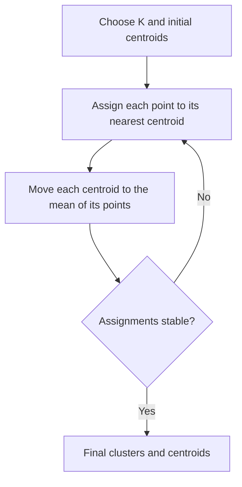

---
tags:
  - machine-learning
  - clustering
---

# K-means Clustering

## 1. The idea: discover groups from features

**Clustering** groups similar observations together without being given the correct group labels. It is **unsupervised learning**.

For example, we might group customers using their annual spending. Each customer is an **observation**; spending is a **feature**. With two features, such as spending and visit frequency, each customer becomes a point on a 2D plot.

**K-means divides observations into $K$ clusters.** Each cluster is represented by its **centroid**: the mean of the points assigned to it.

- $K$ is the number of clusters **we choose**.
- A centroid is a location, not necessarily an actual observation.
- Points are assigned to their nearest centroid, using Euclidean distance.

> [!summary] The central idea
> **Assign points to the nearest centre → move each centre to the mean of its points → repeat.**

## 2. How the algorithm works

1. Choose $K$ and initialize $K$ centroids.
2. **Assign:** put every point in the cluster with the nearest centroid.
3. **Update:** replace each centroid with the mean of its assigned points.
4. Repeat assignment and update until the assignments stop changing, or a stopping limit is reached.



For one feature, distance is the absolute difference: $|x-c|$.

For two features, it is straight-line distance:

$$
d(\mathbf{x},\mathbf{c})=\sqrt{(x_1-c_1)^2+(x_2-c_2)^2}
$$

The subscripts identify **features**. We can compare squared distances instead: taking the square root does not change which distance is smaller.

## 3. Worked example 1: one feature

Six observations have these values:

$$
1,\ 2,\ 3,\ 8,\ 9,\ 10
$$

Choose **$K=2$**. We deliberately start with centroids $c_A=1$ and $c_B=3$ to see how the groups improve.

### First assignment

| Point $x$ | Distance to $c_A=1$ | Distance to $c_B=3$ | Assigned cluster |
| ---: | ---: | ---: | :---: |
| 1 | 0 | 2 | A |
| 2 | 1 | 1 | A* |
| 3 | 2 | 0 | B |
| 8 | 7 | 5 | B |
| 9 | 8 | 6 | B |
| 10 | 9 | 7 | B |

*For the tie at 2, choose A. Either choice is allowed; use a consistent tie rule.*

### First update

Calculate the mean **within each assigned cluster**:

$$
c_A=\frac{1+2}{2}=1.5
\qquad
c_B=\frac{3+8+9+10}{4}=7.5
$$

### Second assignment and update

The midpoint between the new centroids is $(1.5+7.5)/2=4.5$. Points below 4.5 are closer to A; points above it are closer to B.

| Cluster | New members | Updated centroid |
| ------- | ----------- | ---------------- |
| A       | 1, 2, 3     | $(1+2+3)/3=2$    |
| B       | 8, 9, 10    | $(8+9+10)/3=9$   |

Point **3 moved from B to A** because the centroids changed.

With centroids 2 and 9, the boundary becomes 5.5. Assigning again gives the same groups, so their means also stay unchanged. The algorithm has converged.

```text
Cluster A                         Cluster B
1    2    3                       8    9    10
     ↑                                 ↑
  centroid 2                       centroid 9
```

> [!tip] What moves?
> The data points stay fixed. Their cluster memberships can change, and the centroids move.

## 4. WCSS and inertia: what K-means minimizes

**WCSS** means **within-cluster sum of squares**. For every point, calculate its squared distance to its own centroid, then add these values across all clusters.

$$
\boxed{
\text{WCSS}=\sum_{k=1}^{K}\sum_{\mathbf{x}_i\in C_k}
\|\mathbf{x}_i-\boldsymbol{\mu}_k\|^2
}
$$

Here, $C_k$ is cluster $k$, $\boldsymbol{\mu}_k$ is its centroid, and $\|\mathbf{x}_i-\boldsymbol{\mu}_k\|^2$ means squared Euclidean distance. Both sums simply mean **add up all the points’ contributions**.

For our final one-feature clusters:

$$
\begin{aligned}
\text{WCSS}
&=\underbrace{(1-2)^2+(2-2)^2+(3-2)^2}_{\text{cluster A: }2}\\
&\quad+\underbrace{(8-9)^2+(9-9)^2+(10-9)^2}_{\text{cluster B: }2}\\
&=\boxed{4}
\end{aligned}
$$

**In standard, unweighted K-means, inertia is this same quantity: WCSS.** It is a sum, not an average, and not the sum of ordinary distances.

- **Lower WCSS:** points lie closer to their own centroids.
- **Squaring:** faraway points contribute disproportionately; distance 4 contributes 16, while distance 2 contributes 4.
- **Why the mean?** For fixed cluster members, their mean minimizes the sum of squared distances.

Assignment and update each decrease WCSS or leave it unchanged. However, K-means can settle at a solution that is not the best possible one; initialization matters.

## 5. Worked example 2: two features

Now each observation has two coordinates. Assume the two features have comparable scales.

| Point | Feature 1 | Feature 2 |
| --- | ---: | ---: |
| A | 1 | 1 |
| B | 1 | 3 |
| C | 7 | 7 |
| D | 7 | 9 |

Choose **$K=2$**, with initial centroids $\boldsymbol{\mu}_1=(1,1)$ and $\boldsymbol{\mu}_2=(7,7)$.

### Assign using both features

For B, the squared distances are:

$$
d^2(B,\boldsymbol{\mu}_1)=(1-1)^2+(3-1)^2=4
$$

$$
d^2(B,\boldsymbol{\mu}_2)=(1-7)^2+(3-7)^2=36+16=52
$$

So B joins cluster 1. Applying the same calculation to every point:

| Point | Squared distance to $(1,1)$ | Squared distance to $(7,7)$ | Cluster |
| --- | ---: | ---: | :---: |
| A | 0 | 72 | 1 |
| B | 4 | 52 | 1 |
| C | 72 | 0 | 2 |
| D | 100 | 4 | 2 |

### Update each coordinate separately

A centroid has **one mean per feature**:

$$
\boldsymbol{\mu}_1
=\left(\frac{1+1}{2},\frac{1+3}{2}\right)=(1,2)
$$

$$
\boldsymbol{\mu}_2
=\left(\frac{7+7}{2},\frac{7+9}{2}\right)=(7,8)
$$

Reassignment gives the same groups, so these are the final centroids. Neither centroid is an original data point.

### Calculate WCSS

Each point is 1 unit vertically from its centroid, with no horizontal difference:

$$
\text{WCSS}=1^2+1^2+1^2+1^2=\boxed{4}
$$

The procedure is unchanged from one feature. With more features, **distance uses every coordinate, and the centroid averages every coordinate separately**.

## 6. Choosing K: the elbow method

A larger $K$ gives points more centres to choose from. The **best achievable WCSS cannot increase** as $K$ increases. At $K=n$, each of the $n$ points can have its own cluster, giving WCSS 0.

Therefore, choosing the lowest WCSS alone would favour too many clusters.

The **elbow method** looks for a point where adding more clusters produces much smaller improvements.

For our one-feature data, the minimum WCSS values are:

| $K$ | WCSS | Reduction from previous $K$ |
| ---: | ---: | ---: |
| 1 | 77.5 | — |
| 2 | 4 | 73.5 |
| 3 | 2.5 | 1.5 |
| 4 | 1 | 1.5 |
| 5 | 0.5 | 0.5 |
| 6 | 0 | 0.5 |

Plot **$K$ on the horizontal axis** and **WCSS on the vertical axis**. Here, the sharp drop from 1 to 2 followed by small improvements suggests an elbow at **$K=2$**.

> [!important] An elbow is a clue
> Some datasets have no clear elbow. Use it together with cluster separation and whether the groups are useful. Actual runs can give imperfect WCSS values because K-means may find different local solutions.

## 7. Silhouette score: compact and separated?

WCSS measures closeness to centroids. **Silhouette** also asks whether a point is clearly separated from other clusters.

For a point $i$:

- $a(i)$: average distance to the **other points in its own cluster**.
- $b(i)$: average distance to points in the **nearest other cluster**. Calculate an average for each other cluster, then choose the smallest average.

Using ordinary Euclidean distances:

$$
\boxed{s(i)=\frac{b(i)-a(i)}{\max(a(i),b(i))}}
$$

| Silhouette value | Meaning |
| --- | --- |
| Close to **+1** | Much closer to its own cluster than to other clusters |
| Around **0** | About equally close to its own and another cluster |
| Below **0** | Closer on average to another cluster; its assignment may be poor |

The overall **silhouette score is the mean of the individual points’ scores**. Higher is generally better.

### Worked calculation using the two-feature example

For A = $(1,1)$, its only same-cluster neighbour is B = $(1,3)$:

$$
a(A)=2
$$

The other cluster contains C = $(7,7)$ and D = $(7,9)$:

$$
b(A)=\frac{\sqrt{6^2+6^2}+\sqrt{6^2+8^2}}{2}
=\frac{\sqrt{72}+10}{2}\approx9.243
$$

$$
s(A)=\frac{9.243-2}{9.243}\approx\boxed{0.784}
$$

A fits its cluster well. This is **A’s score**, not yet the overall score; calculate the other points’ scores and average all four.

> [!note] Important distinctions
> Silhouette uses distances **between points**, not distances to centroids. Evaluate it for $2\le K\le n-1$; a singleton cluster’s point is conventionally assigned score 0. Compare candidate values of $K$ using the same data, preprocessing, and distance metric.

## 8. Practical choices and limitations

| Aspect | What matters |
| --- | --- |
| **Feature scaling** | Large numerical scales dominate distance. Standardizing each feature as $z=(x-\text{mean})/\text{standard deviation}$ often helps when units differ. Scaling defines what “similar” means. |
| **Initialization** | Different starting centres can give different results. **K-means++** favours well-separated starting centres; multiple runs help, retaining the lowest-WCSS result. Neither guarantees the global optimum. |
| **Cluster shape** | K-means works best for compact, roughly spherical groups of similar spread. It struggles with curved groups and strongly unequal spreads or densities. |
| **Outliers** | Extreme points can pull means toward them and contribute heavily to WCSS. K-means does not identify a separate “noise” class. |
| **Feature type** | Means and distances must make sense. Arbitrary category codes such as red = 1 and blue = 2 do not create meaningful numerical distances. |
| **Interpretation** | Cluster numbers are arbitrary identifiers. Cluster 0 is not better or smaller than cluster 1, and discovered groups are not automatically meaningful real-world categories. |

## Quick recap

| Concept | Remember |
| --- | --- |
| **K-means** | Repeatedly assign to the nearest centre and update centres to means |
| **Centroid** | One average per feature within a cluster |
| **WCSS / inertia** | Sum of squared distances from points to their assigned centroids |
| **Elbow method** | Find where increasing $K$ gives much smaller WCSS improvements |
| **Silhouette score** | Compare within-cluster closeness with separation from other clusters |

**Choose features and their scales carefully, try several values of $K$, and inspect whether the resulting groups make sense.**
