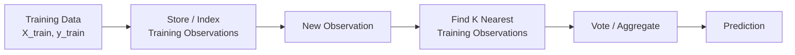
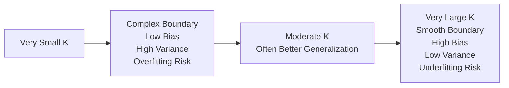
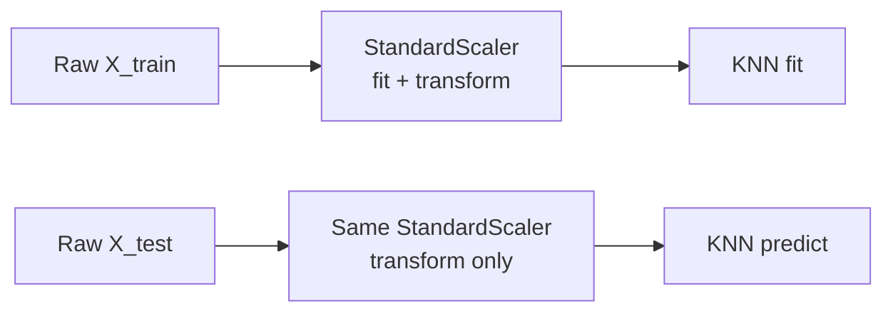
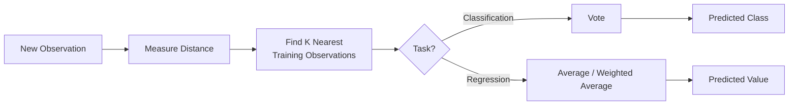

# K-Nearest Neighbors (KNN)

> [!abstract] Definition
> **K-Nearest Neighbors (KNN)** is a supervised, non-parametric, instance-based machine learning algorithm used for **classification and regression**. Instead of learning a mathematical prediction function during training, KNN retains the training observations and predicts a new observation using the target values of its **K nearest training observations**.

---

## 1. Core Idea and Intuition

KNN is based on a simple assumption:

> **Observations that are similar in their feature values are likely to have similar target values.**

Suppose we want to classify a new customer and choose `K = 5`. KNN finds the five training customers most similar to the new customer according to a distance metric.

If their classes are:

| Neighbor | Class |
| -------: | ----- |
|        1 | B     |
|        2 | B     |
|        3 | C     |
|        4 | B     |
|        5 | A     |

then the vote is `A = 1`, `B = 3`, `C = 1`, so the new observation is classified as **Class B**.

For classification, KNN therefore follows:

$$
\boxed{\text{New Observation} \rightarrow \text{Find K Nearest Neighbors} \rightarrow \text{Vote} \rightarrow \text{Predicted Class}}
$$

For regression, voting is replaced by aggregation, usually an average:

$$
\boxed{\text{New Observation} \rightarrow \text{Find K Nearest Neighbors} \rightarrow \text{Average Targets} \rightarrow \text{Predicted Value}}
$$

### What exactly does K mean?

`K` is simply the **number of neighboring training observations considered while making a prediction**.

If `K = 1`, only the nearest training observation is considered. If `K = 3`, the three nearest observations participate. If `K = 15`, fifteen observations participate.

In scikit-learn:

```python
from sklearn.neighbors import KNeighborsClassifier

model = KNeighborsClassifier(n_neighbors=5)
```

means:

$$
K=5
$$

---

## 2. Why KNN is Called a Lazy Learner

Most machine learning algorithms learn some representation of the training data during `fit()`:

| Algorithm           | What is learned during training?                                                    |
| ------------------- | ----------------------------------------------------------------------------------- |
| Linear Regression   | Coefficients and intercept                                                          |
| Logistic Regression | Coefficients and intercept                                                          |
| Decision Tree       | Splitting rules and tree structure                                                  |
| Neural Network      | Weights and biases                                                                  |
| SVM                 | Support vectors and decision boundary parameters                                    |
| **KNN**             | **No conventional predictive equation; training observations are retained/indexed** |

KNN is therefore called a **lazy learner** because most of the computational work is postponed until prediction time. It is also called an **instance-based learner** because predictions depend directly on stored training instances.



This creates an important trade-off:

| Property               | KNN                                  |
| ---------------------- | ------------------------------------ |
| Training/Fitting       | Relatively inexpensive               |
| Prediction             | Potentially expensive                |
| Training data storage  | Required                             |
| Learned coefficients   | No                                   |
| Learned weights/biases | No conventional model weights/biases |
| Model type             | Non-parametric                       |
| Learning style         | Lazy / instance-based                |

> [!important]
> Saying that KNN performs **"no training at all"** is slightly misleading. `fit()` still exists, and implementations may store or organize/index the training observations. The important point is that KNN does not learn a conventional parameterized prediction function such as the coefficients of linear regression.

---

## 3. How KNN Classification Works — Worked Example

Consider the following simplified customer dataset. We use only two features so that the distance calculations are easy to understand.

| Customer | Age | Income (₹ lakh) | Class        |
| -------- | --: | --------------: | ------------ |
| A        |  22 |               3 | Student      |
| B        |  25 |               4 | Student      |
| C        |  28 |               5 | Professional |
| D        |  35 |               8 | Professional |
| E        |  40 |              10 | Business     |
| F        |  45 |              12 | Business     |
| G        |  55 |              15 | Retired      |
| H        |  60 |              16 | Retired      |

A new customer arrives:

$$
X_{new}=(30,6)
$$

Suppose:

$$
K=3
$$

KNN must find the **three closest training observations** to `(30, 6)`.

### Step 1 — Calculate Distance

Using Euclidean distance:

$$
d(x,y)=\sqrt{\sum_{i=1}^{n}(x_i-y_i)^2}
$$

For Customer A `(22,3)`:

$$
d(A,X)=\sqrt{(30-22)^2+(6-3)^2}
=\sqrt{64+9}
=\sqrt{73}
\approx8.54
$$

For Customer B `(25,4)`:

$$
d(B,X)=\sqrt{(30-25)^2+(6-4)^2}
=\sqrt{25+4}
=\sqrt{29}
\approx5.39
$$

For Customer C `(28,5)`:

$$
d(C,X)=\sqrt{(30-28)^2+(6-5)^2}
=\sqrt5
\approx2.24
$$

For Customer D `(35,8)`:

$$
d(D,X)=\sqrt{(30-35)^2+(6-8)^2}
=\sqrt{29}
\approx5.39
$$

Repeating this calculation for every training observation gives:

| Customer | Distance from `(30,6)` | Class        |
| -------- | ---------------------: | ------------ |
| **C**    |               **2.24** | Professional |
| **B**    |               **5.39** | Student      |
| **D**    |               **5.39** | Professional |
| A        |                   8.54 | Student      |
| E        |                  10.77 | Business     |
| F        |                  16.16 | Business     |
| G        |                  26.57 | Retired      |
| H        |                  31.62 | Retired      |

### Step 2 — Select K Nearest Neighbors and Vote

Because `K = 3`, KNN takes the first three observations:

| Neighbor | Distance | Class        |
| -------- | -------: | ------------ |
| C        |     2.24 | Professional |
| B        |     5.39 | Student      |
| D        |     5.39 | Professional |

The votes are:

$$
Professional=2,\qquad Student=1
$$

Therefore:

$$
\boxed{\text{Prediction = Professional}}
$$

This is the fundamental mechanism of KNN classification. Regardless of whether the dataset contains 100 observations or 10 million observations, conceptually the algorithm is trying to identify the K closest training examples and use their classes to make the prediction.

---

## 4. Distance Metrics

The word **"nearest"** has to be mathematically defined. This is the purpose of a distance metric.

### Euclidean Distance

Euclidean distance represents ordinary straight-line distance:

$$
d(x,y)=\sqrt{\sum_{i=1}^{n}(x_i-y_i)^2}
$$

For points `A = (2,3)` and `B = (5,7)`:

$$
d(A,B)=\sqrt{(5-2)^2+(7-3)^2}=\sqrt{9+16}=5
$$

### Manhattan Distance

Manhattan distance is the sum of absolute differences:

$$
d(x,y)=\sum_{i=1}^{n}|x_i-y_i|
$$

For the same points:

$$
d(A,B)=|5-2|+|7-3|=3+4=7
$$

It can be imagined as movement through city blocks rather than travelling diagonally in a straight line.

### Minkowski Distance

Minkowski distance generalizes both:

$$
d(x,y)=\left(\sum_{i=1}^{n}|x_i-y_i|^p\right)^{1/p}
$$

| `p` | Equivalent Metric |
| --: | ----------------- |
| `1` | Manhattan         |
| `2` | Euclidean         |

In scikit-learn:

```python
# Euclidean
KNeighborsClassifier(metric="minkowski", p=2)

# Manhattan
KNeighborsClassifier(metric="minkowski", p=1)

# These can also be specified directly:
KNeighborsClassifier(metric="euclidean")
KNeighborsClassifier(metric="manhattan")
```

> [!note]
> The choice of distance metric matters because changing the metric can change which observations are considered the **nearest neighbors**, which can therefore change the final prediction.

---

## 5. KNN with Many Features

The worked example used two features only for visualization and arithmetic. KNN works the same way with larger feature spaces.

Suppose a customer has five features:

$$
X=[Age,\ Income,\ Experience,\ CreditScore,\ Balance]
$$

For a new observation:

$$
X_{new}=[x_1,x_2,x_3,x_4,x_5]
$$

and training observation:

$$
X_i=[a_1,a_2,a_3,a_4,a_5]
$$

Euclidean distance becomes:

$$
d(X_{new},X_i)=
\sqrt{
(x_1-a_1)^2+
(x_2-a_2)^2+
(x_3-a_3)^2+
(x_4-a_4)^2+
(x_5-a_5)^2
}
$$

Thus, `2 features → 2D`, `3 features → 3D`, `5 features → 5D`, and `100 features → 100D`. Humans cannot visualize a 100-dimensional space, but the mathematical distance calculation still works.

---

## 6. Does KNN Compare the New Observation with Every Training Row?

With **brute-force KNN**, yes.

Suppose:

* Training observations = `10,000`
* Features = `5`
* `K = 5`

For one new observation, brute-force KNN conceptually calculates:

$$
d(X_{new},X_1),\ d(X_{new},X_2),\ d(X_{new},X_3),\ldots,d(X_{new},X_{10000})
$$

It then identifies the five smallest distances.

For example:

| Training Row | Distance | Class |
| ------------ | -------: | ----- |
| Row 7182     |     0.31 | B     |
| Row 293      |     0.38 | B     |
| Row 8801     |     0.44 | C     |
| Row 442      |     0.49 | B     |
| Row 6102     |     0.52 | A     |
| Row 991      |     0.55 | C     |
| ...          |      ... | ...   |

For `K = 5`, only the first five participate:

$$
B,\ B,\ C,\ B,\ A
$$

Therefore:

$$
A=1,\quad B=3,\quad C=1
$$

and the prediction is **B**.

### Computational Complexity

Let:

* $n$ = number of training observations
* $d$ = number of features

Brute-force distance calculation for one query is approximately:

$$
O(nd)
$$

For `n = 10,000` and `d = 5`, roughly `10,000 × 5` feature-level calculations are involved in computing distances, plus the work required to identify the nearest K observations.

This explains a major characteristic of KNN:

> **KNN has relatively cheap fitting but potentially expensive prediction.**

For small and moderate datasets this may be perfectly acceptable. For extremely large datasets or applications requiring very low prediction latency, it can become a serious limitation.

---

## 7. Brute Force, KD Tree and Ball Tree

A KNN implementation does not necessarily have to perform a naive scan every time. Neighbor-search algorithms can organize the training data to make searches more efficient.

| Algorithm   | Basic Idea                                                 |
| ----------- | ---------------------------------------------------------- |
| `brute`     | Directly calculate distances against training observations |
| `kd_tree`   | Partition feature space using a tree structure             |
| `ball_tree` | Organize observations into nested regions ("balls")        |
| `auto`      | Let scikit-learn select an appropriate approach            |

```python
KNeighborsClassifier(
    n_neighbors=5,
    algorithm="auto"
)
```

Possible values are:

```python
algorithm="auto"
algorithm="brute"
algorithm="kd_tree"
algorithm="ball_tree"
```

These algorithms change **how efficiently neighbors are searched for**, not the fundamental KNN logic.

$$
\boxed{\text{Find K nearest observations} \rightarrow \text{use their target values} \rightarrow \text{predict}}
$$

Tree-based methods are not automatically faster in every situation. Their usefulness depends on dimensionality, dataset size, metric, and data structure. In high-dimensional spaces, their advantage can deteriorate substantially.

---

## 8. Choosing the Value of K

There is no universal formula that determines the correct K.

Having:

* 10,000 observations
* 5 features
* 4 classes

does **not** imply a specific K.

K is a **hyperparameter** and should normally be selected through validation or cross-validation.

For example:

|  K | Cross-Validation Accuracy |
| -: | ------------------------: |
|  1 |                      0.86 |
|  3 |                      0.89 |
|  5 |                      0.92 |
|  7 |                  **0.93** |
|  9 |                      0.92 |
| 11 |                      0.91 |
| 15 |                      0.89 |

In this hypothetical experiment, `K = 7` performs best among the tested values.

A commonly mentioned starting heuristic is:

$$
K\approx\sqrt{n}
$$

For `n = 10,000`:

$$
K\approx100
$$

However, this is only a **rough heuristic**, not a rule. Cross-validation is generally a much better way to select K.

### Why are odd values of K commonly used?

For binary classification, using `K = 3, 5, 7, 9...` reduces the chance of equal votes between two classes.

However, odd K does **not guarantee the absence of ties in multiclass classification**. For example, with `K = 5`:

$$
A=2,\quad B=2,\quad C=1
$$

is still a tie between A and B.

---

## 9. Small K vs Large K — Bias and Variance

K controls how **local** the prediction is.

| Small K                   | Large K                             |
| ------------------------- | ----------------------------------- |
| Small neighborhood        | Large neighborhood                  |
| Highly local decisions    | More generalized decisions          |
| Complex decision boundary | Smoother decision boundary          |
| Sensitive to noise        | Less sensitive to individual points |
| Lower bias                | Higher bias                         |
| Higher variance           | Lower variance                      |
| Greater overfitting risk  | Greater underfitting risk           |

With `K = 1`, a single unusual or noisy training observation can completely determine the classification of nearby points.

As K increases, more neighbors participate, so an individual noisy observation has less influence. But if K becomes excessively large—for example `K = 9,000` in a dataset containing 10,000 observations—the prediction stops being meaningfully local and may become dominated by the dataset's majority class.



> [!important]
> **Small K → flexible/local/noise-sensitive**
>
> **Large K → smooth/global/less noise-sensitive**
>
> The appropriate K is determined empirically using validation.

---

## 10. Feature Scaling — Critical for KNN

KNN is highly sensitive to feature scale because its predictions depend directly on distance.

Suppose the features are:

| Feature    | Typical Value |
| ---------- | ------------: |
| Age        |            35 |
| Salary     |     1,200,000 |
| Experience |             8 |
| Children   |             2 |
| Rating     |           4.5 |

Suppose two observations differ by:

* Age: `5`
* Salary: `300,000`
* Experience: `2`

Euclidean distance includes:

$$
5^2+300000^2+2^2+\cdots
$$

The salary term completely dominates the calculation because its numerical scale is enormous compared with the other features. The algorithm may effectively become a **salary-neighbor model** even if the other features are equally important.

### Standardization

A common solution is `StandardScaler`:

$$
z=\frac{x-\mu}{\sigma}
$$

where $\mu$ and $\sigma$ are the mean and standard deviation learned from the **training data**.

```python
from sklearn.preprocessing import StandardScaler

scaler = StandardScaler()

X_train_scaled = scaler.fit_transform(X_train)
X_test_scaled = scaler.transform(X_test)
```

Notice that we call:

```python
fit_transform(X_train)
transform(X_test)
```

and **not**:

```python
fit_transform(X_train)
fit_transform(X_test)   # WRONG
```

The scaler must learn its parameters only from the training data. Fitting it independently on test data creates inconsistent preprocessing and introduces information from the test distribution into the preprocessing process.

### Recommended Approach: Pipeline

```python
from sklearn.pipeline import Pipeline
from sklearn.preprocessing import StandardScaler
from sklearn.neighbors import KNeighborsClassifier

model = Pipeline([
    ("scaler", StandardScaler()),
    ("knn", KNeighborsClassifier(n_neighbors=5))
])

model.fit(X_train, y_train)
y_pred = model.predict(X_test)
```

> [!tip] Interview Question — Why is scaling especially important for KNN?
> Because KNN determines similarity using distance. Features with larger numerical scales can dominate that distance even when they are not more important predictors.

---

## 11. Uniform vs Distance-Weighted KNN

Ordinary KNN gives every selected neighbor equal voting power.

Suppose `K = 5`:

| Neighbor | Distance | Class |
| -------- | -------: | ----- |
| 1        | **0.10** | A     |
| 2        |     3.20 | B     |
| 3        |     3.50 | B     |
| 4        |     4.00 | B     |
| 5        |     4.20 | A     |

With equal voting:

$$
A=2,\qquad B=3
$$

so the prediction is B.

However, notice that the closest A observation is only `0.10` away, whereas the B observations are much farther away. This raises an important question:

> Should a neighbor 0.10 units away have exactly the same influence as a neighbor 4 units away?

### Uniform Weighting

```python
KNeighborsClassifier(
    n_neighbors=5,
    weights="uniform"
)
```

Every selected neighbor has equal influence:

$$
w_i=1
$$

### Distance Weighting

```python
KNeighborsClassifier(
    n_neighbors=5,
    weights="distance"
)
```

Closer observations receive greater influence. Conceptually, weighting is inversely related to distance:

$$
w_i\propto\frac{1}{d_i}
$$

Thus, a very close neighbor can have much greater influence than a relatively distant neighbor.

Neither method is universally superior. `weights` should be treated as another hyperparameter and evaluated using cross-validation.

---

## 12. Curse of Dimensionality

KNN can struggle as the number of features becomes large because the feature space becomes increasingly sparse.

In low dimensions, "near" and "far" can be meaningfully different. As dimensionality increases, observations tend to spread throughout a vastly larger feature space, and distance relationships can become less discriminative.

This phenomenon is known as the **curse of dimensionality**.

It is particularly important for KNN because KNN depends entirely on the idea that:

$$
\text{nearby observations} \approx \text{similar observations}
$$

If distances stop representing meaningful similarity, KNN loses much of its predictive power.

Irrelevant features make the problem worse. If only `Age`, `Income`, and `CreditScore` are useful but dozens of irrelevant numerical variables are included, those variables still contribute to the distance calculation and can distort which observations are considered nearest.

Common approaches include **feature selection, dimensionality reduction, removing irrelevant features, and domain-informed feature engineering**.

> [!important]
> More features do not automatically improve KNN. What matters is whether **distance in the chosen feature space represents meaningful similarity for the prediction problem**.

---

## 13. KNN for Regression

KNN can also predict continuous values.

Suppose `K = 3`, and the three nearest houses have prices:

$$
₹50L,\quad ₹55L,\quad ₹60L
$$

Ordinary KNN regression predicts:

$$
\hat y=\frac{50+55+60}{3}=55
$$

Therefore:

$$
\boxed{\hat y=₹55L}
$$

Implementation:

```python
from sklearn.neighbors import KNeighborsRegressor

model = KNeighborsRegressor(
    n_neighbors=3
)

model.fit(X_train, y_train)
y_pred = model.predict(X_test)
```

Distance-weighted regression is also possible:

```python
model = KNeighborsRegressor(
    n_neighbors=3,
    weights="distance"
)
```

In that case, closer observations contribute more strongly to the predicted value.

---

## 14. Complete Scikit-Learn Classification Example

The following example uses the Iris dataset and combines scaling and KNN in a pipeline.

```python
from sklearn.datasets import load_iris
from sklearn.model_selection import train_test_split
from sklearn.preprocessing import StandardScaler
from sklearn.neighbors import KNeighborsClassifier
from sklearn.pipeline import Pipeline
from sklearn.metrics import (
    accuracy_score,
    classification_report,
    confusion_matrix
)

# Load dataset
iris = load_iris()
X = iris.data
y = iris.target

# Train-test split
X_train, X_test, y_train, y_test = train_test_split(
    X,
    y,
    test_size=0.20,
    random_state=42,
    stratify=y
)

# Scaling + KNN
model = Pipeline([
    ("scaler", StandardScaler()),
    ("knn", KNeighborsClassifier(
        n_neighbors=5,
        weights="uniform",
        metric="euclidean"
    ))
])

# Train
model.fit(X_train, y_train)

# Predict
y_pred = model.predict(X_test)

# Evaluate
print("Accuracy:", accuracy_score(y_test, y_pred))

print(
    classification_report(
        y_test,
        y_pred,
        target_names=iris.target_names
    )
)

print(confusion_matrix(y_test, y_pred))
```

The pipeline is important because the transformation becomes part of the model workflow:



---

## 15. Hyperparameter Tuning with GridSearchCV

Rather than guessing the best combination of K, weighting method, and distance metric, we can evaluate combinations using cross-validation.

```python
from sklearn.model_selection import GridSearchCV
from sklearn.pipeline import Pipeline
from sklearn.preprocessing import StandardScaler
from sklearn.neighbors import KNeighborsClassifier

pipeline = Pipeline([
    ("scaler", StandardScaler()),
    ("knn", KNeighborsClassifier())
])

param_grid = {
    "knn__n_neighbors": [1, 3, 5, 7, 9, 11, 15, 21],
    "knn__weights": ["uniform", "distance"],
    "knn__metric": ["euclidean", "manhattan"]
}

grid_search = GridSearchCV(
    estimator=pipeline,
    param_grid=param_grid,
    cv=5,
    scoring="accuracy",
    n_jobs=-1
)

grid_search.fit(X_train, y_train)

print("Best Parameters:", grid_search.best_params_)
print("Best CV Score:", grid_search.best_score_)

best_model = grid_search.best_estimator_
y_pred = best_model.predict(X_test)
```

Putting `StandardScaler` **inside the pipeline** is especially important during cross-validation. For each fold, the scaler is fitted only on that fold's training portion and then applied to its validation portion. This prevents **data leakage**.

The proper workflow is therefore:

$$
\boxed{\text{Training Data} \rightarrow \text{Cross-Validation} \rightarrow \text{Choose Hyperparameters} \rightarrow \text{Final Evaluation on Test Data}}
$$

The test set should **not** be repeatedly used to decide which K performs best.

---

## 16. Important `KNeighborsClassifier` Parameters

```python
KNeighborsClassifier(
    n_neighbors=5,
    weights="uniform",
    algorithm="auto",
    leaf_size=30,
    p=2,
    metric="minkowski",
    n_jobs=None
)
```

| Parameter     | Purpose                                            |
| ------------- | -------------------------------------------------- |
| `n_neighbors` | Number of neighbors, i.e. K                        |
| `weights`     | Equal or distance-based neighbor influence         |
| `metric`      | Distance metric                                    |
| `p`           | Minkowski power (`1` = Manhattan, `2` = Euclidean) |
| `algorithm`   | Neighbor-search algorithm                          |
| `leaf_size`   | Tree leaf size for KDTree/BallTree                 |
| `n_jobs`      | Parallel jobs used for neighbor search             |

The parameters most commonly important when learning/tuning KNN are:

$$
\boxed{n\_neighbors,\quad weights,\quad metric}
$$

---

## 17. Advantages, Limitations and When to Use KNN

| Advantages                     | Limitations                         |
| ------------------------------ | ----------------------------------- |
| Very intuitive                 | Prediction can be expensive         |
| Simple algorithm               | Stores training observations        |
| Little conventional training   | Sensitive to feature scaling        |
| Non-parametric                 | Sensitive to irrelevant features    |
| Can model nonlinear boundaries | Suffers in high dimensions          |
| Classification + regression    | K and metric require tuning         |
| Useful baseline model          | Can struggle on very large datasets |

KNN is often suitable when the dataset is **small or moderate**, dimensionality is manageable, meaningful similarity can be represented through a distance metric, nonlinear boundaries may exist, and extremely low prediction latency is not required.

It becomes less attractive when datasets are enormous, dimensionality is very high, many features are irrelevant, prediction latency is critical, or the chosen feature representation does not provide a meaningful notion of distance.

---

## 18. Common Mistakes

| Mistake                                | Why It Is a Problem                         | Better Approach                             |
| -------------------------------------- | ------------------------------------------- | ------------------------------------------- |
| Not scaling numerical features         | Large-scale features dominate distance      | Use appropriate scaling                     |
| Assuming `K=5` is always best          | Optimal K depends on data                   | Cross-validation                            |
| Choosing K using test accuracy         | Test data influences model selection        | Tune using CV                               |
| Scaling before train/test split        | Information leakage                         | Split first / use Pipeline                  |
| Fitting scaler separately on test data | Inconsistent transformations                | Fit scaler on training only                 |
| Using many irrelevant features         | Distances become distorted                  | Feature selection                           |
| Assuming odd K prevents every tie      | Multiclass ties can still occur             | Understand voting behavior                  |
| Assuming KD Tree is always faster      | Performance depends on dimensions/data      | Benchmark / use `auto`                      |
| Ignoring class imbalance               | Majority classes may dominate neighborhoods | Evaluate appropriate metrics and strategies |

---

## 19. Interview-Focused Questions

### What is KNN?

KNN is a supervised, non-parametric, instance-based algorithm that predicts a new observation using the target values of its K nearest training observations.

### What does K represent?

The number of neighboring training observations considered while making a prediction.

### Why is KNN called a lazy learner?

Because it does not learn a conventional parameterized prediction function during training. Much of the computational work is deferred until prediction time.

### Does KNN learn weights and biases?

No conventional model weights or biases are learned. KNN retains training observations and makes predictions using neighbor relationships.

### Why is feature scaling important?

Because KNN uses distances. Features with larger numerical scales can dominate the distance calculation.

### What happens when K is too small?

The model becomes highly local and sensitive to noise, resulting in high variance and greater overfitting risk.

### What happens when K is too large?

The model becomes overly smooth and less local, increasing bias and potentially causing underfitting.

### How should K be selected?

Normally through validation or cross-validation rather than using a fixed universal rule.

### Does KNN compare a new observation with every training observation?

With brute-force neighbor search, yes. Other search strategies such as KD Trees and Ball Trees may reduce the amount of direct searching in suitable datasets.

### What is brute-force prediction complexity?

Distance computation for one query is approximately:

$$
O(nd)
$$

where $n$ is the number of training observations and $d$ is the number of features.

### Why can KNN perform poorly with many features?

Because of the curse of dimensionality: feature space becomes sparse and distance can become a less meaningful measure of similarity.

### Classification vs Regression?

| Classification   | Regression                 |
| ---------------- | -------------------------- |
| Find K neighbors | Find K neighbors           |
| Examine classes  | Examine continuous targets |
| Vote             | Average / weighted average |
| Predict class    | Predict numerical value    |

### Parametric or non-parametric?

KNN is **non-parametric**. It does not assume a fixed functional form such as:

$$
y=\beta_0+\beta_1x_1+\cdots+\beta_px_p
$$

---

## 20. KNN Quick Revision

> [!summary] KNN Cheat Sheet
>
> | Concept                    | Key Point                                      |
> | -------------------------- | ---------------------------------------------- |
> | Full name                  | K-Nearest Neighbors                            |
> | Learning type              | Supervised                                     |
> | Tasks                      | Classification + Regression                    |
> | Model family               | Non-parametric                                 |
> | Learning style             | Lazy / instance-based                          |
> | Core idea                  | Predict using nearby training observations     |
> | `K`                        | Number of neighbors                            |
> | Classification             | Neighbor voting                                |
> | Regression                 | Neighbor target aggregation                    |
> | Common distances           | Euclidean, Manhattan, Minkowski                |
> | Small K                    | Low bias, high variance, overfitting risk      |
> | Large K                    | High bias, low variance, underfitting risk     |
> | Scaling                    | Very important                                 |
> | Fitting                    | Relatively cheap                               |
> | Prediction                 | Potentially expensive                          |
> | Brute-force query          | Approximately $O(nd)$ for distance calculation |
> | Major high-D problem       | Curse of dimensionality                        |
> | Search methods             | Brute, KD Tree, Ball Tree                      |
> | Key hyperparameters        | `n_neighbors`, `weights`, `metric`             |
> | Selecting K                | Cross-validation                               |
> | Recommended sklearn design | `Pipeline(StandardScaler → KNN)`               |

---

## Final Mental Model

The entire algorithm can be remembered with one question:

> **"Among the examples I have already seen, which K examples are most similar to this new observation?"**



The quality of a KNN model therefore depends heavily on four choices:

$$
\boxed{
\text{Feature Representation}
+\text{Feature Scaling}
+\text{Distance Metric}
+\text{K}
}
$$

The most important principle is that **mathematical closeness must correspond to meaningful similarity in the real problem**. If two observations that are close in feature space genuinely tend to have similar targets, KNN can work very well. If the feature representation or distance metric makes "closeness" meaningless, changing K alone will not fix the underlying problem.
