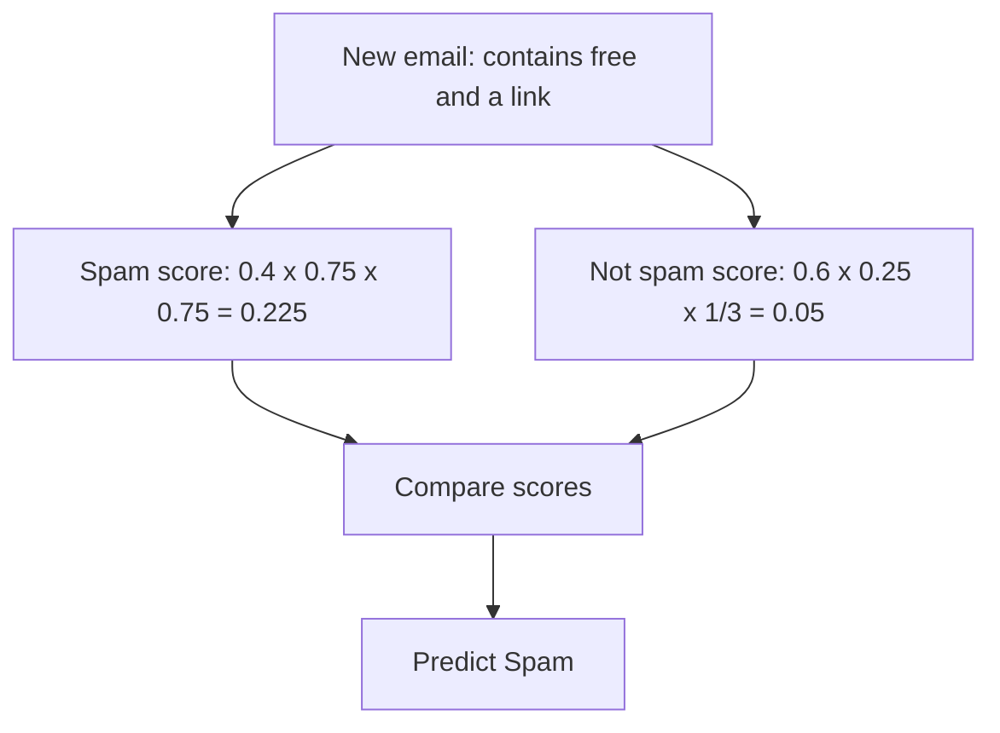

# Naive Bayes: Classifying with Probability

## 1. What are we trying to do?

Suppose an email arrives. We want to label it **Spam** or **Not spam** using clues in the message.

This is called **classification**: choosing a category for something.

- A **class** is a possible answer: Spam or Not spam.
- A **feature** is a piece of information we use: whether the email contains “free,” for example.
- **Training data** consists of examples whose correct classes we already know.

Naive Bayes learns how common each class is and how often different clues appear within each class. It uses those patterns to classify a new example.

> [!summary] The central idea
> For each possible class, ask: **How common is this class, and how well do the observed clues fit it?** Combine these two things and choose the class with the larger score.

## 2. Probability starts with counting

Imagine we have **20 labelled emails**:

| What we counted | Spam | Not spam |
| --- | ---: | ---: |
| Total emails | 8 | 12 |
| Emails containing “free” | 6 | 3 |
| Emails containing a link | 6 | 4 |

An email can contain both “free” and a link. The last two rows are separate counts that can overlap, not separate groups to add together.

### Probability: a fraction of a group

If we randomly pick one of the 20 emails, 8 of the possible choices are spam:

$$
P(\text{Spam}) = \frac{8}{20} = 0.4 = 40\%
$$

The symbol $P$ means “probability.” A probability of 0 means impossible; 1 means certain. Here, we estimate probabilities from our training counts.

### Conditional probability: first narrow the group

What fraction of **spam emails** contain “free”?

Look only at the 8 spam emails. Of those, 6 contain “free”:

$$
P(\text{free}\mid\text{Spam}) = \frac{6}{8} = 0.75
$$

The vertical bar $\mid$ means **“given.”** Read this as:

> The probability that an email contains “free,” **given that it is spam**.

Here, “free” is shorthand for “the email contains the word ‘free.’”

> [!tip] Choosing the denominator
> The condition after the bar tells you which group to count within. Given Spam? Divide by the number of spam emails.

## 3. Bayes’ theorem: turn the question around

These questions sound similar, but ask different things:

| Question | Group we look inside | Answer |
| --- | --- | --- |
| What fraction of spam emails contain “free”? | The 8 spam emails | $6/8 = 75\%$ |
| What fraction of emails containing “free” are spam? | The 9 emails containing “free” | $6/9 \approx 66.7\%$ |

The second question is what we need when a new email arrives: we can see the word, but we do not know the class.

**The direction matters.** $P(\text{free}\mid\text{Spam})$ and $P(\text{Spam}\mid\text{free})$ are generally different.

Bayes’ theorem connects the two directions:

$$
\boxed{
P(\text{Spam}\mid\text{free})
= \frac{P(\text{free}\mid\text{Spam})\,P(\text{Spam})}{P(\text{free})}
}
$$

Substitute our counts:

$$
P(\text{Spam}\mid\text{free})
= \frac{(6/8)\times(8/20)}{9/20}
= \frac{6/20}{9/20}
= \frac{6}{9}
\approx 66.7\%
$$

The numerator is the share of all emails that are **both spam and contain “free.”** Dividing by the share containing “free” narrows our attention to that group.

Before checking the word, our spam estimate was **40%**. After seeing “free,” it becomes **66.7%**.

### Names you will see

| Name | Meaning in this example |
| --- | --- |
| **Prior**: $P(\text{Spam})$ | Probability of spam before looking at this email’s features |
| **Likelihood**: $P(\text{free}\mid\text{Spam})$ | How often this clue appears among spam emails |
| **Posterior**: $P(\text{Spam}\mid\text{free})$ | Updated probability of spam after seeing the clue |
| **Evidence**: $P(\text{free})$ | How often the clue appears across all emails |

The idea behind the vocabulary is simple: **start with a probability, then update it using an observation.**

## 4. What makes Naive Bayes “naive”?

Now consider two clues: the email **contains “free”** and **contains a link**.

Bayes’ theorem needs the probability of both clues occurring together within each class. With many features, there can be too many combinations to estimate reliably from a small dataset.

Naive Bayes takes a shortcut: **within each class, it treats the features as independent.**

In our example, it assumes that once we know an email is spam, knowing whether it contains “free” does not change the probability that it contains a link. It makes the same assumption within the Not spam class.

This is called **conditional independence**. It lets the model estimate the probability of both clues by multiplying:

$$
P(\text{free and link}\mid\text{Spam})
\approx P(\text{free}\mid\text{Spam})\times P(\text{link}\mid\text{Spam})
$$

Real emails may not follow this assumption. Words and links may occur together more often than this multiplication predicts. The shortcut can still produce useful classifications, but the estimated probabilities may be overconfident.

> [!important] Two different things
> **Bayes’ theorem** is a rule of probability. **Naive Bayes** is a classifier that uses this rule together with a simplifying assumption about the features.

## 5. Worked example: classify a new email

Our new email **contains “free” and contains a link**. We use only these two yes/no features.

### Step 1: Find the class priors

From the 20 training emails:

$$
P(\text{Spam}) = \frac{8}{20} = 0.4
\qquad
P(\text{Not spam}) = \frac{12}{20} = 0.6
$$

Before inspecting the clues, Not spam is more common.

### Step 2: Find each clue’s probability within each class

Use the counts from Section 2:

| Observed clue | Among the 8 spam emails | Among the 12 non-spam emails |
| --- | ---: | ---: |
| Contains “free” | $6/8 = 0.75$ | $3/12 = 0.25$ |
| Contains a link | $6/8 = 0.75$ | $4/12 = 1/3$ |

Both clues occur more often within the Spam class.

### Step 3: Calculate one score per class

The rule is:

$$
\boxed{
\text{Class score} = \text{prior}\times\text{first clue likelihood}\times\text{second clue likelihood}
}
$$

For Spam:

$$
\text{Score}(\text{Spam})
= \frac{8}{20}\times\frac{6}{8}\times\frac{6}{8}
= 0.225
$$

For Not spam:

$$
\text{Score}(\text{Not spam})
= \frac{12}{20}\times\frac{3}{12}\times\frac{4}{12}
= 0.05
$$

### Step 4: Compare the scores

$$
0.225 > 0.05
$$

**Prediction: Spam.**

Although Not spam started with a larger prior, the two clues provided enough support for Spam to give it the larger final score.

### Step 5: Turn the scores into probabilities

The scores do **not** add up to 1. A score of 0.225 does **not** mean a 22.5% probability of spam given the clues.

To get the model’s class probabilities, divide each score by the sum of all class scores. This is called **normalization**.

$$
\text{Total score} = 0.225 + 0.05 = 0.275
$$

$$
P_{\text{model}}(\text{Spam}\mid\text{free, link})
= \frac{0.225}{0.275}
\approx 81.8\%
$$

$$
P_{\text{model}}(\text{Not spam}\mid\text{free, link})
= \frac{0.05}{0.275}
\approx 18.2\%
$$

These add up to 100%. They are estimates from the model, including its independence assumption; they are not guaranteed real-world frequencies.

**Why could we skip this division when choosing the class?** Both scores are divided by the same positive number, so the larger score stays larger.

### What if the email does not contain a link?

For a yes/no feature, use the probability of the value actually observed.

Of the 8 spam emails, 6 contain a link, so **2 do not**. Of the 12 non-spam emails, 4 contain a link, so **8 do not**.

For an email containing “free” **but no link**:

| Class | Score |
| --- | ---: |
| Spam | $(8/20)\times(6/8)\times(2/8) = 0.075$ |
| Not spam | $(12/20)\times(3/12)\times(8/12) = 0.10$ |

The prediction becomes **Not spam**. Absence can be useful information too.

## 6. One practical problem: a zero count

Suppose a word never appeared in the non-spam training emails. Its estimated probability within that class would be zero.

Multiplying by zero makes the entire class score zero, regardless of the other clues. But **“not seen in our sample” does not necessarily mean “impossible.”**

**Laplace smoothing** addresses this by adding one pretend observation to **each possible outcome** when estimating feature probabilities.

For a yes/no feature, there are two outcomes:

$$
P(\text{feature = yes}\mid C)
= \frac{\text{number of yes values in class }C + 1}{\text{number of examples in class }C + 2}
$$

If none of 12 non-spam emails contained a particular word:

$$
\text{Without smoothing: }\frac{0}{12}=0
\qquad
\text{With smoothing: }\frac{0+1}{12+2}=\frac{1}{14}
$$

The matching “word absent” probability becomes $13/14$, so the two outcomes still add up to 1.

Use smoothing consistently for all feature probabilities, not just entries with zero counts. For a categorical feature with $K$ possible values, add $K$ to the denominator instead of 2.

Our worked example used unsmoothed counts to keep the arithmetic easy to follow.

## 7. Which version fits which features?

The core idea stays the same. Different versions estimate feature likelihoods differently.

| Version | Feature values | Example |
| --- | --- | --- |
| **Bernoulli Naive Bayes** | Yes/no or 1/0 | Whether each word is present in an email; this is the version used above |
| **Multinomial Naive Bayes** | Counts | How many times each word appears in a document |
| **Categorical Naive Bayes** | One of several categories | Colour: red, green, or blue |
| **Gaussian Naive Bayes** | Continuous measurements | Flower petal length and width |

For Gaussian Naive Bayes, exact-value counting is not useful: a new petal length might never have appeared before. Instead, the model fits a bell-shaped curve to each feature **within each class**, learning its average and spread. Values are scored using the curve’s probability density, rather than the fraction of examples with that exact value.

## 8. What to remember in practice

- **Training means estimating patterns.** In our example, this means counting classes and feature values within each class.
- **Prediction means comparing scores.** Multiply the prior by the likelihood of each observed feature value.
- **Related clues can repeat the same information.** Two duplicate features can make the model count the same clue twice and become too confident.
- **Check performance on new examples.** Keep some labelled data out of training, then compare predictions with the true labels.
- **A useful prediction does not guarantee an accurate probability.** A reported 90% can be too confident when the assumptions fit poorly.

Naive Bayes is fast and simple, making it a useful starting model, particularly for text classification.

## Quick recap

> [!summary] The whole method
> 1. Find how common each class is: the **prior**.
> 2. Find how likely each observed clue is within each class: the **likelihoods**.
> 3. Multiply the prior and likelihoods to get a **score** for each class.
> 4. Predict the class with the largest score.
> 5. If you need probabilities, divide each score by the sum of all scores.

For a class $C$ and observed feature values $x_1,\ldots,x_n$:

$$
\boxed{
\text{Score}(C) = P(C)\times P(x_1\mid C)\times\cdots\times P(x_n\mid C)
}
$$

The “naive” part is treating the features as independent **within each class**, which allows this multiplication.
