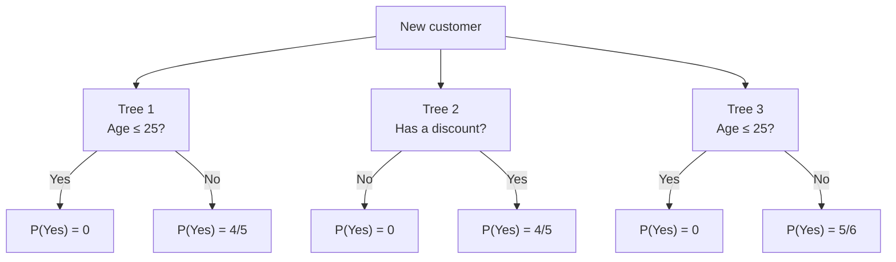

# Random Forest — From Individual Trees to a Forest


> [!abstract] The central idea
> A Random Forest trains many decision trees, introduces randomness so that they do not all learn the same rules, and combines their predictions.
>
> We will follow eight customers through bootstrap sampling, calculate the splits of three small trees, combine their predictions, and use the customers left out of training to understand out-of-bag evaluation.

**Before this note:** [[01 - Decision Trees - Theory]]. A tree routes an example through feature questions to a leaf. Gini measures how mixed the target labels are; training chooses splits that reduce weighted impurity.

## 1. Why build more than one tree?

A decision tree can change substantially when its training data changes slightly. A different root question sends rows into different groups, which can change many later questions.

This sensitivity is called **high variance**: predictions depend strongly on the particular training sample.

Imagine three regression trees predicting the price of the same house:

```text
Tree 1: 48 lakhs
Tree 2: 60 lakhs
Tree 3: 54 lakhs
Average: 54 lakhs
```

If some trees overestimate and others underestimate, averaging can reduce their individual fluctuations. But if every tree makes the same mistake, averaging preserves it.

> [!important] Two ingredients are needed
> The trees must learn useful patterns, and their errors must not be identical. A large collection of identical trees gives exactly the same prediction as one tree.
>
> Combining models is called **ensemble learning**. An ensemble can improve performance, but improvement is not guaranteed simply because more models are present.

Random Forest encourages different trees through two sources of randomness:

1. **Bootstrap sampling:** change which training rows appear, and how often they appear, for each tree.
2. **Random feature selection:** change which features are considered at each split.

It then **aggregates**, or combines, the tree predictions.

## 2. Our running dataset

We will use the same laptop-purchase dataset as the Decision Trees note:

| Customer | Age | Has a discount? | Bought a laptop? |
|---|---:|---|---|
| A | 20 | No | No |
| B | 20 | Yes | No |
| C | 30 | No | No |
| D | 30 | Yes | Yes |
| E | 40 | No | No |
| F | 40 | Yes | Yes |
| G | 50 | No | Yes |
| H | 50 | Yes | Yes |

- One row is one **sample**.
- Age and Discount are the two **features**.
- Bought a laptop is the **target**, with classes No and Yes.
- Customer letters identify rows; they are not prediction features.

We will build a forest with these settings:

| Setting | Value | Meaning |
|---|---|---|
| Number of trees | 3 | Three separately fitted trees |
| Bootstrap sample size | 8 draws per tree | Draw from the eight original customers with replacement |
| Features considered per split | 1 | Randomly consider Age or Discount at a node |
| Maximum depth | 1 | Each tree makes one split, then stops |
| Classification criterion | Gini | Choose the best allowed split by impurity reduction |

A tree with one split is called a **decision stump**. Our trees stop after one split so every calculation remains visible. Random Forests often use much deeper trees; depth 1 and three trees are not recommended general-purpose settings.

The bootstrap samples and feature choices below are specified possible outcomes of randomness, not a claim that a particular software seed will produce them.

## 3. Bootstrap sampling: what does “with replacement” mean?

To create Tree 1's training sample:

1. Randomly select one customer from A through H.
2. Record that customer's entire row, including features and target.
3. Return the customer to the pool, so the same row can be selected again.
4. Repeat until eight selections have been made.

One possible result is:

```text
A, A, B, C, D, F, G, H
```

A appears twice. E does not appear. All other customers appear once.

> [!note] Replacement does not modify the original data
> We are recording repeated selections. We do not remove customers from the original dataset, change their values, or create new independent observations.

The three samples for our forest are:

| Tree | Bootstrap sample: eight draws | Distinct customers included | Customers omitted |
|---|---|---:|---|
| Tree 1 | A, A, B, C, D, F, G, H | 7 | E |
| Tree 2 | B, C, C, D, E, F, H, H | 6 | A, G |
| Tree 3 | A, B, D, D, E, G, G, H | 6 | C, F |

### 3.1 What does each root contain?

Each root represents its own bootstrap sample, not necessarily all the original customers.

| Root | No occurrences | Yes occurrences | Total occurrences |
|---|---:|---:|---:|
| Tree 1 | 4 | 4 | 8 |
| Tree 2 | 4 | 4 | 8 |
| Tree 3 | 3 | 5 | 8 |

Repeated rows count repeatedly in impurity calculations. For Tree 1, A contributes two No occurrences. Implementations can represent repetition through weights rather than physically copying rows.

Consequently, “eight bootstrap occurrences” and “eight distinct customers” are different statements. Software tree displays may also distinguish distinct sample counts from weighted counts.

### 3.2 Why not shuffle the original rows instead?

Shuffling changes row order, but leaves the same examples with the same frequencies. A best-split tree would usually learn the same partitions, apart from possible tie-breaking effects.

Bootstrap sampling changes the empirical distribution: a customer might have zero, one, or several occurrences. That can change class proportions and which splits score best.

Training models on bootstrap samples and combining their predictions is called **bagging**, short for **bootstrap aggregating**.

## 4. The second source of randomness: features at each node

An ordinary best-split tree can compare Age and Discount at its root. In our forest, only one is randomly offered at a node:

```text
Tree 1 root: Age
Tree 2 root: Discount
Tree 3 root: Age
```

Tree 2 therefore evaluates a Discount split even if Age could have produced a better score.

> [!important] Random features; best split among the candidates
> In a standard Random Forest, the candidate features are randomly selected. The tree still searches for a good split among those features using its impurity criterion.
>
> Choosing a feature subset randomly does not mean choosing every threshold randomly.

### 4.1 A new selection is made at each node

In a deeper tree, possible feature selections might be:

```text
Root: consider Age
Left child: consider Discount
Right child: consider Age
Next mixed child: consider Discount
```

The selected features are not fixed for the entire tree. A feature excluded at the root can appear farther down. A feature used earlier can be reused.

The rows are different: **the bootstrap sample is normally drawn once per tree**, then partitioned by its splits. Rows are not freshly bootstrapped at every node.

### 4.2 Why hide a useful feature?

Suppose one feature repeatedly wins the root split. Many bagged trees may then learn similar structures and make similar errors.

Occasionally excluding that feature gives other useful features opportunities to influence the tree. This can make the trees' errors less correlated.

There is a tradeoff: restricting features too strongly can also weaken the trees. We want useful diversity, not randomness for its own sake.

## 5. Train Tree 1: calculate every candidate split

Tree 1 receives:

```text
A, A, B, C, D, F, G, H
```

Its root has four No and four Yes occurrences:

$$
Gini(root)=1-\left(\frac48\right)^2-\left(\frac48\right)^2=0.5
$$

Age is the only candidate feature. Its distinct values are 20, 30, 40, and 50, giving candidate midpoints 25, 35, and 45.

Recall:

$$
Gini_{after}=\frac{N_L}{N}Gini(L)+\frac{N_R}{N}Gini(R)
$$

$$
\Delta Gini=Gini(parent)-Gini_{after}
$$

### 5.1 Try Age ≤ 25

Left: A, A, B → three No, so Gini is 0.

Right: C, D, F, G, H → one No, four Yes:

$$
Gini(R)=1-\left(\frac15\right)^2-\left(\frac45\right)^2=0.32
$$

$$
Gini_{after}=\frac38(0)+\frac58(0.32)=0.20
$$

$$
\Delta Gini=0.50-0.20=0.30
$$

### 5.2 Try Age ≤ 35

Left: A, A, B, C, D → four No, one Yes, so Gini is 0.32.

Right: F, G, H → three Yes, so Gini is 0.

$$
Gini_{after}=\frac58(0.32)+\frac38(0)=0.20
$$

$$
\Delta Gini=0.30
$$

### 5.3 Try Age ≤ 45

Left: A, A, B, C, D, F → four No, two Yes:

$$
Gini(L)=1-\left(\frac46\right)^2-\left(\frac26\right)^2=\frac49
$$

Right: G, H → two Yes, so Gini is 0.

$$
Gini_{after}=\frac68\left(\frac49\right)=\frac13
$$

$$
\Delta Gini=\frac12-\frac13=\frac16\approx0.1667
$$

### 5.4 Choose the split and store leaf predictions

| Threshold | Weighted Gini after | Gini decrease |
|---|---:|---:|
| Age ≤ 25 | 0.2000 | **0.3000** |
| Age ≤ 35 | 0.2000 | **0.3000** |
| Age ≤ 45 | 0.3333 | 0.1667 |

The first two tie. For our worked forest, choose Age ≤ 25.

The depth limit now stops growth. The right child remains mixed:

| Leaf | No | Yes | Estimated $P(Yes)$ | Predicted class |
|---|---:|---:|---:|---|
| Age ≤ 25 | 3 | 0 | 0 | No |
| Age > 25 | 1 | 4 | $4/5=0.8$ | Yes |

The class prediction is the most common class. The probability estimate is the class's fraction of bootstrap occurrences in that leaf, assuming no additional class or sample weights.

## 6. Train Trees 2 and 3

### 6.1 Tree 2: Discount is selected

Bootstrap sample:

```text
B, C, C, D, E, F, H, H
```

Root: four No, four Yes → Gini 0.5.

The Discount split creates:

- No discount: C, C, E → three No → Gini 0.
- Has discount: B, D, F, H, H → one No, four Yes → Gini 0.32.

$$
Gini_{after}=\frac38(0)+\frac58(0.32)=0.20
$$

$$
\Delta Gini=0.50-0.20=0.30
$$

Tree 2's leaves are:

```text
Discount No  → P(Yes) = 0   → Predict No
Discount Yes → P(Yes) = 4/5 → Predict Yes
```

### 6.2 Tree 3: Age is selected

Bootstrap sample:

```text
A, B, D, D, E, G, G, H
```

Root: three No, five Yes:

$$
Gini(root)=1-\left(\frac38\right)^2-\left(\frac58\right)^2
=\frac{30}{64}=0.46875
$$

For Age ≤ 25:

- Left: A, B → two No → Gini 0.
- Right: D, D, E, G, G, H → one No, five Yes.

$$
Gini(R)=1-\left(\frac16\right)^2-\left(\frac56\right)^2
=\frac{10}{36}=\frac5{18}
$$

$$
Gini_{after}=\frac28(0)+\frac68\left(\frac5{18}\right)
=\frac5{24}\approx0.20833
$$

The other candidates give:

| Threshold | Left labels | Right labels | Weighted Gini after |
|---|---|---|---:|
| Age ≤ 25 | 2 No | 1 No, 5 Yes | **0.20833** |
| Age ≤ 35 | 2 No, 2 Yes | 1 No, 3 Yes | 0.43750 |
| Age ≤ 45 | 3 No, 2 Yes | 3 Yes | 0.30000 |

Age ≤ 25 wins, with decrease:

$$
0.46875-0.20833\approx0.26042
$$

Tree 3's leaves are:

```text
Age ≤ 25 → P(Yes) = 0   → Predict No
Age > 25 → P(Yes) = 5/6 → Predict Yes
```

> [!note] Different samples do not guarantee different structures
> Trees 1 and 3 use the same question, but their leaf proportions differ. Random Forest encourages variation; it does not require every tree to have a unique shape.

## 7. The complete forest



A new customer follows one path through **each** tree. Every tree returns an output, and the forest combines those outputs.

The forest does not choose one “best tree” and discard the others. It also does not join the trees into one large decision tree.

## 8. Make a prediction: class votes and probabilities

Consider a new customer:

```text
Age = 42
Discount = No
```

| Tree | Path | $P(No)$ | $P(Yes)$ | Individual class |
|---|---|---:|---:|---|
| Tree 1 | Age > 25 | $1/5$ | $4/5$ | Yes |
| Tree 2 | Discount No | 1 | 0 | No |
| Tree 3 | Age > 25 | $1/6$ | $5/6$ | Yes |

### 8.1 Hard voting

**Hard voting** counts the predicted class from each tree:

```text
Yes: 2 votes
No:  1 vote
Prediction: Yes
```

For multiple classes, select the class with the most votes, which need not receive more than half of all votes. Ties require a defined rule.

### 8.2 Probability averaging

**Probability averaging** combines each tree's estimated probability for each class:

$$
P_{forest}(Yes\mid x)=\frac1B\sum_{b=1}^{B}P_b(Yes\mid x)
$$

Here, $x$ is the new customer's feature vector, $B$ is the number of trees, and $P_b$ is the probability returned by tree $b$.

For our customer:

$$
P_{forest}(Yes)=\frac{\frac45+0+\frac56}{3}
=\frac{49}{90}\approx0.5444
$$

$$
P_{forest}(No)=\frac{41}{90}\approx0.4556
$$

Yes has the larger average probability, so the prediction is **Yes**.

Scikit-learn's `RandomForestClassifier` uses probability averaging. Its prediction is not necessarily the majority of the individual trees' hard labels. [Classifier documentation](https://scikit-learn.org/stable/modules/generated/sklearn.ensemble.RandomForestClassifier.html)

> [!important] Average the tree probabilities, not pooled leaf counts
> Our three reached leaves contain 5, 3, and 6 bootstrap occurrences. Each tree still receives equal weight in the forest average. Pooling all those counts would give a different calculation.

### 8.3 Can the two methods disagree?

Yes. Consider a separate example with three trees returning Yes probabilities:

```text
0.51, 0.51, 0.01
```

Two trees individually predict Yes, so hard voting predicts Yes. But:

$$
\frac{0.51+0.51+0.01}{3}\approx0.3433
$$

Probability averaging predicts No. The third tree's strong estimated preference offsets the other two trees' narrow preferences.

### 8.4 What does 54.44% mean?

It is the forest's estimated probability, not proof that the event has exactly that true probability. Leaf estimates from limited data can be unreliable, and forest probabilities may need calibration.

A **calibrated** model's predictions of roughly 70% should correspond to events occurring roughly 70% of the time across many comparable cases. Calibration is evaluated on held-out data, not established by a single prediction.

## 9. What changes when trees grow deeper?

Without our depth-1 restriction, each mixed child would repeat the ordinary tree-growing procedure:

1. Keep the bootstrap occurrences that reached this node.
2. Select a fresh candidate feature subset.
3. Score valid splits using those occurrences.
4. Choose the best allowed split.
5. Continue until a stopping condition applies.

The leaves may then become more specific and less mixed. The forest prediction still combines one output from each tree.

Deep trees are useful because they can capture complicated patterns, while aggregation reduces part of their instability. However, constraining depth or increasing minimum leaf size can still improve a forest. Individual trees do not have to be maximally deep or deliberately overfit.

## 10. Why averaging helps: variance and correlation

Suppose we repeatedly collected training datasets and fitted a model. At a fixed input, its prediction might change across fits. That variability is prediction variance.

To isolate the effect of averaging, suppose $B$ numerical tree outputs each have variance $\sigma^2$ and every pair has correlation $\rho$.

Then:

$$
Var(\text{average})
=\frac{1}{B^2}\left[B\sigma^2+B(B-1)\rho\sigma^2\right]
$$

There are $B$ individual variance terms and $B(B-1)$ ordered cross terms. Rearranging:

$$
Var(\text{average})=\rho\sigma^2+\frac{1-\rho}{B}\sigma^2
$$

### 10.1 Read the formula through numbers

Let each tree have variance 100 and let $B=10$:

| Correlation $\rho$ | Variance of the average | Interpretation |
|---|---:|---|
| 0 | $100/10=10$ | Uncorrelated fluctuations average out strongly |
| 0.2 | $20+8=28$ | Some shared fluctuation remains |
| 0.8 | $80+2=82$ | Trees move together, so averaging helps less |
| 1 | 100 | Perfectly correlated equal-variance outputs gain nothing |

With $\rho=0.2$ and 100 trees:

$$
Var(\text{average})=20+\frac{0.8}{100}(100)=20.8
$$

Adding trees shrinks the second term, but the shared component remains. Reducing correlation is therefore valuable alongside increasing the number of trees.

> [!note] What this formula does and does not establish
> This is an equal-variance, equal-correlation model of numerical outputs, useful for understanding regression predictions or class-probability estimates. It is not an exact formula for classification error or an assurance that every added tree improves validation accuracy.
>
> Across new training datasets, trees share the same sampled dataset, which creates dependence. With one dataset held fixed, independent random seeds can generate conditionally independent tree fits; that does not remove uncertainty caused by the shared dataset itself.

### 10.2 Variance reduction does not remove every error

**Bias** is systematic prediction error. If all trees miss the same relationship, averaging does not automatically recover it. Random Forest also cannot remove irreducible uncertainty when outcomes depend on information absent from the features.

For squared-error regression, expected prediction error can be decomposed into squared bias, variance, and irreducible noise. Random Forest primarily targets variance, though its settings also affect bias.

## 11. Out-of-bag samples: evaluate using omitted rows

A customer omitted from a tree's bootstrap sample is **out of bag**, or **OOB**, for that tree.

| Tree | OOB customers |
|---|---|
| Tree 1 | E |
| Tree 2 | A, G |
| Tree 3 | C, F |

E is OOB for Tree 1 but appears in Trees 2 and 3. OOB membership belongs to a **customer–tree pair**, not to a permanent split of the whole dataset.

### 11.1 Obtain an OOB prediction for E

E has Age 40, Discount No, and actual target No.

Only Tree 1 omitted E, so only Tree 1 is eligible to predict E for OOB evaluation:

```text
Age 40 > 25 → Tree 1 returns P(Yes) = 0.8 → Predict Yes
Actual class = No → Incorrect OOB prediction
```

Using Trees 2 and 3 for this evaluation would include trees trained on E.

### 11.2 General procedure

For each original training row:

1. Find the trees that omitted the row.
2. Predict the row using only those trees.
3. Combine those eligible predictions.
4. Compare with the row's true target.

Finally calculate a metric across rows with valid OOB predictions. Do not simply average separate per-tree accuracies: each row may have a different set of eligible trees.

### 11.3 Our tiny forest has incomplete OOB coverage

| Customer | Eligible trees | OOB class | Actual | Correct? |
|---|---|---|---|---|
| A | Tree 2 | Yes | No | No |
| B | None | Unavailable | No | — |
| C | Tree 3 | Yes | No | No |
| D | None | Unavailable | Yes | — |
| E | Tree 1 | Yes | No | No |
| F | Tree 3 | Yes | Yes | Yes |
| G | Tree 2 | No | Yes | No |
| H | None | Unavailable | Yes | — |

Only five of eight customers have an OOB prediction, each from one tree. Among those five, one is correct: 20% accuracy.

This is a deliberately tiny forest with shallow trees and too little OOB coverage for a reliable estimate. It demonstrates the calculation; it does not demonstrate that combining trees guarantees an accurate model.

### 11.4 Why are roughly 36.8% of rows OOB?

With $n$ original rows and uniform sampling:

$$
P(\text{a particular row is not selected in one draw})=1-\frac1n
$$

After $n$ independent draws with replacement:

$$
P(\text{row is OOB})=\left(1-\frac1n\right)^n
$$

As $n$ grows:

$$
\left(1-\frac1n\right)^n\longrightarrow e^{-1}\approx0.3679
$$

Thus a standard bootstrap sample contains approximately **63.2% of the original distinct rows** on average, while still containing **$n$ total draws including repetitions**.

For our eight-row dataset, the exact omission probability is:

$$
\left(\frac78\right)^8\approx0.3436
$$

The expected number of distinct included rows is:

$$
8\left[1-\left(\frac78\right)^8\right]\approx5.25
$$

An individual sample can contain more or fewer distinct customers. The percentage is an expectation, not a quota.

If there are $m$ draws instead of $n$, the omission probability is $(1-1/n)^m$. The familiar 36.8% approximation therefore does not apply to every bootstrap sample size.

### 11.5 What OOB evaluation can tell us

OOB evaluation uses omitted rows to estimate generalization without reserving one fixed validation subset. It still requires sufficient trees and appropriate data assumptions.

It does not replace a time-based split for forecasting or a group-based split when multiple rows belong to the same person. Such rows can share information even when one particular row is omitted.

Preprocessing or feature selection fitted using all rows can also expose information from OOB rows. Repeatedly choosing settings against the same OOB results can make the selected score optimistic. Keep a suitable final test set when an independent final assessment is needed.

With scikit-learn, `oob_score=True` requires bootstrapping. Default OOB scoring is accuracy for classification and $R^2$ for regression; regression's score is not an error percentage. [Classifier API](https://scikit-learn.org/stable/modules/generated/sklearn.ensemble.RandomForestClassifier.html), [regressor API](https://scikit-learn.org/stable/modules/generated/sklearn.ensemble.RandomForestRegressor.html)

## 12. Random Forest regression

For a numeric target, each tree uses regression splitting criteria and returns a number. The forest averages those numbers:

$$
\hat y_{forest}(x)=\frac1B\sum_{b=1}^{B}\hat y_b(x)
$$

Consider a separate house-price example:

| Tree | Targets in the reached leaf, in lakhs | Leaf mean |
|---|---|---:|
| 1 | 48, 52 | 50 |
| 2 | 50, 60, 70 | 60 |
| 3 | 45, 55, 65 | 55 |

For squared-error trees:

$$
\hat y_{forest}=\frac{50+60+55}{3}=55\text{ lakhs}
$$

Each tree receives equal weight, regardless of its reached leaf size. As in classification, bootstrap repetitions influence leaf statistics.

Standard constant-leaf regression forests cannot extrapolate beyond the training target range when using these mean predictions: averaging values inside that range keeps the output inside the range. They can model nonlinear relationships within observed data without learning a continuing slope beyond it.

## 13. Hyperparameters: what each changes

A **hyperparameter** is a setting chosen before fitting, rather than a split or leaf value learned during fitting.

| Parameter | What it controls | Main tradeoff |
|---|---|---|
| `n_estimators` | Number of trees | More stable aggregation versus more time and memory |
| `max_features` | Candidate features per split | Diversity versus strength of individual trees |
| `max_depth` | Maximum depth of each tree | Flexibility versus overly specific rules |
| `min_samples_leaf` | Minimum samples required in leaves | Smoother predictions versus missing small-scale patterns |
| `min_samples_split` | Minimum node size before splitting | Limits growth but does not itself guarantee large children |
| `max_leaf_nodes` | Maximum leaves per tree | Direct control of tree size |
| `bootstrap` | Whether to use replacement sampling | Changes row diversity and OOB availability |
| `max_samples` | Bootstrap draws per tree | Data per tree versus variation across samples |
| `criterion` | Split scoring rule | Changes how each tree measures improvement |
| `class_weight` | Relative influence of target classes | Can change splits and minority-class detection |
| `random_state` | Reproducible random choices | Reproduces sampling; does not improve quality by itself |
| `n_jobs` | Parallel processing | Can reduce runtime but increases resource use |

### 13.1 Interpret max_features correctly

With 16 input features:

```text
max_features = 4       → Consider four features per split
max_features = "sqrt"  → Consider sqrt(16) = four features
max_features = 1.0     → Consider all features
```

In scikit-learn, an integer specifies a count; a float specifies a fraction. Therefore **1 and 1.0 mean different things**: one feature versus all features.

Current documented defaults differ: the classifier uses `"sqrt"`; the regressor uses `1.0`. The often-quoted regression choice $p/3$ is a historical rule of thumb, not the current scikit-learn default. Search can inspect additional features if needed to find a valid partition. [Classifier parameters](https://scikit-learn.org/stable/modules/generated/sklearn.ensemble.RandomForestClassifier.html), [regressor parameters](https://scikit-learn.org/stable/modules/generated/sklearn.ensemble.RandomForestRegressor.html)

### 13.2 More trees versus deeper trees

**Adding trees** averages more separately randomized estimates. **Deepening trees** changes how detailed each estimate can become.

Increasing the number of trees usually leads to diminishing returns rather than the same progressive fitting of residual errors seen in boosting. However, validation performance need not improve monotonically, and an entire forest can still overfit because of noisy labels, unsuitable features, leakage, or overly specific trees.

Choose enough trees for stable performance within the available time and memory. Tune depth, leaf size, and feature sampling against validation or appropriate OOB results.

## 14. Feature importance: what did the forest use?

### 14.1 Impurity-based importance

For each feature, accumulate the impurity reductions at splits using it, weighted by the amount of training data reaching those nodes. Tree importances are combined across the forest, typically with normalization.

In our three stumps, Age is used in Trees 1 and 3; Discount is used in Tree 2. Since each stump has one nonzero split, each tree's normalized importance is entirely assigned to its splitting feature. Averaging gives Age $2/3$ and Discount $1/3$ under this normalization.

That does not mean Age causes twice as many purchases, nor that the ranking will survive retraining. Our random candidate choices directly influenced which feature each stump could use.

### 14.2 Permutation importance

Permutation importance asks how much a fitted model's evaluation score changes when one feature's values are shuffled across examples.

For an illustrative held-out evaluation:

```text
Original accuracy:                 0.85
Accuracy after shuffling Age:       0.72
Accuracy after shuffling Discount:  0.81
```

The decreases are 0.13 and 0.04, respectively. Repeating the shuffle helps measure variability. These numbers are a separate illustration, not results from our eight-customer forest.

Impurity importance can favor features with many candidate split points. Permutation importance on held-out data measures dependence of predictive performance on a feature, but correlated features may substitute for one another and hide individual importance. Neither method establishes causation. [Permutation importance guide](https://scikit-learn.org/stable/modules/permutation_importance.html)

## 15. Data preparation and evaluation

### Feature scaling

Standard tree splits compare values within a feature, so putting Age in months rather than years does not require scaling it to match another feature's units. Numerical precision aside, the corresponding partitions can stay the same.

### Categories and missing values

Scikit-learn's standard forests require categorical feature encoding. Binary Discount can be coded 0/1. Unordered categories require care: arbitrary integer codes impose an order on possible threshold splits.

Current standard forest estimators support missing values in supported configurations, but support depends on the estimator and settings. If using imputation, fit it on the training portion only. [Random forest documentation](https://scikit-learn.org/stable/modules/ensemble.html#forest)

### Evaluate the task that matters

Accuracy can hide failure on rare classes. A model predicting No for every customer could look accurate when purchases are rare. Select metrics such as precision, recall, or a regression error measure according to the problem.

Use group-aware or time-aware evaluation when those structures exist. During cross-validation, any learned preprocessing must be fitted within the training fold. Having hundreds of trees does not protect against data leakage.

## 16. Random Forest, bagging, and boosting

| Aspect | Bagged trees | Random Forest | Gradient boosting |
|---|---|---|---|
| Rows | Bootstrap samples in standard bagging | Bootstrap samples in the standard configuration | Depends on the method; may use row subsampling |
| Features at a node | Often all features | Random candidate subset, unless configured to use all | Depends on configuration |
| Relationship between trees | No sequential correction | No sequential correction | New trees improve the current ensemble |
| Combination | Average or vote | Average predictions/probabilities, or voting formulation | Add scaled tree contributions |
| Typical purpose | Reduce instability | Reduce instability while encouraging diversity | Improve the ensemble under a chosen loss |

Random Forest trees can be fitted in parallel because one does not require the previous tree's predictions. This does not mean their statistical errors are independent.

Random Forest has no standard boosting-style learning rate. Tree 2 does not inspect Tree 1's mistakes and increase attention to them. It learns from its own bootstrap sample and random candidate features.

Neither method always wins. Data, metric, tuning, and computational constraints determine which performs better.

## 17. Strengths and limitations

| Strength | Corresponding limitation |
|---|---|
| Can model nonlinear patterns and feature interactions | Cannot recover useful information missing from the inputs |
| Aggregation often improves stability | Shared errors survive averaging |
| Usually does not require feature scaling | Encoding, missing-value handling, and evaluation still matter |
| Trees can train in parallel | Large forests consume time and memory |
| OOB predictions provide an internal evaluation option | Coverage and data assumptions must be checked |
| Feature importance can help inspect a fitted model | A forest is much harder to read than one small tree |

A single tree provides one short decision path. A forest provides many paths and an aggregation step; there may be no single compact rule that faithfully describes its entire behavior.

## 18. The complete algorithm, in order

### Training

For each tree:

1. Draw a bootstrap sample from the training set.
2. Place its occurrences at the root.
3. At each splittable node, select candidate features randomly.
4. Find the best valid split among the candidate features.
5. Partition the occurrences and continue until stopping rules apply.
6. Store leaf predictions or class proportions.

Repeat for the requested number of trees. If calculating OOB performance, preserve which original rows were omitted by each tree.

### Prediction

1. Send the new example through every fitted tree.
2. Collect one output per tree.
3. Average numeric predictions for regression, or combine class probabilities/votes for classification.
4. Return the combined result.

> [!important] No new randomness is required for an ordinary prediction
> Bootstrapping and feature selection happen during fitting. A fitted forest reuses its stored rules when predicting. The same fitted model normally returns the same output for the same input.

## 19. Self-check

> [!question]- Why does a forest need more than many copies of the same tree?
> Identical trees produce identical outputs. Averaging them cannot reduce their shared errors.

> [!question]- What does Tree 1's root contain?
> Eight bootstrap occurrences: A, A, B, C, D, F, G, H. These represent seven distinct customers, with four No and four Yes occurrences.

> [!question]- Does a duplicate bootstrap row get counted twice when scoring splits?
> Yes. Repetition changes its influence on class counts and impurity, although a library may represent repetitions as weights.

> [!question]- Are rows bootstrapped again at each child node?
> Normally no. Each tree receives one bootstrap sample, and splits partition it. Candidate feature subsets are selected afresh at nodes.

> [!question]- Is Random Forest's split threshold randomly chosen?
> In a standard best-split forest, features are sampled randomly and thresholds are optimized among the candidates. Random threshold selection is an additional mechanism used in methods such as Extra Trees.

> [!question]- What is the forest's Yes probability for Age 42, Discount No?
> $(4/5+0+5/6)/3=49/90\approx0.5444$, so the probability-averaging prediction is Yes.

> [!question]- Why not pool the three reached leaves before calculating a probability?
> The forest averages tree outputs equally. Pooling rows would give trees with larger reached leaves more influence.

> [!question]- Which trees may predict customer E for OOB evaluation?
> Only Tree 1, because Trees 2 and 3 included E in training.

> [!question]- Does a standard bootstrap sample contain only 63.2% as many draws as the original dataset?
> No. It contains $n$ draws. Approximately 63.2% of the original distinct rows appear for large $n$, with repetitions accounting for the remaining draws.

> [!question]- What does high correlation between trees do?
> It limits the benefit of averaging because the trees tend to move together and preserve shared errors.

> [!question]- Is adding trees the same as making trees deeper?
> No. More trees improves the sampling of randomized estimators; deeper trees allow more detailed rules within each estimator.

> [!question]- Does Random Forest eliminate overfitting or the need for a final test?
> No. It reduces part of a tree's instability, but suitable evaluation and complexity choices remain necessary.

> [!question]- What changes for regression?
> Each tree uses regression criteria and returns a numeric prediction. The forest averages the numbers.

## References

- [Scikit-learn: forests of randomized trees](https://scikit-learn.org/stable/modules/ensemble.html#forest)
- [Scikit-learn: RandomForestClassifier](https://scikit-learn.org/stable/modules/generated/sklearn.ensemble.RandomForestClassifier.html)
- [Scikit-learn: RandomForestRegressor](https://scikit-learn.org/stable/modules/generated/sklearn.ensemble.RandomForestRegressor.html)
- [Scikit-learn: permutation feature importance](https://scikit-learn.org/stable/modules/permutation_importance.html)

---

**Related:** [[01 - Decision Trees - Theory]]
